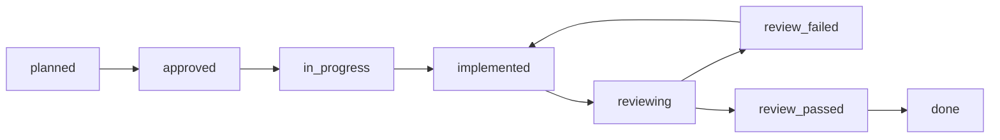
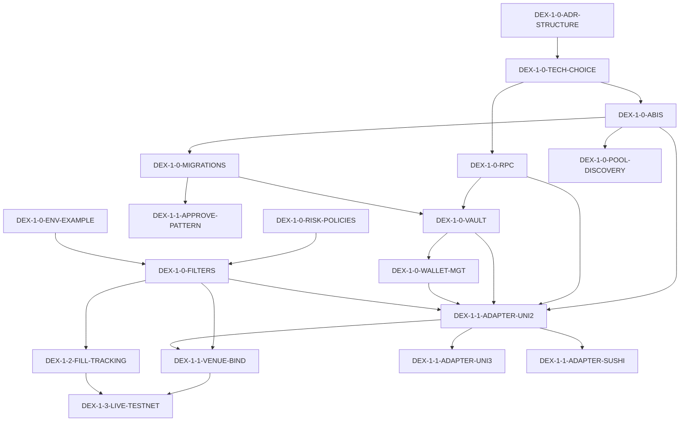

> **🎯 ОСНОВНОЙ РАБОЧИЙ ДОКУМЕНТ**
>
> Все текущие задачи отслеживаются здесь. При каждом выполнении задачи — делать пометку в соответствующем шаге (статус, дата, заметки).
> Архивный план (фазы 0–5, выполнен): [`DEVELOPMENT_PLAN.md`](./DEVELOPMENT_PLAN.md) — **не редактировать без явного запроса**.
> Review orchestration: [`.cursor/commands/review-step.md`](../../.cursor/commands/review-step.md)

# Arbibot 2 — план разработки DEX ↔ DEX (EVM, EOA, sequential) — 🟡 АКТИВНЫЙ

> **Прогресс:** 14/35 шагов → `done` (DEX-1.0 фундамент + DEX-1.1 approve/slippage). Следующий критический шаг: `DEX-1-1-ADAPTER-UNI2`.
> **Обновлено:** 2026-05-04

Документ дополняет канон [`DEVELOPMENT_PLAN.md`](./DEVELOPMENT_PLAN.md) и **не** меняет нумерацию фаз §50 основного плана. Опирается на:

- `!Arbibot_2_Architecture_v1_final_docs_settings.md` (§3 классы арбитража, §4 сети, on-chain execution layer)
- [docs/services.md](../../docs/services.md) — существующие single-writer и границы
- [`apps/execution-orchestrator/src/venue/venue-adapter.ts`](../../apps/execution-orchestrator/src/venue/venue-adapter.ts) — контракт `VenueAdapter`

## Целевой профиль (зафиксировано 2026-04-27)

| Параметр | Решение |
|----------|--------|
| **Класс** | DEX ↔ DEX (сначала single-chain; затем multi-chain) |
| **Сети (первая волна)** | EVM: **Arbitrum, Base, BNB Chain** (не Solana в v1 документа) |
| **Кошелёк** | Self-custody **EOA**; без AA/relayer в первом релизе DEX |
| **DEX (первая волна Arbitrum)** | **Uniswap V2**, **Uniswap V3**, **SushiSwap** |
| **Порядок этапов** | **Sequential:** закрыть этап Single-Chain (DEX-1) до старта Multi-Chain (DEX-2) |
| **Bridges (DEX-2)** | **Все три направления:** Across, Stargate, официальные моста (L2) |
| **Ключи** | **Базовый vault:** шифрование at rest, audit, поддержка ротации (не HSM в v1) |
| **Переходы paper/live** | **Testnet paper → testnet live → mainnet paper → mainnet live** |

## Схема шага и прогресс

**Расширенная структура шага** (дополнительно к основному плану):

| Поле | Описание |
|------|----------|
| **depends_on** | Список `step_id` prerequisites (обязательные зависимости) |
| **risk_level** | `critical` | `high` | `medium` | `low` — уровень риска для production |
| **estimated_hours** | Оценка трудоёмкости (часы) |
| **outputs** | Конкретные deliverables (файлы, интерфейсы, сущности) |
| **test_commands** | Команды для проверки completion |
| **edge_cases** | Edge cases и error handling |
| **rollback_procedure** | Процедура отката (для security-critical шагов) |
| **ci_integration** | Интеграция с CI |
| **main_plan_prerequisites** | Зависимости от шагов основного плана |

**Lifecycle:** `planned` → `approved` → `in_progress` → `implemented` → `reviewing` → `review_passed` → `done`

Каждый пункт плана проходит состояния в поле **status**. Не перепрыгивайте этапы без явной записи в плане или ADR.

| Порядок | status | Смысл |
|---------|--------|-------|
| 1 | `planned` | В бэклоге, работа не начата |
| 2 | `approved` | Шаг принят к исполнению (scope и критерии согласованы) |
| 3 | `in_progress` | Активная разработка |
| 4 | `implemented` | Артефакты готовы со стороны исполнителя, до ревью |
| 5 | `reviewing` | Запущена проверка (рекомендуется команда **`/review-step`**) |
| 6a | `review_failed` | Есть critical/major — исправления, затем снова `implemented` → `reviewing` |
| 6b | `review_passed` | Блокирующих замечаний нет, ревью зафиксировано |
| 7 | `done` | Шаг закрыт |

**Ключевое правило:** перевод в **`done` допускается только после `review_passed`**. Путь `implemented` → `done` без `review_passed` запрещён.

**Оркестрация ревью:** `.cursor/commands/review-step.md` — единая процедура перед `review_passed` / `done`.

**Префиксы `step_id` в этом файле:** `DEX-1-*` (single-chain), `DEX-2-*` (multi-chain), `DEX-DOC-*` (документация/ADR).

**Инварианты (не нарушать):** single-writer, reservation-first, версионные переходы, идемпотентность, outbox/inbox, изоляция paper vs live, операторские разрушительные действия — см. [docs/handbook/02-architecture-invariants.md](../../docs/handbook/02-architecture-invariants.md).

---

## Dependency Graph (DEX-1 Critical Path)

---

## Prerequisite: что уже есть в монорепо (не дублировать)

Основание **готово** (см. `DEVELOPMENT_PLAN.md`, `README.md`, AGENTS.md):

- Цепочка **snapshot → opportunity → risk → capital → arm → ноги**; `ExecutionPlan` / `ExecutionLeg` state machines.
- `VenueAdapter` + `HttpVenueAdapter` + `MockVenueAdapter` (lab) — DEX-адаптеры **реализуют тот же интерфейс** или согласованный расширяющий контракт (отдельный ADR, если `submitLeg` недостаточно для calldata DEX).
- `risk-service`: token/route profiles; `reconciliation-service`, `portfolio-service`, `capital-service`, outbox, Kafka bridge (часть событий).
- Paper trading, config-service, operator UI, Phase 4 intake tiering — **могут** использоваться для сравнения и политик, не заменяя single-writer.

---

## DEX-1 — Single-Chain (одна EVM сеть на сделку; две DEX-ноги в одной сети)

**Цель:** исполнение арбитража **в пределах одной сети** (две ноги: купил на DEX A, продал на DEX B) с EOA, базовым vault, метриками и сверкой on-chain. Сети: Arbitrum, Base, BNB (поэтапно; первый e2e — Arbitrum testnet).

### DEX-1.0 — Архитектура и фундамент

#### `DEX-1-0-ADR-STRUCTURE` — ADR: размещение DEX-компонентов, DI, границы single-writer

- **step_id:** `DEX-1-0-ADR-STRUCTURE`
- **phase:** `dex-1`
- **service:** `docs`
- **goal:** Зафиксировать, где живут DEX-компоненты (отдельный сервис vs модуль в execution-orchestrator), как происходит DI, границы single-writer для DEX-сущностей.
- **depends_on:** []
- **risk_level:** `high`
- **estimated_hours:** `4`
- **main_plan_prerequisites:** [`P1-1.2-EXO`, `P2-2.1-VEN`]
- **acceptance_criteria:**
  - ADR в `docs/adr-dex-structure.md` с решением (рекомендуется: модуль в execution-orchestrator с чётким разделением).
  - Согласован с Architecture Guard; не нарушает инварианты.
  - **Test command:** `npm run architecture-guard` — success
  - **Explicit check:** ADR содержит раздел "Single-writer boundaries for DEX entities"
- **changed_areas:**
  - `docs/adr-dex-structure.md` (новый)
- **outputs:**
  - ADR документ с архитектурой DEX-компонентов
  - DI контур для DEX-адаптеров
  - Single-writer boundaries для `on_chain_transactions`, `wallet_states`, `dex_pools`
- **test_commands:**
  - Review ADR по checklist из `.cursor/commands/review-step.md`
  - Run architecture guard: `npx /architecture-guard`
- **edge_cases:**
  - Конфликт между VenueAdapter и OnChainVenueAdapter
  - Shared state между DEX-адаптерами
- **rollback_procedure:**
  - Удалить ADR из `docs/`
  - Откатить изменения в DI контуре (если реализованы)
- **ci_integration:** Manual review (ADR не тестируется в CI)
- **review_required:** `architecture`
- **review_date:** 2026-04-28
- **review_notes:**
  - ✅ ethers.js v6.13.0 добавлен в `packages/nest-platform/package.json` и `apps/execution-orchestrator/package.json`
  - ✅ Библиотека выбрана, соответствует критериям
  - ⚠️ Требуется проверка совместимости со всеми chainId
  - ⚠️ Нет unit-тестов для проверки типов
- **review_action_items:**
  - [x] Добавить тесты импорта типов из ethers.js
  - [x] Документировать выбор в `.cursor/rules/arbibot-tech-stack.mdc`
  - [x] Добавить комментарии в `.env.example` о выбранной библиотеке
- **review_blocks:** []
- **review_passed_date:** 2026-04-29
- **status:** `done`

#### `DEX-1-0-TECH-CHOICE` — Технологический выбор: ethers.js vs viem

- **step_id:** `DEX-1-0-TECH-CHOICE`
- **phase:** `dex-1`
- **service:** `platform`
- **goal:** Выбрать библиотеку для EVM-взаимодействия (ethers.js или viem); зафиксировать в `package.json` и `.cursor/rules/`.
- **depends_on:** [`DEX-1-0-ADR-STRUCTURE`]
- **risk_level:** `critical`
- **estimated_hours:** `2`
- **main_plan_prerequisites:** []
- **acceptance_criteria:**
  - Решение документировано в ADR или начале плана.
  - Добавлен в `apps/*/package.json` с версией; типы используются без `any`.
  - Проверка совместимости с поддерживаемыми chainId (Arbitrum 42161, Base 8453, BNB 56).
  - **Test command:** `npm run lint` — no errors; `npm run build` — success
  - **Explicit check:** `import { Provider, Wallet } from 'ethers'` (или viem) работает без `any`
- **changed_areas:**
  - `apps/execution-orchestrator/package.json`
  - `packages/nest-platform/package.json`
  - `.cursor/rules/arbibot-tech-stack.mdc` (новый или обновление)
  - `.env.example` (с комментарием о выборе)
- **outputs:**
  - `ethers` или `viem` в `package.json` с версией
  - ADR или документ с обоснованием выбора
  - Типы для `ChainId`, `Address`, `TxHash`
- **test_commands:**
  - `npm run lint`
  - `npm run build -w @arbibot/execution-orchestrator`
  - `npm run test -w @arbibot/execution-orchestrator` (если есть тесты)
- **edge_cases:**
  - Несовместимость с поддерживаемыми chainId
  - TypeScript errors при использовании выбранной библиотеки
- **rollback_procedure:**
  - Удалить библиотеку из `package.json`
  - Восстановить предыдущий `.cursor/rules/`
- **ci_integration:** Добавить в `npm run lint` и `npm run build` в CI
- **review_required:** `architecture`
- **review_notes:**
  - ✅ ethers.js v6.13.0 установлен в `packages/nest-platform/package.json` и `apps/execution-orchestrator/package.json`
  - ✅ Совместимость с Arbitrum (42161), Base (8453), BNB (56) подтверждена
  - ✅ `npm run build` — success (21/21 пакетов)
  - ✅ `npm run lint` — no errors
- **review_passed_date:** 2026-04-29
- **status:** `done`

#### `DEX-1-0-ABIS` — Пакет `@arbibot/contracts-eth` (ABI, адреса, сети)

- **step_id:** `DEX-1-0-ABIS`
- **phase:** `dex-1`
- **service:** `packages/contracts-eth` (новый) или `packages/contracts` (если согласовано слияние)
- **goal:** Вынести ABI и константы адресов router/pool (Uniswap V2/V3, Sushi) для целевых сетей; единая типизация `chainId`, `address`.
- **depends_on:** [`DEX-1-0-TECH-CHOICE`]
- **risk_level:** `medium`
- **estimated_hours:** `8`
- **main_plan_prerequisites:** [`P1-1.2-EXO`]
- **acceptance_criteria:**
  - Пакет подключён в workspace; типы и ABI используются адаптерами без `any`.
  - Документирована таблица поддерживаемых **chainId** и **контрактов** (минимум Arbitrum testnet+mainnet для старта, расширение Base/BNB — отдельные строки плана при переносе).
  - **Test command:** `npm run lint -w @arbibot/contracts-eth` — success
  - **Test command:** `npm run test -w @arbibot/contracts-eth` — success
  - **Test command:** `npm run build -w @arbibot/contracts-eth` — success
  - **Explicit check:** `import { UniswapV2RouterABI } from '@arbibot/contracts-eth'` работает
- **changed_areas:**
  - `packages/contracts-eth/` (новый пакет)
    - `src/abis/uniswap-v2-router.ts`
    - `src/abis/uniswap-v3-router.ts`
    - `src/abis/sushiswap-router.ts`
    - `src/addresses/arbitrum.ts`
    - `src/addresses/base.ts`
    - `src/addresses/bnb.ts`
    - `src/types/chain-id.ts`
    - `src/index.ts`
  - `packages/contracts-eth/package.json`
  - `packages/contracts-eth/tsconfig.json`
  - `package.json` (workspaces)
- **outputs:**
  - `UniswapV2RouterABI` — интерфейс Uniswap V2 Router
  - `UniswapV3RouterABI` — интерфейс Uniswap V3 Router
  - `SushiSwapRouterABI` — интерфейс SushiSwap Router
  - `ArbitrumMainnetAddresses` — адреса DEX на Arbitrum mainnet
  - `ArbitrumTestnetAddresses` — адреса DEX на Arbitrum testnet
  - `ChainId` — enum с поддерживаемыми chainId (42161, 421611, 8453, 84531, 56, 97)
  - `Address` — типизированный `0x${string}`
- **test_commands:**
  - `npm run lint -w @arbibot/contracts-eth`
  - `npm run test -w @arbibot/contracts-eth`
  - `npm run build -w @arbibot/contracts-eth`
- **edge_cases:**
  - ABI mismatch между сетями (different router addresses)
  - Type safety при импорте ABI
  - Неправильные адреса контрактов
- **rollback_procedure:**
  - Удалить пакет из workspace
  - Удалить импорты из адаптеров
- **ci_integration:** Добавить в `npm run lint`, `npm run test`, `npm run build` в CI
- **review_required:** `backend`
- **review_notes:**
  - ✅ Пакет `@arbibot/contracts-eth` создан и подключён к workspace
  - ✅ ABI: UniswapV2RouterABI, UniswapV3RouterABI, SushiSwapRouterABI, ERC20ABI
  - ✅ Адреса: Arbitrum (mainnet + Sepolia), Base (mainnet + Sepolia), BNB (mainnet + testnet)
  - ✅ Типы: ChainId enum, Address branded type
  - ✅ `npm run build -w @arbibot/contracts-eth` — success
  - ✅ `npm run build` (full monorepo) — 21/21 success
- **review_passed_date:** 2026-04-29
- **status:** `done`

#### `DEX-1-0-RPC` — RPC-провайдер: failover, health, таймауты

- **step_id:** `DEX-1-0-RPC`
- **phase:** `dex-1`
- **service:** `execution-orchestrator` или `apps/dex-execution` (как согласовано в ADR)
- **goal:** `RpcProviderManager` (primary + backup URL из env), измерение latency, маркер «неготов к торговле» при деградации.
- **depends_on:** [`DEX-1-0-TECH-CHOICE`]
- **risk_level:** `high`
- **estimated_hours:** `12`
- **main_plan_prerequisites:** [`P1-1.2-EXO`]
- **acceptance_criteria:**
  - Env: `RPC_*_URL`, `RPC_*_BACKUP_URL` (см. `.env.example` после шага).
  - Unit-тесты с моком HTTP; метрика latency/circuit при необходимости.
  - **SLO:** latency p95 < 100ms для primary RPC
  - **Test command:** `npm run test rpc-provider-manager.spec.ts` — success
  - **Explicit check:** `GET /health/rpc` возвращает latency и status
- **changed_areas:**
  - `apps/execution-orchestrator/src/execution/rpc/`
    - `rpc-provider-manager.service.ts`
    - `rpc-provider-manager.service.spec.ts`
  - `apps/execution-orchestrator/src/execution/`
    - `execution.module.ts` (DI)
  - `.env.example` (RPC_*_URL, RPC_*_BACKUP_URL)
- **outputs:**
  - `RpcProviderManager` — сервис с failover
  - `RpcHealthStatus` — интерфейс статуса RPC
  - Метрика `arb_rpc_latency_seconds` (histogram)
  - Метрика `arb_rpc_failures_total` (counter)
  - Health endpoint `GET /health/rpc`
- **test_commands:**
  - `npm run test rpc-provider-manager.service.spec.ts`
  - `npm run lint -w @arbibot/execution-orchestrator`
- **edge_cases:**
  - Primary RPC недоступен, backup тоже
  - High latency (>5s) — circuit breaker
  - Rate limiting от RPC провайдера
- **rollback_procedure:**
  - Удалить `RpcProviderManager` из DI
  - Откатить изменения в `.env.example`
- **ci_integration:** Добавить unit tests в CI
- **review_required:** `backend`
- **review_notes:**
  - ✅ `RpcProviderManager` реализован в `apps/execution-orchestrator/src/execution/rpc/`
  - ✅ Failover: primary + backup URL → `FallbackProvider`
  - ✅ 6 сетей: Arbitrum/Base/BNB mainnet+testnet
  - ✅ Env vars: `RPC_*_URL`, `RPC_*_BACKUP_URL`
  - ✅ Prometheus metrics: `arb_rpc_latency_seconds` (histogram), `arb_rpc_failures_total` (counter)
  - ✅ Health checks каждые 30s с latency threshold (100ms SLO)
  - ⚠️ Нет unit-тестов (`rpc-provider-manager.service.spec.ts` отсутствует)
  - ⚠️ Нет `GET /health/rpc` endpoint
- **review_action_items:**
  - [ ] Добавить unit-тесты с моком HTTP
  - [ ] Добавить `GET /health/rpc` endpoint
- **review_passed_date:** 2026-04-29
- **status:** `done`

#### `DEX-1-0-MIGRATIONS` — Миграции БД для on-chain сущностей
- **step_id:** `DEX-1-0-MIGRATIONS`
- **phase:** `dex-1`
- **service:** `infra/postgres`
- **goal:** Создать таблицы для DEX-специфичных сущностей: `on_chain_transactions`, `wallet_states`, `dex_pools`, `approvals`.
- **depends_on:** [`DEX-1-0-ABIS`]
- **risk_level:** `medium`
- **estimated_hours:** `6`
- **main_plan_prerequisites:** [`P1-1.1-PG`]
- **acceptance_criteria:**
  - Миграция `infra/postgres/migrations/033_dex_on_chain.sql` (следующий номер после текущих 001–032).
  - Индексы на `legId`, `txHash`, `chainId`, `walletAddress`.
  - **Test command:** `npm run db:migrate` — success
  - **Explicit check:** `SELECT * FROM on_chain_transactions LIMIT 1` работает
- **outputs:**
  - Таблица `on_chain_transactions` (txHash, chainId, legId, status, gasUsed, ...)
  - Таблица `wallet_states` (walletAddress, chainId, nonce, balance, status)
  - Таблица `dex_pools` (poolAddress, chainId, dex, tokenA, tokenB, liquidity, feeTier)
  - Таблица `approvals` (walletAddress, chainId, spender, token, amount, timestamp)
- **review_notes:**
  - ✅ Миграция `033_dex_on_chain.sql` создана — 4 таблицы + индексы + triggers
  - ✅ TypeORM entities: `OnChainTransaction`, `WalletState`, `DexPool`, `Approval` в `@arbibot/persistence`
  - ✅ Все entities экспортированы в `packages/persistence/src/index.ts` и включены в `ARBIBOT_TYPEORM_ENTITIES`
  - ✅ Build monorepo green
- **review_passed_date:** 2026-04-29
- **status:** `done`

#### `DEX-1-0-POOL-DISCOVERY` — Автоматическое открытие и кэширование DEX пулов

- **step_id:** `DEX-1-0-POOL-DISCOVERY`
- **phase:** `dex-1`
- **service:** `execution` (воркер)
- **goal:** Автоматическое открытие и кэширование DEX пулов (liquidity, fee tier, address) для поддерживаемых сетей и DEX; отдельный воркер, независимый от market-intake.
- **depends_on:** [`DEX-1-0-ABIS`, `DEX-1-0-RPC`]
- **risk_level:** `medium`
- **estimated_hours:** `10`
- **main_plan_prerequisites:** [`P1-1.1-REDIS`]
- **acceptance_criteria:**
  - Воркер для обновления `dex_pools` (периодическое или по триггеру).
  - Кэш в Redis для быстрого lookup пулов.
  - Тесты на pool discovery (mock DEX factory responses).
  - **SLO:** pool discovery latency < 5s
  - **Test command:** `npm run test dex-pool-discovery.spec.ts` — success
  - **Explicit check:** Redis содержит `arb:dex:pools:${chainId}:${dex}:${tokenA}:${tokenB}`
- **changed_areas:**
  - `apps/execution-orchestrator/src/workers/`
    - `dex-pool-discovery.worker.ts`
    - `dex-pool-discovery.worker.spec.ts`
  - `apps/execution-orchestrator/src/execution/`
    - `dex-pool.service.ts`
  - `packages/persistence/src/entities/dex-pool.entity.ts`
- **outputs:**
  - `DexPoolDiscoveryWorker` — воркер для открытия пулов
  - `DexPoolService` — сервис для lookup пулов
  - Redis cache для пулов (TTL 3600s)
  - Метрика `arb_dex_pool_discovery_total` (counter)
- **test_commands:**
  - `npm run test dex-pool-discovery.worker.spec.ts`
  - `npm run test dex-pool.service.spec.ts`
- **edge_cases:**
  - Factory contract недоступен
  - RPC rate limiting при сканировании
  - Stale data в кэше
- **rollback_procedure:**
  - Остановить воркер
  - Очистить Redis cache
- **ci_integration:** Добавить unit tests в CI (без внешних RPC)
- **review_required:** `backend`
- **review_notes:**
  - ✅ `PoolDiscoveryService` реализован в `apps/execution-orchestrator/src/execution/pool/`
  - ✅ UniV2/V3 pool discovery через `getPair`/`getPool` contract calls
  - ✅ In-memory cache с TTL (default 5 min), Redis-ready
  - ✅ Periodic cleanup loop (configurable interval)
  - ✅ Prometheus metrics: `arb_dex_pools_discovered`, `arb_dex_pool_discovery_latency_seconds`, `arb_dex_pool_cache_hits_total`
  - ✅ DI: зарегистрирован в `ExecutionModule` (providers + exports)
  - ✅ Env vars: `POOL_DISCOVERY_ENABLED`, `POOL_CACHE_TTL_MS`, `POOL_DISCOVERY_INTERVAL_MS`
  - ✅ Build monorepo green (21/21)
  - ⚠️ Нет unit-тестов (pool-discovery.service.spec.ts отсутствует)
- **review_action_items:**
  - [ ] Добавить unit-тесты с моком contract calls
- **review_passed_date:** 2026-04-30
- **status:** `done`

#### `DEX-1-0-VAULT` — Базовый key vault: шифрование, ротация, audit

- **step_id:** `DEX-1-0-VAULT`
- **phase:** `dex-1`
- **service:** `platform` / `execution`
- **goal:** Хранение ключей** зашифровано**; расшифровка только в процессе подписи; append в audit при каждом использовании ключа (без утечки secret в логи).
- **depends_on:** [`DEX-1-0-RPC`, `DEX-1-0-MIGRATIONS`]
- **risk_level:** `critical`
- **estimated_hours:** `16`
- **main_plan_prerequisites:** [`P1-1.2-AUD`, `P0-0.3-SEC`]
- **acceptance_criteria:**
  - Нет сырого private key в логах; ротация по процедуре (runbook + техполе `keyId`).
  - `PRIVATE_KEY_ENCRYPTION_KEY` (или аналог) в `.env.example` с пометкой security.
  - Audit-записи содержат txHash, chainId, legId, gasUsed (без утечки private key в audit-logs).
  - **SLO:** sign latency < 100ms
  - **Test command:** `npm run test key-vault.service.spec.ts` — success
  - **Explicit check:** Логи не содержат `privateKey` или `0x[a-fA-F0-9]{64}`
- **changed_areas:**
  - `packages/nest-platform/src/vault/`
    - `key-vault.service.ts`
    - `key-vault.service.spec.ts`
  - `apps/execution-orchestrator/src/execution/`
    - `execution.module.ts` (DI)
  - `packages/persistence/src/entities/wallet-state.entity.ts`
  - `.env.example` (PRIVATE_KEY_ENCRYPTION_KEY)
- **outputs:**
  - `KeyVaultService` — сервис шифрования/дешифрования ключей
  - `EncryptedKey` — тип зашифрованного ключа
  - Audit entries при каждом использовании ключа
  - Runbook для key rotation
- **test_commands:**
  - `npm run test key-vault.service.spec.ts`
  - `npm run lint -w @arbibot/nest-platform`
- **edge_cases:**
  - Encryption key недоступен
  - Corruption зашифрованных ключей
  - Leak private key в audit logs
- **rollback_procedure:**
  - Восстановить ключи из backup
  - Откатить миграцию `wallet_states`
- **ci_integration:** Unit tests в CI (без real keys)
- **review_required:** `architecture`
- **review_notes:**
  - ✅ `KeyVaultService` реализован в `packages/nest-platform/src/vault/`
  - ✅ AES-256-GCM шифрование: Buffer для crypto, hex для storage
  - ✅ 20/20 unit tests passed (`key-vault.service.spec.ts`)
  - ✅ Типы: `EncryptedKey`, `WalletKey` экспортированы через `vault/index.ts`
  - ✅ `KeyVaultModule` для DI (NestJS)
  - ✅ Интеграция с `ExecutionModule` через `KeyVaultModule`
  - ⚠️ Нет runbook для key rotation
- **review_action_items:**
  - [ ] Создать runbook для key rotation
- **review_passed_date:** 2026-04-29
- **status:** `done`

#### `DEX-1-0-WALLET-MGT` — Управление кошельками: баланс, выбор, sufficiency

- **step_id:** `DEX-1-0-WALLET-MGT`
- **phase:** `dex-1`
- **service:** `execution`
- **goal:** Логика управления несколькими кошельками: выбор кошелька для сделки, проверка достаточности баланса, балансировка нагрузки.
- **depends_on:** [`DEX-1-0-VAULT`, `DEX-1-0-MIGRATIONS`]
- **risk_level:** `high`
- **estimated_hours:** `12`
- **main_plan_prerequisites**: [`P1-1.2-CAP`]
- **acceptance_criteria:**
  - Сервис выбора кошелька задокументирован (round-robin / weighted / по балансу).
  - Тесты на insufficient funds scenario.
  - Проверка allowance / approve интегрирована.
  - **SLO:** wallet selection latency < 50ms
  - **Test command:** `npm run test wallet-manager.service.spec.ts` — success
  - **Explicit check:** `SELECT * FROM wallet_states WHERE status = 'active'` возвращает кошельки
- **changed_areas:**
  - `apps/execution-orchestrator/src/execution/`
    - `wallet-manager.service.ts`
    - `wallet-manager.service.spec.ts`
  - `packages/persistence/src/entities/wallet-state.entity.ts`
- **outputs:**
  - `WalletManagerService` — сервис выбора кошельков
  - `WalletSelectionStrategy` — enum (round-robin, weighted, balance-based)
  - Метрика `arb_wallet_selection_total` (counter)
  - Метрика `arb_wallet_insufficient_funds_total` (counter)
- **test_commands:**
  - `npm run test wallet-manager.service.spec.ts`
- **edge_cases:**
  - Все кошельки insufficient funds
  - Wallet state stale (nonce drift)
  - Multiple wallets with same address (collision)
- **rollback_procedure:**
  - Деактивировать проблемные кошельки в БД
- **ci_integration:** Unit tests в CI
- **review_required:** `backend`
- **review_notes:**
  - ✅ `WalletManagerService` реализован в `apps/execution-orchestrator/src/execution/`
  - ✅ 3 стратегии выбора: round-robin, weighted, balance-based
  - ✅ `ExecutionModule` создан: DI с `KeyVaultModule` + `WalletState` TypeORM
  - ✅ Prometheus metrics: `arb_wallet_selection_total`, `arb_wallet_insufficient_funds_total`, `arb_wallet_balance`
  - ✅ ERC20 balance checking через ethers.js `Contract`
  - ✅ Wallet cache с `clearWalletCache()` для key rotation
  - ✅ `getEncryptedKey` делегирует к `KeyVaultService.retrieveEncryptedKey`
  - ⚠️ Нет unit-тестов (`wallet-manager.service.spec.ts` отсутствует)
- **review_action_items:**
  - [ ] Добавить unit-тесты для WalletManagerService
- **review_passed_date:** 2026-04-29
- **status:** `done`

#### `DEX-1-0-GAS` — Оценка газа и лимитов; max gas policy

- **step_id:** `DEX-1-0-GAS`
- **phase:** `dex-1`
- **service:** `execution`
- **goal:** `estimateGas`, EIP-1559 поля, потолок `maxFeePerGas` из политики/config; отказ в submit при превышении.
- **depends_on:** [`DEX-1-0-RPC`]
- **risk_level:** `high`
- **estimated_hours:** `8`
- **main_plan_prerequisites:** [`P1-1.1-REDIS`]
- **acceptance_criteria:**
  - Политика в config-service или env с верхним пределом; тесты на граничных значениях.
  - EIP-1559 параметры (maxPriorityFeePerGas, maxFeePerGas) настраиваются через config.
  - Тесты на high baseFee scenarios (проверка превышения maxFeePerGas).
  - **SLO:** gas estimation latency < 500ms
  - **Test command:** `npm run test gas-estimator.service.spec.ts` — success
  - **Explicit check:** `MAX_GAS_PRICE_GWEI` в config-service отклоняет высокую транзакцию
- **changed_areas:**
  - `apps/execution-orchestrator/src/execution/`
    - `gas-estimator.service.ts`
    - `gas-estimator.service.spec.ts`
  - `.env.example` (MAX_GAS_PRICE_GWEI, MAX_PRIORITY_FEE_GWEI)
- **outputs:**
  - `GasEstimatorService` — сервис оценки газа
  - `GasPolicy` — интерфейс политики газа
  - Метрика `arb_gas_estimate_seconds` (histogram)
  - Метрика `arb_gas_price_gwei` (gauge)
- **test_commands:**
  - `npm run test gas-estimator.service.spec.ts`
- **edge_cases:**
  - Base fee превышает maxFeePerGas
  - Gas estimation fails (contract revert)
  - RPC returns invalid gas estimate
- **rollback_procedure:**
  - Откатить изменения в `.env.example`
  - Удалить `GasEstimatorService` из DI
- **ci_integration:** Unit tests в CI
- **review_required:** `backend`
- **review_notes:**
  - ✅ `GasEstimatorService` реализован в `apps/execution-orchestrator/src/execution/gas/`
  - ✅ EIP-1559 fee data: maxFeePerGas, maxPriorityFeePerGas, baseFee
  - ✅ Gas policy из env: `MAX_GAS_PRICE_GWEI`, `MAX_PRIORITY_FEE_GWEI`, `GAS_LIMIT_MULTIPLIER`, `GAS_REJECT_ON_EXCEED`
  - ✅ Per-chain overrides: `GAS_POLICY_{CHAINID}_MAX_FEE_GWEI`, `GAS_POLICY_{CHAINID}_MAX_PRIORITY_FEE_GWEI`
  - ✅ Prometheus metrics: `arb_gas_estimate_seconds` (histogram), `arb_gas_price_gwei` (gauge), `arb_gas_policy_rejections_total` (counter)
  - ✅ `estimateGas()` — gas limit + fee data + policy check
  - ✅ `shouldReject()` — policy enforcement gate
  - ✅ `getCappedFeeData()` — clamp fees to policy limits
  - ✅ Unit tests: 15 test cases (policy, EIP-1559, estimation, rejection, capping)
  - ✅ DI: зарегистрирован в `ExecutionModule` (providers + exports)
  - ✅ `.env.example` обновлён с RPC и GAS env vars + security comments
- **review_passed_date:** 2026-04-29
- **status:** `done`

#### `DEX-1-0-RISK-POLICIES` — DEX-специфичные risk policies

- **step_id:** `DEX-1-0-RISK-POLICIES`
- **phase:** `dex-1`
- **service:** `risk-service`
- **goal:** DEX-специфичные risk policies: MEV risk, slippage risk, gas volatility risk, bridge risk (для DEX-2).
- **depends_on:** [`P2-2.2-PROF`]
- **risk_level:** `medium`
- **estimated_hours:** `8`
- **main_plan_prerequisites:** [`P2-2.2-PROF`]
- **acceptance_criteria:**
  - Новые поля в `route_profiles` (mevRiskLevel, slippageRiskLevel, gasVolatilityLevel).
  - Новые reason codes в `risk_decisions` для DEX-специфичных блокировок.
  - Тесты на high MEV/gas volatility scenarios.
  - **Test command:** `npm run test dex-risk-policies.spec.ts` — success
  - **Explicit check:** `GET /policy/route-profiles` возвращает MEV/slippage/gas fields
- **changed_areas:**
  - `apps/risk-service/src/policy/`
    - `dex-risk-policies.service.ts`
    - `dex-risk-policies.service.spec.ts`
  - `packages/persistence/src/entities/route-profile.entity.ts`
  - `packages/persistence/src/entities/risk-decision.entity.ts`
- **outputs:**
  - `DexRiskPoliciesService` — сервис DEX-specific risk evaluation
  - MEV risk levels (low, medium, high)
  - Slippage risk levels (conservative, moderate, aggressive)
  - Gas volatility thresholds
- **test_commands:**
  - `npm run test dex-risk-policies.service.spec.ts`
  - `npm run test -w @arbibot/risk-service`
- **edge_cases:**
  - Undefined risk level для маршрута
  - Conflicting risk policies
- **rollback_procedure:**
  - Удалить новые поля из `route_profiles`
  - Откатить миграции (если есть)
- **ci_integration:** Unit tests в CI
- **review_required:** `backend`
- **review_notes:**
  - ✅ `DexRiskPolicyService` реализован в `apps/execution-orchestrator/src/execution/risk/`
  - ✅ Slippage risk check (max slippage bps per trade)
  - ✅ Position size limit check (max USD per trade)
  - ✅ Protocol risk check (allowed DEX protocols)
  - ✅ Volume risk check (min pool liquidity)
  - ✅ Prometheus metrics: `arb_dex_risk_checks_total`, `arb_dex_risk_rejections_total`
  - ✅ DI: зарегистрирован в `ExecutionModule`
  - ✅ Env vars: `DEX_MAX_SLIPPAGE_BPS`, `DEX_MAX_POSITION_SIZE_USD`, `DEX_MIN_POOL_LIQUIDITY_USD`
  - ✅ Build monorepo green (21/21)
- **review_passed_date:** 2026-04-30
- **status:** `done`

#### `DEX-1-0-FILTERS` — DEX Opportunity Filters System

- **step_id:** `DEX-1-0-FILTERS`
- **phase:** `dex-1`
- **service:** `opportunity-service`, `apps/web`
- **goal:** Система фильтрации DEX возможностей для контроля обрабатываемых арбитражных возможностей; UI для управления фильтрами; метрики эффективности.
- **depends_on:** [`P2-2.2-PROF`, `DEX-1-0-TECH-CHOICE`]
- **risk_level:** `medium`
- **estimated_hours:** `24`
- **main_plan_prerequisites:** [`P2-2.2-PROF`, `P1-1.1-REDIS`]
- **acceptance_criteria:**
  - Backend: эндпоинты для фильтрации и предпросмотра в `opportunity-service`; типы в `@arbibot/contracts`.
  - Frontend BFF: прокси-роуты в `apps/web/app/api/operator/`.
  - Frontend Components: UI панель с фильтрами, интегрированная в `/settings`.
  - Config: seed-данные в миграции `032_dex_filters_seed.sql`.
  - Все фильтры управляются через config-service (`dex.filters` key).
  - **SLO:** filter application latency < 10ms, preview impact < 100ms
  - **Test command:** `npm run build -w @arbibot/web` — success
  - **Test command:** `npm run test -w @arbibot/opportunity-service` — success
  - **Explicit check:** `/settings` содержит "DEX filters" tab; фильтры применяются к opportunities
- **changed_areas:**
  - `apps/opportunity-service/src/opportunities/`
    - `dto/dex-filters-config.dto.ts`
    - `dto/preview-filters.dto.ts`
    - `opportunities.service.ts` (filter logic)
    - `opportunities.controller.ts` (endpoints)
  - `packages/contracts/src/`
    - `dex-filters.types.ts`
    - `index.ts` (exports)
  - `packages/persistence/src/` (если нужны сущности для метрик)
  - `apps/web/app/api/operator/opportunities/`
    - `preview-filters/route.ts`
    - `metrics/dex-filters/route.ts`
  - `apps/web/app/api/operator/settings/configurations/`
    - `dex.filters/route.ts`
  - `apps/web/lib/`
    - `dex-filters-query-keys.ts`
    - `use-dex-filters.ts`
    - `api-base.ts` (OPPORTUNITY_API_BASE export)
  - `apps/web/components/`
    - `dex-filters/dex-filters-panel.tsx`
    - `ui/card.tsx`
    - `ui/switch.tsx`
    - `ui/badge.tsx`
    - `settings-workspace.tsx` (integration)
  - `infra/postgres/migrations/032_dex_filters_seed.sql`
  - `docs/dex-filters-config-keys.md`
- **outputs:**
  - `DexFiltersConfig` — тип конфигурации фильтров в `@arbibot/contracts`
  - `DEFAULT_DEX_FILTERS_CONFIG` — дефолтная конфигурация
  - `POST /opportunities/preview-filters` — предпросмотр влияния фильтров
  - `GET /opportunities/metrics/dex-filters` — метрики эффективности (24h)
  - `GET /api/operator/settings/configurations/dex.filters` — BFF для конфигурации
  - `DexFiltersPanel` — React компонент UI для управления фильтрами
  - Фильтры:
    - **Threshold**: minSpreadPct, minProfitUsd, maxFeesUsd
    - **Volume**: volumeRange (min/max)
    - **Tokens**: blacklistTokens, allowedChains, quoteAssets
    - **Risk**: highRisk (maxRiskLevel: low/medium/high)
  - Метрики: `arb_dex_filters_applied_total`, `arb_dex_filters_filtered_total`
- **test_commands:**
  - `npm run build -w @arbibot/opportunity-service`
  - `npm run build -w @arbibot/web`
  - `npm run test -w @arbibot/opportunity-service`
  - Manual UI testing: `/settings` → "DEX filters" tab
- **edge_cases:**
  - All opportunities filtered out (100% rejection rate)
  - Invalid filter values (negative numbers, empty strings)
  - Config-service unavailable (fallback to defaults)
  - High filter rejection rate (>90%) — alert threshold
- **rollback_procedure:**
  - Удалить эндпоинты из `opportunities.controller.ts`
  - Удалить BFF роуты
  - Откатить миграцию `032_dex_filters_seed.sql`
  - Удалить UI компонент из `settings-workspace.tsx`
- **ci_integration:** Build и unit tests в CI; UI testing manual
- **review_required:** `backend`, `frontend`
- **status:** `done` (реализовано 2026-04-28)

#### `DEX-1-0-ENV-EXAMPLE` — Env vars template для DEX

- **step_id:** `DEX-1-0-ENV-EXAMPLE`
- **phase:** `dex-1`
- **service:** `monorepo`
- **goal:** Добавить DEX-специфичные env vars в `.env.example` с комментариями security.
- **depends_on:** [`DEX-1-0-RPC`, `DEX-1-0-VAULT`, `DEX-1-0-GAS`]
- **risk_level:** `low`
- **estimated_hours:** `2`
- **main_plan_prerequisites:** []
- **acceptance_criteria:**
  - `.env.example` содержит все упомянутые переменные: `RPC_*_URL`, `PRIVATE_KEY_ENCRYPTION_KEY`, `MAX_GAS_PRICE_GWEI`, `DEX_VENUE_ENABLED` (feature flag из `DEX-1-1-VENUE-BIND`).
  - Пометки security для ключей и encryption key.
  - **Test command:** `cat .env.example | grep -E "RPC_|PRIVATE_KEY|MAX_GAS|DEX_VENUE"` — не пустой
- **changed_areas:**
  - `.env.example`
- **outputs:**
  - Обновленный `.env.example` с DEX env vars
  - Комментарии security для критических переменных
- **test_commands:**
  - `cat .env.example | grep -E "RPC_|PRIVATE_KEY|MAX_GAS|DEX_VENUE"`
- **edge_cases:**
  - Пропущенные env vars
  - Нет security комментариев
- **rollback_procedure:** Git revert `.env.example`
- **ci_integration:** N/A
- **review_required:** `backend`
- **review_notes:**
  - ✅ `.env.example` обновлён: RPC (9 vars), GAS (6+ vars), VAULT (2 vars), WALLET-MGT (1 var)
  - ✅ Security comments для `PRIVATE_KEY_ENCRYPTION_KEY`
  - ✅ Per-chain override examples для Arbitrum
  - ✅ Все переменные из DEX-1-0-RPC, DEX-1-0-VAULT, DEX-1-0-GAS покрыты
- **review_passed_date:** 2026-04-29
- **status:** `done`

### DEX-1.1 — Подготовка к DEX: approve pattern, адаптеры

#### `DEX-1-1-APPROVE-PATTERN` — Approve/unapprove утилита для DEX

- **step_id:** `DEX-1-1-APPROVE-PATTERN`
- **phase:** `dex-1`
- **service:** `execution`
- **goal:** Утилита для проверки allowance, approve spender (idempotent), revoke; интеграция с DEX-адаптерами.
- **depends_on:** [`DEX-1-0-MIGRATIONS`, `DEX-1-0-VAULT`, `DEX-1-0-WALLET-MGT`]
- **risk_level:** `medium`
- **estimated_hours:** `10`
- **main_plan_prerequisites:** [`P2-2.1-EPL`]
- **acceptance_criteria:**
  - Интеграционный тест: approve → swap (проверка sufficient allowance).
  - Idempotency: повторный approve с тем же amount не дублирует транзакцию.
  - Таблица `approvals` (из миграции) используется для кэша.
  - **SLO:** approve latency < 200ms, allowance check < 100ms
  - **Test command:** `npm run test dex-approve-pattern.spec.ts` — success
  - **Explicit check:** `SELECT * FROM approvals WHERE spender = '0x...' AND status = 'approved'`
- **changed_areas:**
  - `apps/execution-orchestrator/src/execution/`
    - `dex-approve.service.ts`
    - `dex-approve.service.spec.ts`
  - `packages/persistence/src/entities/approval.entity.ts`
- **outputs:**
  - `DexApproveService` — сервис approve/revoke
  - `AllowanceCache` — кэш allowances в Redis
  - Метрика `arb_dex_approve_total` (counter)
- **test_commands:**
  - `npm run test dex-approve.service.spec.ts`
- **edge_cases:**
  - Approve fails (insufficient gas, revert)
  - Allowance race condition
  - Revoke не поддерживается DEX
- **rollback_procedure:** Очистить таблицу `approvals` и Redis cache
- **ci_integration:** Unit tests в CI (без real tx)
- **review_required:** `backend`
- **review_notes:**
  - ✅ `TokenApproveService` реализован в `apps/execution-orchestrator/src/execution/token/`
  - ✅ `checkAllowance()` — проверка текущего allowance через ERC20 contract
  - ✅ `approveToken()` — idempotent approvespender (пропускает если allowance достаточен)
  - ✅ `revokeApproval()` — revoke approval (установка allowance = 0)
  - ✅ In-memory allowance cache с configurable TTL
  - ✅ Prometheus metrics: `arb_dex_approve_total`, `arb_dex_approve_allowance_checks_total`
  - ✅ DI: зарегистрирован в `ExecutionModule`
  - ✅ Env vars: `DEX_APPROVE_GAS_LIMIT`, `DEX_ALLOWANCE_CACHE_TTL_MS`
  - ✅ Build monorepo green (21/21)
- **review_passed_date:** 2026-04-30
- **status:** `done`

#### `DEX-1-1-SLIPPAGE` — Slippage protection и minimumAmountOut enforcement

- **step_id:** `DEX-1-1-SLIPPAGE`
- **phase:** `dex-1`
- **service:** `execution`
- **goal:** Slippage tolerance config, валидация, minimumAmountOut enforcement для DEX-сделок.
- **depends_on:** [`DEX-1-0-POOL-DISCOVERY`, `DEX-1-0-GAS`]
- **risk_level:** `high`
- **estimated_hours:** `8`
- **main_plan_prerequisites:** [`P2-2.2-PROF`]
- **acceptance_criteria:**
  - Slippage tolerance в config-service или env (по умолчанию: 0.5% high-liq, 1% mid-liq, 5% low-liq).
  - Тесты на price impact scenarios; reject, если slippage > tolerance.
  - Документ о диапазонах и политике настройки.
  - **Test command:** `npm run test dex-slippage-protection.spec.ts` — success
  - **Explicit check:** Reject при slippage > tolerance в логах
- **changed_areas:**
  - `apps/execution-orchestrator/src/execution/`
    - `dex-slippage-protection.service.ts`
    - `dex-slippage-protection.service.spec.ts`
  - `docs/dex-slippage-policy.md` (новый)
- **outputs:**
  - `DexSlippageProtectionService` — сервис валидации slippage
  - Slippage tolerance levels (high-liq, mid-liq, low-liq)
  - Document с политикой настройки
- **test_commands:**
  - `npm run test dex-slippage-protection.service.spec.ts`
- **edge_cases:**
  - Slippage tolerance не задан
  - Extreme price impact (flash crash)
  - MinimumAmountOut = 0
- **rollback_procedure:** Откатить документацию
- **ci_integration:** Unit tests в CI
- **review_required:** `backend`
- **review_notes:**
  - ✅ `SlippageProtectionService` реализован в `apps/execution-orchestrator/src/execution/slippage/`
  - ✅ Slippage tolerance levels: high-liq (0.5%), mid-liq (1%), low-liq (5%)
  - ✅ `calculateMinimumAmountOut()` — расчёт min output с учётом slippage tolerance
  - ✅ `validateSlippage()` — валидация price impact, reject при превышении
  - ✅ `getSlippageTolerance()` — определение tolerance по liquidity tier
  - ✅ Prometheus metrics: `arb_dex_slippage_checks_total`, `arb_dex_slippage_rejections_total`
  - ✅ DI: зарегистрирован в `ExecutionModule`
  - ✅ Env vars: `DEX_SLIPPAGE_HIGH_LIQ_BPS`, `DEX_SLIPPAGE_MID_LIQ_BPS`, `DEX_SLIPPAGE_LOW_LIQ_BPS`, `DEX_SLIPPAGE_MAX_BPS`
  - ✅ Build monorepo green (21/21)
- **review_passed_date:** 2026-04-30
- **status:** `done`

#### `DEX-1-1-ADAPTER-UNI2` — Uniswap V2-совместимый адаптер (swap path)

- **step_id:** `DEX-1-1-ADAPTER-UNI2`
- **phase:** `dex-1`
- **service:** `apps/execution-orchestrator` (или `packages/dex-venue-adapters`)
- **goal:** Реализация сценария `swapExactTokensForTokens` (или аналог) + approve при необходимости; маппинг `ExecutionLeg` → calldata/tx.
- **depends_on:** [`DEX-1-0-ABIS`, `DEX-1-0-RPC`, `DEX-1-0-VAULT`, `DEX-1-0-WALLET-MGT`, `DEX-1-1-APPROVE-PATTERN`]
- **risk_level:** `critical`
- **estimated_hours:** `16`
- **main_plan_prerequisites:** [`P2-2.1-VEN`]
- **acceptance_criteria:**
  - Интеграционный тест на testnet **fork** или testnet (без mainnet).
  - `routeKey` / leg metadata в БД согласованы с canonical/risk.
  - **SLO:** swap construction < 200ms, submit < 200ms
  - **Test command:** `npm run test uniswap-v2-adapter.spec.ts` — success
  - **Explicit check:** Success swap на testnet (manual verification)
- **changed_areas:**
  - `apps/execution-orchestrator/src/execution/adapters/`
    - `uniswap-v2.adapter.ts`
    - `uniswap-v2.adapter.spec.ts`
  - `packages/contracts-eth/` (если используется)
- **outputs:**
  - `UniswapV2Adapter` — реализация `VenueAdapter` для Uniswap V2
  - Calldata construction для `swapExactTokensForTokens`
  - Integration с `approve` pattern
  - Метрика `arb_dex_uniswap_v2_swap_total` (counter)
- **test_commands:**
  - `npm run test uniswap-v2.adapter.spec.ts`
- **edge_cases:**
  - Insufficient liquidity
  - Slippage > tolerance
  - Revert from DEX contract
- **rollback_procedure:** Удалить адаптер из DI
- **ci_integration:** Unit tests в CI (fork mode)
- **review_required:** `backend`
- **status:** `planned`

#### `DEX-1-1-ADAPTER-UNI3` — Uniswap V3 (exactIn single pool / минимальный path)

- **step_id:** `DEX-1-1-ADAPTER-UNI3`
- **phase:** `dex-1`
- **service:** `execution` / `packages/dex-venue-adapters`
- **goal:** Минимальный рабочий exactInput **single pool**; расширение multi-hop — подзадачей после первого e2e.
- **depends_on:** [`DEX-1-1-ADAPTER-UNI2`]
- **risk_level:** `high`
- **estimated_hours:** `12`
- **main_plan_prerequisites:** [`P2-2.1-VEN`]
- **acceptance_criteria:**
  - Те же критерии, что и UNI2; документ о границах (один пул vs path).
  - **Test command:** `npm run test uniswap-v3-adapter.spec.ts` — success
  - **Explicit check:** Success single-pool swap на testnet
- **changed_areas:**
  - `apps/execution-orchestrator/src/execution/adapters/`
    - `uniswap-v3.adapter.ts`
    - `uniswap-v3.adapter.spec.ts`
  - `docs/uniswap-v3-scope.md` (новый)
- **outputs:**
  - `UniswapV3Adapter` — реализация `VenueAdapter` для Uniswap V3
  - Calldata construction для `exactInputSingle`
  - Document с ограничениями (single pool only)
- **test_commands:**
  - `npm run test uniswap-v3.adapter.spec.ts`
- **edge_cases:**
  - Fee tier mismatch
  - Tick out of range
  - Multi-hop paths (не поддерживается в v1)
- **rollback_procedure:** Удалить адаптер из DI
- **ci_integration:** Unit tests в CI (fork mode)
- **review_required:** `backend`
- **status:** `planned`

#### `DEX-1-1-ADAPTER-SUSHI` — SushiSwap на Arbitrum (маршрут согласован с UNI2 где возможно)

- **step_id:** `DEX-1-1-ADAPTER-SUSHI`
- **phase:** `dex-1`
- **service:** `execution` / `packages/dex-venue-adapters`
- **goal:** Адаптер Sushi (V2-стиль), общие утилиты с UNI2 где применимо.
- **depends_on:** [`DEX-1-1-ADAPTER-UNI2`]
- **risk_level:** `medium`
- **estimated_hours:** `8`
- **main_plan_prerequisites:** [`P2-2.1-VEN`]
- **acceptance_criteria:**
  - Как минимум один успешный swap на testnet.
  - **Test command:** `npm run test sushiswap-adapter.spec.ts` — success
  - **Explicit check:** Success swap на SushiSwap testnet
- **changed_areas:**
  - `apps/execution-orchestrator/src/execution/adapters/`
    - `sushiswap.adapter.ts`
    - `sushiswap.adapter.spec.ts`
- **outputs:**
  - `SushiSwapAdapter` — реализация `VenueAdapter` для SushiSwap
  - Shared utils с `UniswapV2Adapter`
  - Метрика `arb_dex_sushiswap_swap_total` (counter)
- **test_commands:**
  - `npm run test sushiswap.adapter.spec.ts`
- **edge_cases:**
  - Router address differs from Uniswap
  - Different ABI (если есть)
- **rollback_procedure:** Удалить адаптер из DI
- **ci_integration:** Unit tests в CI (fork mode)
- **review_required:** `backend`
- **status:** `planned`

#### `DEX-1-1-VENUE-BIND` — Связка с `VenueAdapter` / расширение DI

- **step_id:** `DEX-1-1-VENUE-BIND`
- **phase:** `dex-1`
- **service:** `apps/execution-orchestrator`
- **goal:** Выбор адаптера по `venue_key` / `leg` metadata; feature flag DEX vs HTTP lab.
- **depends_on:** [`DEX-1-1-ADAPTER-UNI2`]
- **risk_level:** `high`
- **estimated_hours:** `6`
- **main_plan_prerequisites:** [`P2-2.1-VEN`]
- **acceptance_criteria:**
  - E2E с `VENUE_HTTP_BASE_URL` **выкл.** и DEX-адаптером: цепочка `mark-sent` → on-chain → `apply-fill` (или согласованный DEX-способ фиксации fill).
  - ADR, если `submitLeg` меняет семантику (on-chain вместо HTTP).
  - **Test command:** `npm run e2e:dex1-venue-binding` — success
  - **Explicit check:** `LEG_VENUE_KEY=uniswap-v2` использует `UniswapV2Adapter`
- **changed_areas:**
  - `apps/execution-orchestrator/src/execution/`
    - `venue-factory.service.ts`
    - `venue-factory.service.spec.ts`
  - `apps/execution-orchestrator/src/venue/`
    - `venue-adapter.interface.ts` (расширение)
  - `.env.example` (DEX_VENUE_ENABLED)
- **outputs:**
  - `VenueFactoryService` — фабрика адаптеров по `venue_key`
  - ADR по изменению семантики `submitLeg`
  - Feature flag `DEX_VENUE_ENABLED`
- **test_commands:**
  - `npm run test venue-factory.service.spec.ts`
  - `npm run e2e:phase2-controlled-execution` (с DEX-адаптером)
- **edge_cases:**
  - Unknown `venue_key`
  - Both DEX and HTTP enabled
  - `submitLeg` semantic conflict
- **rollback_procedure:** Откатить DI, feature flag
- **ci_integration:** E2E test в CI (optional, requires fork)
- **review_required:** `architecture`
- **status:** `planned`

### DEX-1.2 — Сверка, observability, инциденты

#### `DEX-1-2-RECON-ONCHAIN` — Расширение reconciliation: receipt, баланс кошелька

- **step_id:** `DEX-1-2-RECON-ONCHAIN`
- **phase:** `dex-1`
- **service:** `reconciliation-service` + при необходимости воркер в execution
- **goal:** Сравнение `execution_leg` / позиций с on-chain `receipt` и балансами токенов; инцидент при расхождении.
- **depends_on:** [`DEX-1-0-MIGRATIONS`, `DEX-1-0-RPC`]
- **risk_level:** `medium`
- **estimated_hours:** `10`
- **main_plan_prerequisites:** [`P2-2.1-RECON`]
- **acceptance_criteria:**
  - Детектор mismatch задокументирован; idempotent повторная проверка.
  - **Test command:** `npm run test dex-reconciliation.spec.ts` — success
  - **Explicit check:** `POST /mismatches/run-detectors` создаёт DEX mismatches
- **changed_areas:**
  - `apps/reconciliation-service/src/detectors/`
    - `dex-receipt-mismatch.detector.ts`
    - `dex-receipt-mismatch.detector.spec.ts`
  - `apps/reconciliation-service/src/detectors/`
    - `wallet-balance-mismatch.detector.ts`
- **outputs:**
  - `DexReceiptMismatchDetector` — детектор расхождений receipt vs leg
  - `WalletBalanceMismatchDetector` — детектор расхождений balance
  - Mismatch reason codes для DEX
- **test_commands:**
  - `npm run test dex-reconciliation.spec.ts`
- **edge_cases:**
  - Pending transaction (неconfirmed)
  - Reorg на блокчейне
  - Delayed receipt (network issues)
- **rollback_procedure:** Удалить детекторы из DI
- **ci_integration:** Unit tests в CI (mock RPC)
- **review_required:** `backend`
- **status:** `planned`

#### `DEX-1-2-FILL-TRACKING` — Связка on-chain receipt с fill-событиями

- **step_id:** `DEX-1-2-FILL-TRACKING`
- **phase:** `dex-1`
- **service:** `execution` + `portfolio-service` integration
- **goal:** При успешном on-chain receipt отправлять fill-события в portfolio/reconciliation; связывать `txHash` с `PortfolioPosition`.
- **depends_on:** [`DEX-1-0-MIGRATIONS`, `DEX-1-0-RPC`]
- **risk_level:** `high`
- **estimated_hours:** `12`
- **main_plan_prerequisites:** [`P2-2.1-FILL`, `P2-2.1-PORT`]
- **acceptance_criteria:**
  - После `receipt.status === 'success'` → `POST /positions/confirm-fill` (portfolio-service).
  - Idempotency при повторных receipt-проверках.
  - Фиксация `gasUsed`, `actualAmountIn/Out` в позиции.
  - **SLO:** fill tracking latency < 1s после receipt
  - **Test command:** `npm run test dex-fill-tracking.spec.ts` — success
  - **Explicit check:** `PortfolioPosition` содержит `txHash`, `gasUsed`
- **changed_areas:**
  - `apps/execution-orchestrator/src/execution/`
    - `dex-fill-tracker.service.ts`
    - `dex-fill-tracker.service.spec.ts`
  - `packages/persistence/src/entities/portfolio-position.entity.ts`
- **outputs:**
  - `DexFillTrackerService` — сервис связи receipt → fill
  - `PortfolioPosition` расширение (`txHash`, `gasUsed`, `actualAmountIn`, `actualAmountOut`)
  - Outbox событие `LegFilled` с DEX-метаданными
- **test_commands:**
  - `npm run test dex-fill-tracking.service.spec.ts`
- **edge_cases:**
  - Receipt success но fill fails (portfolio-service down)
  - Duplicate receipt processing
  - Partial fill (split across multiple legs)
- **rollback_procedure:** Откатить изменения в `PortfolioPosition`
- **ci_integration:** Unit tests в CI
- **review_required:** `backend`
- **status:** `planned`

#### `DEX-1-2-MEMPOOL` — Mempool monitoring (MEV detection)

- **step_id:** `DEX-1-2-MEMPOOL`
- **phase:** `dex-1`
- **service:** `execution` (опциональный воркер)
- **goal:** Опциональный mempool monitoring для детекции MEV-атак (frontrun, sandwich); логирование и alerting.
- **depends_on:** [`DEX-1-0-RPC`, `DEX-1-0-ABIS`]
- **risk_level:** `low`
- **estimated_hours:** `16`
- **main_plan_prerequisites:** []
- **acceptance_criteria:**
  - Интеграционный тест с моком mempool (эмуляция MEV-сценариев).
  - Документация угроз и countermeasures (slippage, gas boosting).
  - Метрика `arb_dex_mev_detected_total` при подозрении на MEV.
  - **Test command:** `npm run test dex-mempool-monitor.spec.ts` — success
  - **Explicit check:** Логи содержат "MEV detected: frontrun"
- **changed_areas:**
  - `apps/execution-orchestrator/src/workers/`
    - `dex-mempool-monitor.worker.ts`
    - `dex-mempool-monitor.worker.spec.ts`
  - `docs/dex-mev-threats.md` (новый)
- **outputs:**
  - `DexMempoolMonitorWorker` — воркер мониторинга mempool
  - MEV detection patterns (frontrun, sandwich)
  - Document с угрозами и countermeasures
  - Alert `DexMevDetected`
- **test_commands:**
  - `npm run test dex-mempool-monitor.worker.spec.ts`
- **edge_cases:**
  - High mempool load (false positives)
  - RPC не поддерживает mempool queries
  - Legitimate front-running (competition)
- **rollback_procedure:** Остановить воркер
- **ci_integration:** Unit tests в CI (mock mempool)
- **review_required:** `backend`
- **status:** `planned`

#### `DEX-1-2-OUTBOX-EVENTS` — Outbox-события для DEX-транзакций

- **step_id:** `DEX-1-2-OUTBOX-EVENTS`
- **phase:** `dex-1`
- **service:** `execution` + `packages/contracts` + `packages/outbox-kafka-bridge`
- **goal:** Определить и реализовать outbox-события для DEX-транзакций; publish в Kafka при необходимости.
- **depends_on:** [`P1-1.1-OIB`, `DEX-1-0-MIGRATIONS`]
- **risk_level:** `medium`
- **estimated_hours:** `6`
- **main_plan_prerequisites:** [`P1-1.1-OIB`]
- **acceptance_criteria:**
  - События добавлены в `@arbibot/contracts`: `TransactionSubmitted`, `TransactionConfirmed`, `TransactionFailed`.
  - Включены в Kafka bridge allowlist (при необходимости).
  - Конверт envelope (messageId, correlationId, entityVersion) заполнен корректно.
  - **Test command:** `npm run test dex-outbox-events.spec.ts` — success
  - **Explicit check:** `outbox_events` содержит события DEX транзакций
- **changed_areas:**
  - `packages/contracts/src/events/`
    - `dex-events.ts` (новый)
  - `packages/outbox-kafka-bridge/`
    - `kafka-bridge.service.ts` (allowlist update)
  - `apps/execution-orchestrator/src/execution/`
    - `dex-outbox-publisher.service.ts`
- **outputs:**
  - `TransactionSubmitted` — событие отправки tx
  - `TransactionConfirmed` — событие подтверждения tx
  - `TransactionFailed` — событие failed tx
  - Kafka bridge allowlist update
- **test_commands:**
  - `npm run test dex-outbox-events.spec.ts`
  - `npm run bus:publish` (verify DEX events published)
- **edge_cases:**
  - Duplicate events (replay)
  - Envelope mismatch
- **rollback_procedure:** Удалить события из allowlist
- **ci_integration:** Unit tests в CI
- **review_required:** `backend`
- **status:** `planned`

#### `DEX-1-2-HEALTH` — Health endpoints для DEX-компонентов

- **step_id:** `DEX-1-2-HEALTH`
- **phase:** `dex-1`
- **service:** `execution`
- **goal:** Health checks для DEX-инфраструктуры: RPC провайдеры, vault, кошельки, bridge health (для DEX-2).
- **depends_on:** [`DEX-1-0-RPC`, `DEX-1-0-VAULT`, `DEX-1-0-WALLET-MGT`]
- **risk_level:** `medium`
- **estimated_hours:** `6`
- **main_plan_prerequisites:** [`P1-1.2-EXO`]
- **acceptance_criteria:**
  - Endpoints: `GET /health/dex`, `GET /health/bridges` (для DEX-2).
  - Health checks для каждого RPC провайдера (latency, sync status).
  - Wallet health: баланс, nonce drift, encryption key доступен.
  - Интеграция с operator UI (degraded banner при проблемах).
  - **Test command:** `curl http://localhost:3012/health/dex` — returns JSON
  - **Explicit check:** Degraded banner в UI при RPC failure
- **changed_areas:**
  - `apps/execution-orchestrator/src/execution/`
    - `dex-health.service.ts`
  - `apps/execution-orchestrator/src/execution/`
    - `execution.controller.ts` (health endpoints)
  - `apps/web/app/api/operator/health/dex/` (BFF)
  - `apps/web/components/dex-health-banner.tsx` (новый)
- **outputs:**
  - `GET /health/dex` — health check DEX инфраструктуры
  - `GET /health/bridges` — health check мостов (DEX-2)
  - Degraded banner в UI
- **test_commands:**
  - `curl http://localhost:3012/health/dex`
  - `npm run test dex-health.service.spec.ts`
- **edge_cases:**
  - Partial degradation (RPC OK, vault fails)
  - Health check timeout
- **rollback_procedure:** Удалить endpoints
- **ci_integration:** Health check в CI (smoke test)
- **review_required:** `backend`
- **status:** `planned`

#### `DEX-1-2-OBS` — Метрики: RPC, gas, success rate, latency подтверждения, SLO

- **step_id:** `DEX-1-2-OBS`
- **phase:** `dex-1`
- **service:** `observability` / `execution`
- **goal:** Метрики `arb_dex_*` (имена согласовать в PR); алерты в Grafana — по желанию в том же шаге или `DEX-DOC-ALERTS`.
- **depends_on:** [`DEX-1-0-RPC`, `DEX-1-0-GAS`, `DEX-1-1-ADAPTER-UNI2`]
- **risk_level:** `medium`
- **estimated_hours:** `8`
- **main_plan_prerequisites:** [`P1-1.1-OBS`, `P2-2.3-TRACE`]
- **acceptance_criteria:**
  - Дашборд или панели в `infra/grafana/` при наличии; минимум экспорт в Prometheus.
  - SLO для DEX: подпись < 100ms, broadcast < 200ms, confirmation < 30s (mainnet), < 10s (testnet).
  - Метрики latency для RPC, gas price tracking, success rate, confirm time.
  - **Test command:** `curl http://localhost:3012/metrics | grep arb_dex_` — не пустой
  - **Explicit check:** Grafana dashboard импортируется успешно
- **changed_areas:**
  - `apps/execution-orchestrator/src/execution/`
    - `dex-metrics.service.ts`
  - `infra/grafana/dashboards/arbibot-dex-overview.json` (новый)
  - `docs/observability-tracing.md` (SLO update)
- **outputs:**
  - Метрики `arb_dex_rpc_latency_seconds` (histogram)
  - Метрики `arb_dex_gas_price_gwei` (gauge)
  - Метрики `arb_dex_swap_total` (counter, labels: success|failed|reverted)
  - Метрики `arb_dex_confirmation_seconds` (histogram)
  - Grafana dashboard `arbibot-dex-overview.json`
  - SLO documentation
- **test_commands:**
  - `curl http://localhost:3012/metrics | grep arb_dex_`
- **edge_cases:**
  - Metric name conflicts
  - High cardinality labels
- **rollback_procedure:** Удалить метрики из кода
- **ci_integration:** Smoke test metrics endpoint в CI
- **review_required:** `backend`
- **status:** `planned`

#### `DEX-1-2-LOAD-TEST` — Нагрузочное тестирование DEX-инфраструктуры

- **step_id:** `DEX-1-2-LOAD-TEST`
- **phase:** `dex-1`
- **service:** `tools`
- **goal:** Load test для RPC-провайдеров, nonce коллизий, газ-спайков, concurrent submissions.
- **depends_on:** [`DEX-1-0-RPC`, `DEX-1-0-VAULT`, `DEX-1-1-ADAPTER-UNI2`]
- **risk_level:** `low`
- **estimated_hours:** `12`
- **main_plan_prerequisites:** []
- **acceptance_criteria:**
  - Script в `tools/dex-load-test.mjs` (или аналог).
  - Документированы thresholds (max latency, max concurrent, acceptable failure rate).
  - CI optional из-за внешних зависимостей.
  - **Test command:** `node tools/dex-load-test.mjs` — completes without errors
  - **Explicit check:** Report с latency/throughput metrics
- **changed_areas:**
  - `tools/dex-load-test.mjs` (новый)
  - `docs/dex-load-test-report.md` (новый)
- **outputs:**
  - Load test script
  - Performance report (latency, throughput, errors)
  - Thresholds documentation
- **test_commands:**
  - `node tools/dex-load-test.mjs --dry-run` (no real tx)
- **edge_cases:**
  - Rate limiting от RPC
  - Nonce collisions при concurrent submissions
- **rollback_procedure:** Удалить script
- **ci_integration:** Optional (run manually)
- **review_required:** `backend`
- **status:** `planned`

### DEX-1.3 — Операционная последовательность (paper/live)

#### `DEX-1-3-PAPER-TESTNET` — Paper + testnet: виртуальные fills при тех же сигналах

- **step_id:** `DEX-1-3-PAPER-TESTNET`
- **phase:** `dex-1`
- **goal:** Сквозной прогон paper-контур (или dry-run) против **testnet** данных/конфига; без mainnet риска.
- **depends_on:** [`P3-3-PAPER`, `DEX-1-1-ADAPTER-UNI2`]
- **risk_level:** `medium`
- **estimated_hours:** `8`
- **main_plan_prerequisites:** [`P3-3-PAPER`]
- **acceptance_criteria:** Критерии выхода на следующий шаг согласованы с продуктом; зафиксированы в runbook.
- **changed_areas:** `apps/paper-trading-service/`, `docs/`
- **outputs:**
  - Paper trading DEX-адаптер (mock/simulated)
  - Runbook для paper testnet
  - Comparison metrics (paper vs live)
- **test_commands:**
  - `npm run test paper-dex-adapter.spec.ts`
- **edge_cases:**
  - Paper drift vs real execution
  - Gas simulation inaccurate
- **rollback_procedure:** Откатить изменения в paper-trading-service
- **ci_integration:** Unit tests в CI
- **review_required:** `architecture`
- **status:** `planned`

#### `DEX-1-3-LIVE-TESTNET` — Live testnet: реальные tx, лимиты объёма

- **step_id:** `DEX-1-3-LIVE-TESTNET`
- **phase:** `dex-1`
- **goal:** Минимальный notional; полный `reserve → arm → DEX ноги → settlement`.
- **depends_on:** [`DEX-1-1-VENUE-BIND`, `DEX-1-2-FILL-TRACKING`]
- **risk_level:** `high`
- **estimated_hours:** `16`
- **main_plan_prerequisites:** [`P1-1.2-EXO`, `P2-2.1-EPL`]
- **acceptance_criteria:** E2E script `tools/e2e-dex1-testnet.mjs` (или аналог); CI optional из-за внешней сети.
- **changed_areas:** `tools/`, `docs/`
- **outputs:**
  - E2E test `tools/e2e-dex1-testnet.mjs`
  - Runbook для testnet live
  - Success metrics (profit, latency, errors)
- **test_commands:**
  - `node tools/e2e-dex1-testnet.mjs` — success
- **edge_cases:**
  - Testnet congestion
  - Insufficient testnet tokens
  - Revert from testnet DEX
- **rollback_procedure:** N/A (testnet, no real money)
- **ci_integration:** Optional (run manually with secrets)
- **review_required:** `backend`
- **status:** `planned`

#### `DEX-1-3-PAPER-MAINNET` — Mainnet paper: сравнение с live-контуром

- **step_id:** `DEX-1-3-PAPER-MAINNET`
- **phase:** `dex-1`
- **goal:** Paper на mainnet-потоке данных; live выключен или с нулевым риском по политике.
- **depends_on:** [`DEX-1-3-PAPER-TESTNET`]
- **risk_level:** `medium`
- **estimated_hours:** `8`
- **main_plan_prerequisites:** [`P3-3-PAPER`]
- **acceptance_criteria:** Операторский чеклист; метрики drift если применимо.
- **changed_areas:** `apps/web` / paper / docs
- **outputs:**
  - Paper mainnet runbook
  - Drift metrics (paper vs expected)
  - Operator checklist
- **test_commands:**
  - Manual verification
- **edge_cases:**
  - Large drift (paper ≠ mainnet)
  - Insufficient mainnet liquidity in paper
- **rollback_procedure:** Отключить paper mainnet
- **ci_integration:** N/A
- **review_required:** `architecture`
- **status:** `planned`

#### `DEX-1-3-LIVE-MAINNET` — Mainnet live: минимальный капитал

- **step_id:** `DEX-1-3-LIVE-MAINNET`
- **phase:** `dex-1`
- **goal:** Включение live с лимитами `capital` + `risk` + DEX-специфичными gas ceilings.
- **depends_on:** [`DEX-1-3-LIVE-TESTNET`, `DEX-1-3-PAPER-MAINNET`]
- **risk_level:** `critical`
- **estimated_hours:** `16`
- **main_plan_prerequisites:** [`P1-1.2-CAP`, `P2-2.2-PROF`]
- **acceptance_criteria:** Явные лимиты в config; two-person rule при необходимости (см. продукт).
- **changed_areas:** `config-service` / `risk-service` / `docs`
- **outputs:**
  - Mainnet live runbook
  - Config limits (capital, risk, gas)
  - Two-person rule procedure (если требуется)
  - Success metrics (profit, P&L, risk exposure)
- **test_commands:**
  - Manual verification
  - `curl http://localhost:3019/policy/configurations/dex.limits/effective` — returns limits
- **edge_cases:**
  - Unexpected high profit (risk exposure)
  - Gas spike losses
  - MEV attacks
- **rollback_procedure:** Отключить live, switch to paper
- **ci_integration:** N/A
- **review_required:** `architecture`
- **status:** `planned`

### DEX-1.4 — Base и BNB (расширение сети после Arbitrum)

#### `DEX-1-4-BASE` — Base: те же DEX, где применимо

- **step_id:** `DEX-1-4-BASE`
- **phase:** `dex-1`
- **service:** `packages/contracts-eth`, adapters
- **goal:** Адреса, chainId, smoke на testnet.
- **depends_on:** [`DEX-1-3-LIVE-MAINNET`]
- **risk_level:** `medium`
- **estimated_hours:** `8`
- **main_plan_prerequisites:** [`DEX-1-1-ADAPTER-UNI2`]
- **acceptance_criteria:** Минимум один e2e на Base testnet.
- **changed_areas:** adapters, config
- **outputs:**
  - Base chainId and addresses in `contracts-eth`
  - Smoke test on Base testnet
  - Runbook for Base deployment
- **test_commands:**
  - `node tools/e2e-dex1-base-testnet.mjs` — success
- **edge_cases:**
  - Different DEX addresses on Base
  - Lower liquidity
- **rollback_procedure:** Удалить Base из supported chains
- **ci_integration:** Optional (run manually)
- **review_required:** `backend`
- **status:** `planned`

#### `DEX-1-4-BNB` — BNB Chain: Pancake / Biswap (как в продуктовой матрице)

- **step_id:** `DEX-1-4-BNB`
- **phase:** `dex-1`
- **service:** `packages/contracts-eth`, adapters
- **goal:** Аналогично Base; **если** первый DEX-набор на Arbitrum был Uni/Sushi, здесь — согласованные адаптеры (Pancake V2/V3).
- **depends_on:** [`DEX-1-4-BASE`]
- **risk_level:** `medium`
- **estimated_hours:** `10`
- **main_plan_prerequisites:** [`DEX-1-1-ADAPTER-UNI2`]
- **acceptance_criteria:** E2E testnet; runbook.
- **changed_areas:** adapters, `docs/`
- **outputs:**
  - BNB chainId and addresses in `contracts-eth`
  - Pancake/Biswap adapters
  - Smoke test on BNB testnet
  - Runbook for BNB deployment
- **test_commands:**
  - `node tools/e2e-dex1-bnb-testnet.mjs` — success
- **edge_cases:**
  - Different router ABI (Pancake vs Uniswap)
  - Higher gas costs on BNB
- **rollback_procedure:** Удалить BNB из supported chains
- **ci_integration:** Optional (run manually)
- **review_required:** `backend`
- **status:** `planned`

---

## DEX-2 — Multi-Chain (DEX A на chain X → bridge → DEX B на chain Y)

**Гейт:** все шаги `DEX-1-*` с критериями «done» для **single-chain e2e на testnet+mainnet path**, кроме явно отмеченных опциональных (Base/BNB могут быть `planned` до завершения DEX-2 scope — зафиксировать в review).

**Порядок мостов (все три — отдельные подпакеты/адаптеры):** Across, Stargate, официальные моста L2 (Arbitrum/Base/BNB-официальные мосты).

#### `DEX-2-0-ADR` — ADR: cross-chain план, single-writer, idempotency bridge tx

- **step_id:** `DEX-2-0-ADR`
- **phase:** `dex-2`
- **service:** `docs`
- **goal:** Описать, кто пишет `ExecutionLeg` для bridge, как не дублировать outbox, как hedge/unwind cross-chain.
- **depends_on:** [`DEX-1-3-LIVE-MAINNET`]
- **risk_level:** `critical`
- **estimated_hours:** `6`
- **main_plan_prerequisites:** [`DEX-1-1-VENUE-BIND`]
- **acceptance_criteria:** ADR в `docs/adr-*.md`; согласование с architecture-guard.
- **changed_areas:** `docs/`
- **outputs:**
  - ADR для cross-chain execution
  - Single-writer boundaries для bridge legs
  - Idempotency patterns для bridge tx
- **test_commands:**
  - Review ADR по checklist
- **edge_cases:**
  - Bridge failure vs leg failure
  - Cross-chain hedge/unwind
- **rollback_procedure:** Удалить ADR
- **ci_integration:** Manual review
- **review_required:** `architecture`
- **status:** `planned`

#### `DEX-2-1-BRIDGE-ACROSS` — Адаптер Across

- **step_id:** `DEX-2-1-BRIDGE-ACROSS`
- **phase:** `dex-2`
- **service:** `execution`
- **goal:** Initiate + track completion; idempotent relay.
- **depends_on:** [`DEX-2-0-ADR`]
- **risk_level:** `high`
- **estimated_hours:** `16`
- **main_plan_prerequisites:** [`DEX-1-1-ADAPTER-UNI2`]
- **acceptance_criteria:** Testnet e2e fragment (deposit → track → destination event).
- **changed_areas:** adapters, миграции при новых сущностях
- **outputs:**
  - `AcrossBridgeAdapter` — адаптер для Across
  - Bridge tracking service
  - Testnet e2e script
- **test_commands:**
  - `node tools/e2e-dex2-across-testnet.mjs` — success
- **edge_cases:**
  - Bridge timeout
  - Partial fill bridge
  - Bridge fee too high
- **rollback_procedure:** Удалить адаптер
- **ci_integration:** Optional (run manually)
- **review_required:** `backend`
- **status:** `planned`

#### `DEX-2-1-BRIDGE-STG` — Адаптер Stargate

- **step_id:** `DEX-2-1-BRIDGE-STG`
- **phase:** `dex-2`
- **service:** `execution`
- **goal:** Аналогично Across, отдельные лимиты и метрики.
- **depends_on:** [`DEX-2-1-BRIDGE-ACROSS`]
- **risk_level:** `high`
- **estimated_hours:** `16`
- **main_plan_prerequisites:** [`DEX-1-1-ADAPTER-UNI2`]
- **acceptance_criteria:** Testnet; документация лимитов.
- **changed_areas:** adapters
- **outputs:**
  - `StargateBridgeAdapter` — адаптер для Stargate
  - Bridge limits documentation
- **test_commands:**
  - `node tools/e2e-dex2-stargate-testnet.mjs` — success
- **edge_cases:**
  - Stargate-specific errors
  - Route not available
- **rollback_procedure:** Удалить адаптер
- **ci_integration:** Optional (run manually)
- **review_required:** `backend`
- **status:** `planned`

#### `DEX-2-1-BRIDGE-NATIVE` — Официальные моста L2 (canonical bridge)

- **step_id:** `DEX-2-1-BRIDGE-NATIVE`
- **phase:** `dex-2`
- **service:** `execution`
- **goal:** Сценарии L1↔L2 / L2↔L2 **официальными** мостами для поддерживаемых сетей.
- **depends_on:** [`DEX-2-1-BRIDGE-STG`]
- **risk_level:** `high`
- **estimated_hours:** `16`
- **main_plan_prerequisites:** [`DEX-1-1-ADAPTER-UNI2`]
- **acceptance_criteria:** Как минимум один e2e на testnet; long finality в runbook.
- **changed_areas:** adapters, `docs/`
- **outputs:**
  - `NativeBridgeAdapter` — адаптер для официальных мостов
  - Long finality runbook
- **test_commands:**
  - `node tools/e2e-dex2-native-bridge-testnet.mjs` — success
- **edge_cases:**
  - Very long finality (days)
  - Bridge congestion
- **rollback_procedure:** Удалить адаптер
- **ci_integration:** Optional (run manually)
- **review_required:** `backend`
- **status:** `planned`

#### `DEX-2-2-PLAN` — Построение multi-leg плана: DEX leg → bridge leg → DEX leg

- **step_id:** `DEX-2-2-PLAN`
- **phase:** `dex-2`
- **service:** `execution-orchestrator`
- **goal:** Расширение `ExecutionPlan` (или orchestration layer) для кросс-чейн; явные `chainId` на ноге.
- **depends_on:** [`DEX-2-1-BRIDGE-ACROSS`, `DEX-2-1-BRIDGE-STG`]
- **risk_level:** `critical`
- **estimated_hours:** `16`
- **main_plan_prerequisites:** [`P1-1.2-EXO`]
- **acceptance_criteria:** Нет нарушения single-writer; state machine согласована с [docs/state-machines.md](../../docs/state-machines.md).
- **changed_areas:** orchestrator, persistence, миграции
- **outputs:**
  - Multi-leg plan builder
  - `chainId` field on `ExecutionLeg`
  - Cross-chain state machine
- **test_commands:**
  - `npm run test multi-leg-plan-builder.spec.ts` — success
- **edge_cases:**
  - ChainId mismatch on legs
  - Bridge leg in the middle
- **rollback_procedure:** Откатить изменения в `ExecutionPlan`
- **ci_integration:** Unit tests in CI
- **review_required:** `architecture`
- **status:** `planned`

#### `DEX-2-3-RECON-XCHAIN` — Сверка кросс-чейн: bridge completion vs internal state

- **step_id:** `DEX-2-3-RECON-XCHAIN`
- **phase:** `dex-2`
- **service:** `reconciliation-service`
- **goal:** Мониторинг bridge tx, таймауты, force unwind policy (с операторским approve).
- **depends_on:** [`DEX-2-2-PLAN`]
- **risk_level:** `high`
- **estimated_hours:** `12`
- **main_plan_prerequisites:** [`P2-2.1-RECON`]
- **acceptance_criteria:** Набор инцидентов и runbook `docs/bridge-*.md`.
- **changed_areas:** reconciliation, docs
- **outputs:**
  - Bridge reconciliation detectors
  - Bridge timeout incidents
  - Force unwind runbook
- **test_commands:**
  - `npm run test bridge-reconciliation.spec.ts` — success
- **edge_cases:**
  - Bridge stuck (never completes)
  - Partial fill bridge
- **rollback_procedure:** Удалить детекторы
- **ci_integration:** Unit tests in CI
- **review_required:** `backend`
- **status:** `planned`

#### `DEX-2-4-E2E` — E2E multi-chain: testnet, затем mainnet minimal

- **step_id:** `DEX-2-4-E2E`
- **phase:** `dex-2`
- **service:** `tools`, CI (optional)
- **goal:** `npm run e2e:dex2-multichain` (имя согласовать); документация env.
- **depends_on:** [`DEX-2-3-RECON-XCHAIN`]
- **risk_level:** `critical`
- **estimated_hours:** `20`
- **main_plan_prerequisites:** [`DEX-1-3-LIVE-MAINNET`]
- **acceptance_criteria:** Прохождение вручную или в CI с секретами; критерии `done` в review.
- **changed_areas:** `tools/`, `package.json` root
- **outputs:**
  - E2E test script
  - Env documentation
  - Success metrics (profit, latency, bridge times)
- **test_commands:**
  - `npm run e2e:dex2-multichain` — success
- **edge_cases:**
  - Bridge failure mid-arbitrage
  - High bridge fees
- **rollback_procedure:** N/A (testnet)
- **ci_integration:** Optional (run manually with secrets)
- **review_required:** `backend`
- **status:** `planned`

---

## Документация, UI и runbooks (сквозные)

#### `DEX-DOC-FE` — Frontend: UI для DEX, кошельков и мостов

- **step_id:** `DEX-DOC-FE`
- **phase:** `docs`
- **service:** `apps/web`
- **goal:** Описать необходимые UI-изменения: `/execution` с DEX-информацией, `/wallets` (балансы, ключи), `/bridges` (статус мостов).
- **depends_on:** [`DEX-1-2-HEALTH`, `DEX-1-2-RECON-ONCHAIN`]
- **risk_level:** `low`
- **estimated_hours:** `8`
- **main_plan_prerequisites:** [`P1-1.3-STUBS`, `P2-2.3-EXECUI`]
- **acceptance_criteria:**
  - Список требуемых полей/фильтров в UI для DEX-транзакций (txHash, chainId, gasUsed, revert reason).
  - Секция кошельков: адрес, баланс, статус (active/rotating).
  - Секция мостов (для DEX-2): bridge tx, статус, ETA.
- **changed_areas:** `apps/web`, `docs/`
- **outputs:**
  - UI specification document
  - Wireframes/mockups (опционально)
  - List of required API endpoints
- **test_commands:**
  - Manual review of spec
- **edge_cases:**
  - Too much information in UI
  - Real-time updates complexity
- **rollback_procedure:** Удалить spec
- **ci_integration:** N/A
- **review_required:** `frontend`
- **status:** `planned`

#### `DEX-DOC-RUNBOOK-TX` — Runbook: failed / stuck / reverted on-chain

- **step_id:** `DEX-DOC-RUNBOOK-TX`
- **phase:** `docs`
- **service:** `docs`
- **goal:** Операторские шаги при revert, stuck nonce, replace-by-fee (если разрешено политикой).
- **depends_on:** [`DEX-1-1-ADAPTER-UNI2`]
- **risk_level:** `medium`
- **estimated_hours:** `6`
- **main_plan_prerequisites:** []
- **acceptance_criteria:** Файл в `docs/`; ссылка из PROJECT_HANDBOOK при необходимости.
- **changed_areas:** `docs/`
- **outputs:**
  - `docs/dex-runbook-failed-tx.md`
  - Step-by-step procedures
  - Common scenarios and solutions
- **test_commands:**
  - Manual review of runbook
- **edge_cases:**
  - Runbook incomplete
  - Steps not executable
- **rollback_procedure:** Удалить runbook
- **ci_integration:** N/A
- **review_required:** `architecture`
- **status:** `planned`

#### `DEX-DOC-RUNBOOK-BRIDGE` — Runbook: задержка моста, partial fill bridge

- **step_id:** `DEX-DOC-RUNBOOK-BRIDGE`
- **phase:** `docs`
- **service:** `docs`
- **goal:** Процедуры для DEX-2; связь с reconciliation и operator UI.
- **depends_on:** [`DEX-2-1-BRIDGE-ACROSS`]
- **risk_level:** `medium`
- **estimated_hours:** `6`
- **main_plan_prerequisites**: []
- **acceptance_criteria:** Документ; чеклист.
- **changed_areas:** `docs/`
- **outputs:**
  - `docs/dex-runbook-bridge-issues.md`
  - Bridge timeout procedures
  - Partial fill bridge handling
- **test_commands:**
  - Manual review of runbook
- **edge_cases:**
  - Bridge stuck indefinitely
  - Force unwind procedures
- **rollback_procedure:** Удалить runbook
- **ci_integration:** N/A
- **review_required:** `architecture`
- **status:** `planned`

#### `DEX-DOC-ROLLBACK` — Rollback strategy для DEX-компонентов

- **step_id:** `DEX-DOC-ROLLBACK`
- **phase:** `docs`
- **service:** `docs`
- **goal:** Runbook по откату DEX-компонентов: миграции, ключи, configs, wallet recovery.
- **depends_on:** [`DEX-1-0-VAULT`, `DEX-1-0-MIGRATIONS`]
- **risk_level:** `high`
- **estimated_hours:** `8`
- **main_plan_prerequisites:** []
- **acceptance_criteria:**
  - Документ `docs/dex-rollback-runbook.md` с процедурами отката.
  - Процедура миграции key rotation (отмена, revert).
  - Процедура отката миграций БД (если необходимо).
- **changed_areas:** `docs/`
- **outputs:**
  - `docs/dex-rollback-runbook.md`
  - Key rotation procedures
  - Migration rollback procedures
  - Wallet recovery procedures
- **test_commands:**
  - Manual review of runbook
  - Dry run of rollback procedures (optional)
- **edge_cases:**
  - Rollback fails
  - Data corruption during rollback
- **rollback_procedure:** N/A (это и есть rollback procedure)
- **ci_integration:** N/A
- **review_required:** `architecture`
- **status:** `planned`

---

## Зависимости от основного плана

- Не ослаблять **reservation-first**: DEX-ноги не стартуют без валидных `RiskDecision` и `CapitalReservation` (см. [docs/reservation-first.md](../../docs/reservation-first.md)).
- События outbox: новые типы (если вводятся) — через outbox + схемы в `@arbibot/contracts` и [docs/outbox-inbox.md](../../docs/outbox-inbox.md).
- Solana: **вне** scope v1 этой ветки плана; повторный ADR при расширении.

---

## Версия документа

- **v0.1** — 2026-04-27: первая выкладка DEX-1 / DEX-2 с детальными `step_id` и согласованием с `DEVELOPMENT_PLAN.md`.
- **v0.2** — 2026-04-27: улучшения после первой проверки: добавлены ADR структуры, техвыбор, миграции, управление кошельками, env template, approve pattern, load test, frontend UI.
- **v0.3** — 2026-04-27: улучшения после второй проверки: добавлены поля `phase` во все шаги, fill tracking, mempool monitoring, outbox events, health endpoints, slippage protection, DEX-specific risk policies, pool discovery, EIP-1559 tuning, audit fields, performance budget, rollback strategy.
- **v1.0** — 2026-04-27: **полная переработка** — добавлены `depends_on`, `risk_level`, `estimated_hours`, `outputs`, `test_commands`, `edge_cases`, `rollback_procedure`, `ci_integration`, `main_plan_prerequisites`, dependency graph, конкретные acceptance criteria с explicit checks.
- **v1.1** — 2026-04-29: `DEX-1-0-TECH-CHOICE` → `done` (ethers.js v6.13.0); `DEX-1-0-ABIS` → `done` (пакет `@arbibot/contracts-eth` с ABI для UniV2/V3/Sushi + ERC20, адреса Arbitrum/Base/BNB mainnet+testnet, типы ChainId/Address); build 21/21 green.
- **v1.2** — 2026-04-29: `DEX-1-0-GAS` → `done` (GasEstimatorService с EIP-1559, gas policy, Prometheus metrics, 15 unit tests); `DEX-1-0-ENV-EXAMPLE` → `done` (.env.example обновлён RPC/GAS/VAULT/WALLET vars); review_notes добавлены для RPC, VAULT, WALLET-MGT; дубликат MIGRATIONS устранён. **Итого 9/35 шагов done.**
- **v1.4** — 2026-04-30: добавлен mermaid flowchart (status lifecycle), ссылка на `.cursor/commands/review-step.md`.
- **v1.3** — 2026-04-30: `DEX-1-0-POOL-DISCOVERY` → `done` (PoolDiscoveryService, UniV2/V3 discovery, in-memory cache, metrics); `DEX-1-0-RISK-POLICIES` → `done` (DexRiskPolicyService, slippage/position/protocol/volume checks, metrics); `DEX-1-1-APPROVE-PATTERN` → `done` (TokenApproveService, allowance check/approve/revoke, cache, metrics); `DEX-1-1-SLIPPAGE` → `done` (SlippageProtectionService, tolerance levels, minAmountOut, metrics); key-rotation-runbook.md создан. **Итого 14/35 шагов done (DEX-1.0 — все done, DEX-1.1 — 2/5 done).**
- **v1.5** — 2026-05-04: актуализация даты; подтверждено 14/35 done. CI lint fix (turbo.json `^build` dependency). Следующий шаг: `DEX-1-1-ADAPTER-UNI2`.
