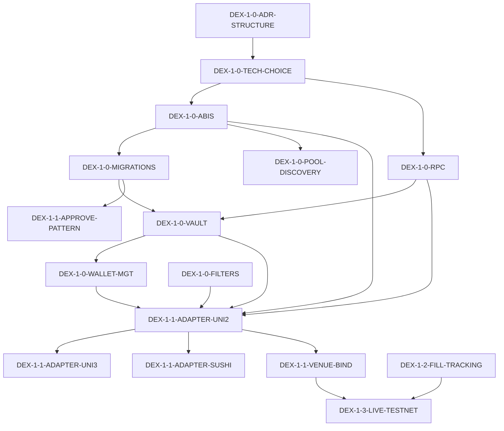

# Arbibot 2 — DEX план (index)

> **🎯 ОСНОВНОЙ РАБОЧИЙ ДОКУМЕНТ**
> Полные детали шагов — в файлах `dex/*.md`. Этот файл — навигация и прогресс.

**Прогресс:** 35/35 + DEX-2-0-ADR + DEX-2-1-BRIDGE-ACROSS + DEX-2-1-BRIDGE-STG + DEX-2-1-BRIDGE-NATIVE + DEX-2-2-PLAN → `done`. DEX-2 bridge adapters + multi-leg plan builder завершены.
**Обновлено:** 2026-05-20 (session 35)

## Файлы плана

| Файл | Содержание | Шаги |
|------|-----------|-------|
| [`dex/dex-1.0-foundation.md`](dex/dex-1.0-foundation.md) | Архитектура, tech choice, ABIS, RPC, миграции, pool discovery, vault, wallet, gas, risk policies, filters, env | DEX-1-0-* |
| [`dex/dex-1.1-adapters.md`](dex/dex-1.1-adapters.md) | Approve pattern, slippage, UniV2/V3/Sushi адаптеры, venue bind | DEX-1-1-* |
| [`dex/dex-1.2-observability.md`](dex/dex-1.2-observability.md) | Reconciliation on-chain, fill tracking, mempool, outbox events, health, metrics, load test | DEX-1-2-* |
| [`dex/dex-1.3-operations.md`](dex/dex-1.3-operations.md) | Paper testnet, live testnet, paper mainnet, live mainnet | DEX-1-3-* |
| [`dex/dex-1.4-networks.md`](dex/dex-1.4-networks.md) | Base, BNB Chain, Arbitrum | DEX-1-4-* |
| [`dex/dex-2-multichain.md`](dex/dex-2-multichain.md) | Cross-chain ADR, bridge adapters (Across, Stargate, native), multi-leg plan, recon, e2e | DEX-2-* |
| [`dex/dex-doc.md`](dex/dex-doc.md) | Frontend UI spec, runbooks (tx, bridge, rollback) | DEX-DOC-* |

## Целевой профиль

| Параметр | Решение |
|----------|---------|
| **Класс** | DEX ↔ DEX (single-chain → multi-chain) |
| **Сети** | EVM: **Arbitrum, Base, BNB Chain** |
| **Кошелёк** | Self-custody **EOA** |
| **DEX (Arbitrum)** | **Uniswap V2**, **Uniswap V3**, **SushiSwap** |
| **Порядок** | **Sequential:** DEX-1 → DEX-2 |
| **Bridges** | Across, Stargate, официальные мосты (L2) |
| **Ключи** | Базовый vault: шифрование at rest, audit, ротация |
| **Переходы** | Testnet paper → testnet live → mainnet paper → mainnet live |

## Прогресс по шагам

### DEX-1.0 — Архитектура и фундамент (12 шагов)

| step_id | Суть | Статус |
|---------|------|--------|
| `DEX-1-0-ADR-STRUCTURE` | ADR: размещение DEX-компонентов | ✅ done |
| `DEX-1-0-TECH-CHOICE` | ethers.js vs viem | ✅ done |
| `DEX-1-0-ABIS` | Пакет `@arbibot/contracts-eth` | ✅ done |
| `DEX-1-0-RPC` | RPC failover, health | ✅ done |
| `DEX-1-0-MIGRATIONS` | Миграции on-chain сущностей | ✅ done |
| `DEX-1-0-POOL-DISCOVERY` | Pool discovery + кэш | ✅ done |
| `DEX-1-0-VAULT` | Key vault: шифрование, audit | ✅ done |
| `DEX-1-0-WALLET-MGT` | Управление кошельками | ✅ done |
| `DEX-1-0-GAS` | Оценка газа, EIP-1559 | ✅ done |
| `DEX-1-0-RISK-POLICIES` | DEX risk policies | ✅ done |
| `DEX-1-0-FILTERS` | DEX opportunity filters | ✅ done |
| `DEX-1-0-ENV-EXAMPLE` | Env vars template | ✅ done |

### DEX-1.1 — Адаптеры (5 шагов)

| step_id | Суть | Статус |
|---------|------|--------|
| `DEX-1-1-APPROVE-PATTERN` | Approve/unapprove утилита | ✅ done |
| `DEX-1-1-SLIPPAGE` | Slippage protection | ✅ done |
| `DEX-1-1-ADAPTER-UNI2` | Uniswap V2 адаптер | ✅ done |
| `DEX-1-1-ADAPTER-UNI3` | Uniswap V3 адаптер | ✅ done |
| `DEX-1-1-ADAPTER-SUSHI` | SushiSwap адаптер | ✅ done |

### DEX-1.2 — Сверка и observability (7 шагов)

| step_id | Суть | Статус |
|---------|------|--------|
| `DEX-1-2-RECON-ONCHAIN` | On-chain reconciliation | ✅ done |
| `DEX-1-2-FILL-TRACKING` | Fill tracking | ✅ done |
| `DEX-1-2-MEMPOOL` | Mempool MEV detection | ✅ done |
| `DEX-1-2-OUTBOX-EVENTS` | Outbox DEX events | ✅ done |
| `DEX-1-2-HEALTH` | DEX health endpoints | ✅ done |
| `DEX-1-2-OBS` | Метрики, Grafana, SLO | ✅ done |
| `DEX-1-2-LOAD-TEST` | Нагрузочное тестирование | ✅ done |

### DEX-1.3 — Операционная последовательность (4 шага)

| step_id | Суть | Статус |
|---------|------|--------|
| `DEX-1-3-PAPER-TESTNET` | Paper + testnet | ✅ done |
| `DEX-1-3-LIVE-TESTNET` | Live testnet e2e | ✅ done |
| `DEX-1-3-PAPER-MAINNET` | Paper mainnet | ✅ done |
| `DEX-1-3-LIVE-MAINNET` | Mainnet live с лимитами | ✅ done |

### DEX-1.4 — Расширение сети (3 шага)

| step_id | Суть | Статус |
|---------|------|--------|
| `DEX-1-4-BASE` | Base chain | ✅ done |
| `DEX-1-4-BNB` | BNB Chain (Pancake/Biswap) | ✅ done |
| `DEX-1-4-ARBITRUM` | Arbitrum (UniV2/V3/Sushi + chainId fix) | ✅ done |

### DEX-2 — Multi-Chain (5 шагов)

| step_id | Суть | Статус |
|---------|------|--------|
| `DEX-2-0-ADR` | Cross-chain ADR | ✅ done |
| `DEX-2-1-BRIDGE-ACROSS` | Across adapter | ✅ done |
| `DEX-2-1-BRIDGE-STG` | Stargate adapter | ✅ done |
| `DEX-2-1-BRIDGE-NATIVE` | Native L2 bridges | ✅ done |
| `DEX-2-2-PLAN` | Multi-leg plan builder | ✅ done |
| `DEX-2-3-RECON-XCHAIN` | Cross-chain recon | 📋 planned |
| `DEX-2-4-E2E` | Multi-chain e2e | 📋 planned |

### Документация (4 шага)

| step_id | Суть | Статус |
|---------|------|--------|
| `DEX-DOC-FE` | Frontend UI spec | ✅ done |
| `DEX-DOC-RUNBOOK-TX` | Failed tx runbook | ✅ done |
| `DEX-DOC-RUNBOOK-BRIDGE` | Bridge runbook | 📋 planned |
| `DEX-DOC-ROLLBACK` | Rollback strategy | 📋 planned |

## Схема шага (расширенная)

Каждый шаг в `dex/*.md` содержит:

| Поле | Описание |
|------|----------|
| **depends_on** | Список `step_id` prerequisites |
| **risk_level** | `critical` | `high` | `medium` | `low` |
| **estimated_hours** | Оценка трудоёмкости |
| **outputs** | Конкретные deliverables |
| **test_commands** | Команды для проверки |
| **edge_cases** | Edge cases и error handling |
| **rollback_procedure** | Процедура отката |
| **ci_integration** | Интеграция с CI |
| **main_plan_prerequisites** | Зависимости от основного плана |

**Lifecycle:** `planned` → `approved` → `in_progress` → `implemented` → `reviewing` → `review_passed` → `done`

**Оркестрация ревью:** `.cursor/commands/review-step.md`

## Dependency Graph (DEX-1 Critical Path)

## Версия документа

- **v2.0** — 2026-05-12: разделение монолита на index + section files