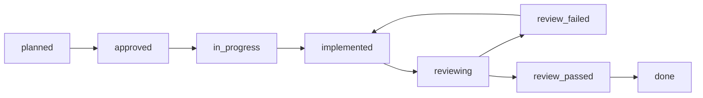

# Arbibot 2 — план разработки (последовательный)

Документ синхронизирован с:

- `!Arbibot_2_Architecture_v1_final_docs_settings.md` (модули, state machines, storage, события, сервисы §31, фазы §50, P0–P2 §28)
- `!Arbibot_2_Frontend_Spec_settings.md` (роуты, разделы, UX оператора)
- `!Arbibot_2_Tech_Stack_Proposal_settings.md` (стадии A–D, Stage 1–3, Config-1–3)

## Схема шага и прогресс

У каждого исполняемого пункта обязательны поля ниже. Прогресс ведите через **status** (чекбоксы не используются).

### Обязательный step lifecycle

Каждый пункт плана проходит состояния в поле **status**. Не перепрыгивайте этапы без явной записи в плане или ADR.

| Порядок | status | Смысл |
|---------|--------|--------|
| 1 | `planned` | В бэклоге, работа не начата |
| 2 | `approved` | Шаг принят к исполнению (scope и критерии согласованы) |
| 3 | `in_progress` | Активная разработка |
| 4 | `implemented` | Артефакты готовы со стороны исполнителя, до ревью |
| 5 | `reviewing` | Запущена проверка (рекомендуется команда **`/review-step`**) |
| 6a | `review_failed` | Есть critical/major — исправления, затем снова `implemented` → `reviewing` |
| 6b | `review_passed` | Блокирующих замечаний нет, ревью зафиксировано |
| 7 | `done` | Шаг закрыт |

**Ключевое правило:** перевод в **`done` допускается только после `review_passed`**. Путь `implemented` → `done` без `review_passed` запрещён.

**Исключение (наследие):** шаги **`BS-*`** («Сделано на старте репозитория») уже в `done` до введения процесса; при формальном аудите можно выставить цепочку `review_passed` → `done` или оставить как есть с пометкой в PR.

**Оркестрация ревью:** `.cursor/commands/review-step.md` — единая процедура перед `review_passed` / `done`.

### Поля шага

| Поле | Описание |
|------|----------|
| **step_id** | Уникальный идентификатор: `P{0-5}-{подсекция}-{код}`, `CFG-{1\|2\|3}`, `PRIO-P{0\|1\|2}-{код}`, `FE-ROUTE-{имя}`, `BS-{код}` для стартовых артефактов. |
| **phase** | `0`–`5` для дорожной карты; `config` для слоя конфигурации. Для `PRIO-*` — фаза основной поставки (см. goal). |
| **service** | Владелец/артефакт: имя сервиса, `monorepo`, `platform`, `apps/web`, `docs`, `infra`, `observability`, и т.п. |
| **goal** | Зачем шаг; при дубликате (матрица PRIO, роут) можно указать «канон: `step_id`». |
| **acceptance_criteria** | Проверяемые условия завершения. |
| **changed_areas** | Репозиторий, пакеты, спеки. |
| **review_required** | Ровно одно: `backend` \| `frontend` \| `architecture` — какой агент обязателен в дополнение к Architecture Guard. |
| **status** | Одно из: `planned` \| `approved` \| `in_progress` \| `implemented` \| `reviewing` \| `review_failed` \| `review_passed` \| `done` (см. lifecycle выше). |

**review_required:** доминирующий слой ревью (код Nest → `backend`, Next/UI → `frontend`, ADR/контракты без основного кода → `architecture`).

**Легенда кросс-потоков (§50.8):** в каждой фазе параллельно ведутся: доменный backend · execution/интеграции · платформа/observability/security · фронт/OpenClaw.

---

## Сделано на старте репозитория

#### `BS-MONOREPO` — Монорепо и Turbo

- **step_id:** `BS-MONOREPO`
- **phase:** `0`
- **service:** `monorepo`
- **goal:** Зафиксировать единый репозиторий с workspaces и сборкой Turbo.
- **acceptance_criteria:**
  - Корневой `package.json`, workspaces `apps/*`, `packages/*`, Turbo в рабочем состоянии.
- **changed_areas:** корень репозитория, `turbo.json` (если есть)
- **review_required:** `architecture`
- **status:** `done`

#### `BS-TSCONFIG` — Пакет `@arbibot/tsconfig`

- **step_id:** `BS-TSCONFIG`
- **phase:** `0`
- **service:** `packages/tsconfig`
- **goal:** Общие TS-конфиги для сервисов и приложений.
- **acceptance_criteria:**
  - Пакет `@arbibot/tsconfig` с `base.json`, `nest.json` подключается из приложений.
- **changed_areas:** `packages/tsconfig/`
- **review_required:** `backend`
- **status:** `done`

#### `BS-CONTRACTS` — Пакет `@arbibot/contracts`

- **step_id:** `BS-CONTRACTS`
- **phase:** `0`
- **service:** `packages/contracts`
- **goal:** Минимальные общие символы контрактов для старта.
- **acceptance_criteria:**
  - Пакет `@arbibot/contracts` опубликован в workspace и импортируется без ошибок типов.
- **changed_areas:** `packages/contracts/`
- **review_required:** `architecture`
- **status:** `done`

#### `BS-RISK-SKELETON` — Скелет Risk Service

- **step_id:** `BS-RISK-SKELETON`
- **phase:** `0`
- **service:** `apps/risk-service`
- **goal:** Рабочий скелет Risk API и домена (задел Phase 0 / Phase 1).
- **acceptance_criteria:**
  - NestJS + Fastify; `POST /evaluate-risk`, `GET /risk-decisions/:id`; DTO, домен, тесты на уровне скелета.
- **changed_areas:** `apps/risk-service/`
- **review_required:** `backend`
- **status:** `done`

#### `BS-WEB-SCAFFOLD` — Заготовка `apps/web`

- **step_id:** `BS-WEB-SCAFFOLD`
- **phase:** `0`
- **service:** `apps/web`
- **goal:** Каталог и заготовка под Next.js.
- **acceptance_criteria:**
  - Структура `apps/web/` согласована с дорожной картой фронта.
- **changed_areas:** `apps/web/`
- **review_required:** `frontend`
- **status:** `done`

#### `BS-INFRA-TOOLS` — Каталоги infra и tools

- **step_id:** `BS-INFRA-TOOLS`
- **phase:** `0`
- **service:** `infra`
- **goal:** Место для инфраструктуры и вспомогательных утилит.
- **acceptance_criteria:**
  - Каталоги `infra/`, `tools/` присутствуют в репозитории.
- **changed_areas:** `infra/`, `tools/`
- **review_required:** `architecture`
- **status:** `done`

#### `BS-ROOT-SPECS` — Спеки в корне

- **step_id:** `BS-ROOT-SPECS`
- **phase:** `0`
- **service:** `docs`
- **goal:** Архитектурные и продуктовые спеки доступны в корне репозитория.
- **acceptance_criteria:**
  - Основные `.md` спеки (архитектура, фронт, стек) лежат в корне и согласованы с ссылками в этом плане.
- **changed_areas:** корень репозитория (`*.md`)
- **review_required:** `architecture`
- **status:** `done`

---

## Phase 0 — подготовка и архитектурная фиксация

**Цель (§50.2):** убрать разрыв между архитектурой и инженерным исполнением.

### 0.1 Границы и контракты

**Ревью (2026-04-10):** по `.cursor/commands/review-step.md` выполнены `npm run lint`, `npm run build`, `npm test` из корня монорепо — успех. Architecture guard: в текущей кодовой базе не выявлено блокирующих нарушений single-writer, reservation-first и outbox/inbox (relay не пишет в чужие агрегаты). Условие `review_passed` зафиксировано; шаги ниже переведены в `done`.

#### `P0-0.1-SVCMAP` — Карта сервисов первой волны

- **step_id:** `P0-0.1-SVCMAP`
- **phase:** `0`
- **service:** `docs`
- **goal:** Зафиксировать карту сервисов §31.1: владелец, sync API vs events vs очереди.
- **acceptance_criteria:**
  - Документ ADR или `docs/services.md` согласован с архитектурой; перечислены сервисы первой волны и границы интеграций.
- **changed_areas:** `docs/`
- **review_required:** `architecture`
- **status:** `done`

#### `P0-0.1-AGG` — Агрегаты: владелец, хранилище, concurrency

- **step_id:** `P0-0.1-AGG`
- **phase:** `0`
- **service:** `docs`
- **goal:** Для каждого критичного агрегата задокументировать владельца записи, хранилище, optimistic concurrency (§9, §20.1).
- **acceptance_criteria:**
  - Таблица или раздел в спеке: агрегат → owner service → store → правила версионирования/конкуренции.
- **changed_areas:** `docs/`, при необходимости архитектурный `.md`
- **review_required:** `architecture`
- **status:** `done`

#### `P0-0.1-SQL` — Черновик SQL schema §20

- **step_id:** `P0-0.1-SQL`
- **phase:** `0`
- **service:** `docs`
- **goal:** Черновик схемы БД по таблицам §20 (минимальный набор ядра).
- **acceptance_criteria:**
  - Описаны сущности/таблицы: `risk_decisions`, `arbitrage_opportunities`, `capital_reservations`, `execution_plans`, `execution_legs`, `outbox_events`, `inbox_events`, `audit_log` (имена, ключи, связи на уровне черновика).
- **changed_areas:** `docs/`, возможно `infra/` миграции позже
- **review_required:** `architecture`
- **status:** `done`

#### `P0-0.1-OAPI` — Черновик OpenAPI §22

- **step_id:** `P0-0.1-OAPI`
- **phase:** `0`
- **service:** `docs`
- **goal:** Черновик OpenAPI для синхронных контрактов первой очереди (EvaluateRisk, ReserveCapital, ArmPlan, …).
- **acceptance_criteria:**
  - Файл или пакет спецификации с операциями и моделями DTO на уровне черновика, согласованный с §22.
- **changed_areas:** `docs/`, `packages/contracts` или отдельный openapi каталог
- **review_required:** `architecture`
- **status:** `done`

#### `P0-0.1-ASYNC` — Черновик AsyncAPI / JSON Schema §21

- **step_id:** `P0-0.1-ASYNC`
- **phase:** `0`
- **service:** `docs`
- **goal:** Envelope §21.1 и события §21.3 (SnapshotUpdated, RiskDecisionIssued, …) в виде схем.
- **acceptance_criteria:**
  - Черновик AsyncAPI и/или JSON Schema для envelope и перечисленных событий; поля `messageId`, `correlationId`, и т.д. по архитектуре.
- **changed_areas:** `docs/`, `packages/contracts`
- **review_required:** `architecture`
- **status:** `done`

#### `P0-0.1-APPR` — Модель approval destructive actions

- **step_id:** `P0-0.1-APPR`
- **phase:** `0`
- **service:** `docs`
- **goal:** Описать preview → подтверждение → audit для опасных действий оператора; согласовать с фронтом §5.4, §6.
- **acceptance_criteria:**
  - Документ с потоком approval; ссылка на UX-спеку; согласование с `!Arbibot_2_Frontend_Spec_settings.md`.
- **changed_areas:** `docs/`
- **review_required:** `architecture`
- **status:** `done`

### 0.2 State machines и политики

#### `P0-0.2-SM` — Формализация переходов агрегатов

- **step_id:** `P0-0.2-SM`
- **phase:** `0`
- **service:** `docs`
- **goal:** Формализовать переходы: ArbitrageOpportunity, RiskDecision, ExecutionPlan/Leg, CapitalReservation, PortfolioPosition (§19, §14).
- **acceptance_criteria:**
  - Диаграммы или таблицы переходов для Opportunity, RiskDecision, ExecutionPlan/Leg, CapitalReservation; согласованность с архитектурой; готовность к переносу в код/тесты.
  - Для `PortfolioPosition` в Phase 0 допускается зафиксированный placeholder/outline с явной пометкой, что полноценная state machine переносится в Phase 2 вместе с portfolio/reconciliation.
- **changed_areas:** `docs/`
- **review_required:** `architecture`
- **status:** `implemented`

#### `P0-0.2-RESV` — Reservation-first в контрактах

- **step_id:** `P0-0.2-RESV`
- **phase:** `0`
- **service:** `docs`
- **goal:** Зафиксировать reservation-first и запрет исполнения без reservation token (§24.1) в контрактах и sequence-диаграммах.
- **acceptance_criteria:**
  - Явные правила в OpenAPI/событиях/доках; диаграммы показывают обязательный reservation до arm/execute.
- **changed_areas:** `docs/`
- **review_required:** `architecture`
- **status:** `implemented`

#### `P0-0.2-PLAY` — Схема playbooks ExecutionPlan

- **step_id:** `P0-0.2-PLAY`
- **phase:** `0`
- **service:** `docs`
- **goal:** Partial fill / hedge / unwind — параметры уровня ExecutionPlan (§23) как конфигурируемая схема.
- **acceptance_criteria:**
  - Черновик схемы конфигурации playbook; связь с state machine плана.
- **changed_areas:** `docs/`
- **review_required:** `architecture`
- **status:** `implemented`

### 0.3 Безопасность и OpenClaw (baseline)

#### `P0-0.3-SEC` — Security baseline

- **step_id:** `P0-0.3-SEC`
- **phase:** `0`
- **service:** `platform`
- **goal:** Baseline: mTLS/сервисная идентификация, сегментация, ротация секретов (§8).
- **acceptance_criteria:**
  - Документ baseline; требования переносимы в Phase 1–2 инфраструктуру.
- **changed_areas:** `docs/`, `infra/` (черновик)
- **review_required:** `architecture`
- **status:** `planned`

#### `P0-0.3-OC` — OpenClaw не SoT; границы Operator API

- **step_id:** `P0-0.3-OC`
- **phase:** `0`
- **service:** `docs`
- **goal:** Черновик: OpenClaw не источник истины; границы Operator API (§49, Phase 5).
- **acceptance_criteria:**
  - Краткий ADR или раздел: что читает/пишет OpenClaw; запрет обхода policy control plane.
- **changed_areas:** `docs/`
- **review_required:** `architecture`
- **status:** `planned`

### 0.4 Инфраструктура и репозиторий

#### `P0-0.4-CI` — CI на PR

- **step_id:** `P0-0.4-CI`
- **phase:** `0`
- **service:** `platform`
- **goal:** GitHub Actions: lint/test/build на PR (стек Stage 1).
- **acceptance_criteria:**
  - Workflow запускается на PR; падает при ошибках lint/test/build для затронутых пакетов.
- **changed_areas:** `.github/workflows/`
- **review_required:** `backend`
- **status:** `implemented`

#### `P0-0.4-DOCK` — Docker / compose для dev

- **step_id:** `P0-0.4-DOCK`
- **phase:** `0`
- **service:** `infra`
- **goal:** Образы сервисов по мере появления или единый compose для локальной разработки.
- **acceptance_criteria:**
  - Документированный способ поднять зависимости локально (compose или аналог).
- **changed_areas:** `infra/`
- **review_required:** `architecture`
- **status:** `implemented`

#### `P0-0.4-VER` — Политика версионирования API

- **step_id:** `P0-0.4-VER`
- **phase:** `0`
- **service:** `docs`
- **goal:** Политика `schema_version` в envelope §21.1.
- **acceptance_criteria:**
  - Описаны правила инкремента версии схемы событий/API и совместимости.
- **changed_areas:** `docs/`
- **review_required:** `architecture`
- **status:** `implemented`

**Definition of Done (§50.2):** у каждого доменного агрегата — owner, lifecycle, persistence contract; у критичных событий — payload draft; у destructive actions — approval flow описан и согласован.

---

## Phase 1 — foundation platform

**Цель (§50.3):** production-capable скелет: путь opportunity → risk → reserve → arm в тестовой среде.

### 1.1 Данные и messaging

#### `P1-1.1-PG` — PostgreSQL миграции

- **step_id:** `P1-1.1-PG`
- **phase:** `1`
- **service:** `platform`
- **goal:** Миграции по schema §20, итеративно от ядра цепочки.
- **acceptance_criteria:**
  - Применяемые миграции; соответствие черновику §20; smoke-подключение из сервисов dev.
- **changed_areas:** `infra/`, сервисы с DB
- **review_required:** `backend`
- **status:** `implemented`

#### `P1-1.1-REDIS` — Redis кэш/координация

- **step_id:** `P1-1.1-REDIS`
- **phase:** `1`
- **service:** `platform`
- **goal:** Redis для кэша и координации по стеку.
- **acceptance_criteria:**
  - Подключение из dev/stage; политика использования задокументирована.
- **changed_areas:** `infra/`, backend-сервисы
- **review_required:** `backend`
- **status:** `implemented`

#### `P1-1.1-OIB` — Outbox / Inbox

- **step_id:** `P1-1.1-OIB`
- **phase:** `1`
- **service:** `platform`
- **goal:** Реализация outbox/inbox (§6.1, §20) без дублирования доменного эффекта при retry.
- **acceptance_criteria:**
  - Паттерн outbox/inbox в коде; идемпотентная обработка входящих; тесты на повтор доставки.
  - Текущий checkpoint в репо: transactional outbox для `RiskDecisionIssued`; inbox helper `tryClaimInboxMessage` приведён к реальной форме `QueryFailedError`/PG unique violation и покрыт unit-тестами в `packages/messaging`.
  - Зафиксировано (2026-04-10): `fetchLockedOutboxBatch` в `packages/messaging`; поллинг relay в `opportunity-service` (`OutboxRelayService`) **только для `RiskDecisionIssued`** → обновление `arbitrage_opportunities` до `risk_checked`. `processed_at` выставляется только при успешном доменном применении или идемпотентном совпадении; неизвестные типы и исчерпание retry → `relay_dead_letter_*` (см. `docs/outbox-inbox.md`, миграция `005`). Поведение relay закреплено service-level тестами в `opportunity-service`.
  - Остальные P0-события (`CapitalReserved`, `PlanArmed`, …) в релее **не** реализованы — отдельная задача. Транспорт Kafka/Redpanda — следующая итерация.
- **changed_areas:** общие библиотеки, сервисы-владельцы агрегатов
- **review_required:** `backend`
- **status:** `review_passed`

#### `P1-1.1-OBS` — Observability baseline

- **step_id:** `P1-1.1-OBS`
- **phase:** `1`
- **service:** `observability`
- **goal:** Метрики §26.1, структурированные логи, корреляция `correlation_id`.
- **acceptance_criteria:**
  - Единый формат логов; метрики базового набора; `correlation_id` проходит через sync вызовы.
  - Зафиксировано (2026-04-10): `installMetricsOnFastify` + `GET /metrics` (prom-client) во всех Nest-сервисах; заголовок `x-correlation-id` на цепочке opportunity→risk, orchestrator→capital, audit-client→audit.
- **changed_areas:** все новые сервисы Phase 1
- **review_required:** `backend`
- **status:** `review_passed`

### 1.2 Сервисы (минимальный вертикальный срез)

#### `P1-1.2-MKT` — Canonical Market Service

- **step_id:** `P1-1.2-MKT`
- **phase:** `1`
- **service:** `canonical-market-service`
- **goal:** Справочник, ResolveInstrument/Route.
- **acceptance_criteria:**
  - API/модуль согласован с контрактом; тесты на разрешение инструмента/маршрута.
- **changed_areas:** `apps/` или `services/` (как заведено в репо)
- **review_required:** `backend`
- **status:** `planned`

#### `P1-1.2-INTAKE` — Market Intake Service

- **step_id:** `P1-1.2-INTAKE`
- **phase:** `1`
- **service:** `market-intake-service`
- **goal:** Нормализованные snapshots, freshness (§18.2).
- **acceptance_criteria:**
  - Поток snapshot в хранилище/события; индикаторы свежести.
- **changed_areas:** новый сервис intake
- **review_required:** `backend`
- **status:** `planned`

#### `P1-1.2-OPP` — Opportunity Service

- **step_id:** `P1-1.2-OPP`
- **phase:** `1`
- **service:** `opportunity-service`
- **goal:** Lifecycle detected → enriched → risk_checked (§19.1).
- **acceptance_criteria:**
  - Состояния возможности согласованы со спекой; интеграция с risk intake.
  - Зафиксировано (2026-04-10): `POST .../enrich`, `POST .../request-risk-evaluation` (HTTP к risk-service), состояния `enriched` / `risk_checked`, колонка `risk_decision_id` (миграция `003`), outbox relay доводит событие асинхронно при необходимости.
  - После review-фиксов: `RiskClientService` сохраняет семантику статусов risk-service (`400` / `404` / `409` / `5xx`), а `packages/contracts` синхронизирован с маршрутами `enrich` / `request-risk-evaluation`; добавлены focused tests для relay и risk client.
- **changed_areas:** новый сервис opportunity
- **review_required:** `backend`
- **status:** `review_passed`

#### `P1-1.2-RISK` — Risk Service (расширение скелета)

- **step_id:** `P1-1.2-RISK`
- **phase:** `1`
- **service:** `apps/risk-service`
- **goal:** Персистентность, `ReserveRiskWindow`/лимиты, режимы fast/conservative/… (§11), публикация RiskDecisionIssued.
- **acceptance_criteria:**
  - Уже есть: скелет Nest+Fastify, `POST /evaluate-risk`, `GET /risk-decisions/:id`, DTO, домен, базовые тесты (`BS-RISK-SKELETON`).
  - Реализованный checkpoint: персистентность решений, режимы риска/лимиты, transactional outbox и envelope для `RiskDecisionIssued`; `notionalUsd` доведён до persistence, read DTO и event payload/schema.
  - Зафиксировано в репо (2026-04-09): опциональный `idempotencyKey` (UUID v4) на `POST /evaluate-risk`; колонки `idempotency_key`, `notional_usd` в `risk_decisions` и partial unique index (`infra/postgres/migrations/002_idempotency.sql`); повтор с тем же ключом и тем же payload → `200` + заголовок `X-Idempotent-Replayed`, без второй записи outbox; конфликт ключа и payload → `409`. Тесты в `risk.service.spec` / `risk.controller.spec`.
  - Зафиксировано (2026-04-10): `POST /reserve-risk-window`, таблица `risk_window_reservations`, опциональный `riskWindowReservationId` на evaluate с consume в одной транзакции; колонка `risk_window_reservation_id` на `risk_decisions`; ответ evaluate включает `outboxMessageId` при новой записи outbox.
- **changed_areas:** `apps/risk-service/`, `infra/postgres/migrations/`, `packages/persistence/`, контракты событий
- **review_required:** `backend`
- **status:** `review_passed`

#### `P1-1.2-CAP` — Capital Service

- **step_id:** `P1-1.2-CAP`
- **phase:** `1`
- **service:** `capital-service`
- **goal:** ReserveCapital, TTL резерва, привязка к `plan_id`.
- **acceptance_criteria:**
  - API резерва; истечение TTL; связь с execution plan в модели данных.
  - Зафиксировано в репо (2026-04-09): lazy lifecycle `active` → `expired` при `expires_at <= now` — `GET .../reservations/:id` в транзакции с `pessimistic_write` и сохранением; общий хелпер `materializeCapitalReservationExpiryIfNeeded` в `@arbibot/persistence`; юнит-тесты на хелпер в пакете persistence.
  - Single-writer сохранён: `execution-orchestrator` не пишет в `capital_reservations`, а использует pre-linked reservation как вход оркестрации.
  - Вне scope этого шага (при необходимости позже): фоновый cleanup, явный `POST release`, события по смене состояния резерва.
- **changed_areas:** `apps/capital-service/`, `packages/persistence/`
- **review_required:** `backend`
- **status:** `review_passed`

#### `P1-1.2-EXO` — Execution Orchestrator (скелет)

- **step_id:** `P1-1.2-EXO`
- **phase:** `1`
- **service:** `execution-orchestrator`
- **goal:** Скелет плана: planned → reserved → armed; venue mock допустим в Phase 1.
- **acceptance_criteria:**
  - State machine плана до `armed`; интеграция с capital reservation token; без реальных бирж опционально.
  - Зафиксировано в репо (2026-04-09): `ExecutionPlan` проходит `planned -> reserved -> armed`, переходы требуют pre-linked active capital reservation token и approved `RiskDecision`; orchestrator не мутирует `CapitalReservation` напрямую; тесты на state transitions и conflict-cases добавлены.
  - `ExecutionLeg` и полный execution lifecycle остаются вне scope этого шага и закрываются каноническим `P2-2.1-EPL`.
- **changed_areas:** новый сервис orchestrator
- **review_required:** `backend`
- **status:** `review_passed`

#### `P1-1.2-AUD` — Audit trail

- **step_id:** `P1-1.2-AUD`
- **phase:** `1`
- **service:** `audit-service` или модуль в платформе
- **goal:** Запись решений и операторских действий.
- **acceptance_criteria:**
  - Запись в `audit_log` или эквивалент; связь с correlation/idempotency.
  - Текущий checkpoint в репо: append/list API и persistence для audit entries.
  - Зафиксировано в репо (2026-04-09): опциональный `idempotencyKey` на `POST /audit/entries`; колонка `idempotency_key` + partial unique index в `002_idempotency.sql`; транзакция + `pessimistic_write`, повтор с тем же ключом и payload → `200` и `X-Idempotent-Replayed`, гонка по unique → догрузка строки; конфликт ключа и payload → `409`.
  - Зафиксировано (2026-04-10): `AuditClientService` в `@arbibot/nest-platform` (best-effort HTTP); автозапись из `risk-service` (EvaluateRisk, ReserveRiskWindow), `capital-service` (ReserveCapital), `execution-orchestrator` (LinkReservation, ArmPlan) с idempotency-ключами.
- **changed_areas:** `apps/audit-service/`, `infra/postgres/migrations/`, `packages/persistence/`, потребители (позже)
- **review_required:** `backend`
- **status:** `review_passed`

### 1.3 Фронтенд (базовый dashboard)

#### `P1-1.3-NEXT` — Next.js App Router в `apps/web`

- **step_id:** `P1-1.3-NEXT`
- **phase:** `1`
- **service:** `apps/web`
- **goal:** Инициализация Next.js App Router по стеку Frontend.
- **acceptance_criteria:**
  - `apps/web` собирается и запускается; TypeScript strict; базовая структура App Router.
- **changed_areas:** `apps/web/`
- **review_required:** `frontend`
- **status:** `implemented`

#### `P1-1.3-LAYOUT` — Layout, навигация, тема

- **step_id:** `P1-1.3-LAYOUT`
- **phase:** `1`
- **service:** `apps/web`
- **goal:** Top-nav, фильтры (§3), тёмная тема §7.
- **acceptance_criteria:**
  - Общий layout соответствует спеке; тема переключается/применена по умолчанию согласно §7.
  - Зафиксировано (2026-04-10): панель фильтров (поиск + state), переключатель light/dark с `localStorage`, FOUC-guard через inline script в `layout`.
- **changed_areas:** `apps/web/`
- **review_required:** `frontend`
- **status:** `implemented`

#### `P1-1.3-M1` — Dashboard M1

- **step_id:** `P1-1.3-M1`
- **phase:** `1`
- **service:** `apps/web`
- **goal:** `/dashboard` — capital overview, portfolio snapshot, opportunities, execution highlights, incidents (§5.1); от заглушек к read API.
- **acceptance_criteria:**
  - Страница `/dashboard` с секциями M1; контракт данных с backend задокументирован или типизирован.
  - Зафиксировано (2026-04-10): типы read-моделей в `apps/web/lib/*-types.ts`; превью opportunities + строки audit из read API; слоты incidents / capital остаются по спеке до Phase 2.
- **changed_areas:** `apps/web/`, BFF/API клиенты
- **review_required:** `frontend`
- **status:** `implemented`

#### `P1-1.3-STUBS` — Заглушки остальных роутов

- **step_id:** `P1-1.3-STUBS`
- **phase:** `1`
- **service:** `apps/web`
- **goal:** Заглушки `/portfolio`, `/opportunities`, `/execution`, `/tokens`, `/paper`, `/incidents`, `/runbooks`, `/openclaw`, `/settings`.
- **acceptance_criteria:**
  - Каждый роут из спеки §4 открывается (placeholder UI); навигация из layout.
- **changed_areas:** `apps/web/app/...`
- **review_required:** `frontend`
- **status:** `implemented`

**Definition of Done (§50.3):** snapshot → risk → reserve → arm в тесте; идемпотентность на дубликатах событий; базовые дашборды и audit timeline доступны оператору.

---

## Phase 2 — controlled execution

**Цель (§50.4):** controlled execution в ограниченном контуре + reconciliation + UI инцидентов.

### 2.1 Execution и портфель

#### `P2-2.1-VEN` — Venue Adapter Services

- **step_id:** `P2-2.1-VEN`
- **phase:** `2`
- **service:** `venue-adapters`
- **goal:** Первая волна CEX/DEX/RPC (стек Execution).
- **acceptance_criteria:**
  - Адаптеры с единым контрактом; sandbox/paper режим где требуется; тесты на ошибки API.
- **changed_areas:** новые сервисы/модули venue
- **review_required:** `backend`
- **status:** `planned`

#### `P2-2.1-EPL` — Полный цикл ExecutionPlan/Leg

- **step_id:** `P2-2.1-EPL`
- **phase:** `2`
- **service:** `execution-orchestrator`
- **goal:** Отправка, ack, partial fill, idempotency keys (§19.3–19.4).
- **acceptance_criteria:**
  - E2E сценарий в тестовом контуре; идемпотентность подтверждена тестами.
- **changed_areas:** orchestrator, venue adapters
- **review_required:** `backend`
- **status:** `planned`

#### `P2-2.1-FILL` — CommitFill / ReleaseReserve / ClosePosition

- **step_id:** `P2-2.1-FILL`
- **phase:** `2`
- **service:** `execution-orchestrator`
- **goal:** Реализация операций §21.2 с версионированием и идемпотентностью.
- **acceptance_criteria:**
  - Контракты и тесты на дубликаты команд; согласованность с reservation-first.
- **changed_areas:** orchestrator, capital, portfolio
- **review_required:** `backend`
- **status:** `planned`

#### `P2-2.1-PORT` — Portfolio Service

- **step_id:** `P2-2.1-PORT`
- **phase:** `2`
- **service:** `portfolio-service`
- **goal:** Позиции только из подтверждённых fills (§9, §19.6).
- **acceptance_criteria:**
  - Нет позиций без fill; reconciliation-ready модель.
- **changed_areas:** новый сервис portfolio
- **review_required:** `backend`
- **status:** `planned`

#### `P2-2.1-RECON` — Reconciliation Service

- **step_id:** `P2-2.1-RECON`
- **phase:** `2`
- **service:** `reconciliation-service`
- **goal:** Базовые mismatch cases (§24.3).
- **acceptance_criteria:**
  - Алерты/задачи на расхождения; документированные кейсы.
- **changed_areas:** новый сервис reconciliation
- **review_required:** `backend`
- **status:** `planned`

### 2.2 Политики и риск P1

#### `P2-2.2-PROF` — TokenProfile / RouteProfile

- **step_id:** `P2-2.2-PROF`
- **phase:** `2`
- **service:** `risk-service` / policy
- **goal:** Профили токена и маршрута (§14.4, §28.2 P1).
- **acceptance_criteria:**
  - Хранение и API чтения профилей; использование в risk/execution решениях.
- **changed_areas:** risk, config, DB
- **review_required:** `backend`
- **status:** `planned`

#### `P2-2.2-ADRISK` — Adaptive risk и dynamic sizing

- **step_id:** `P2-2.2-ADRISK`
- **phase:** `2`
- **service:** `risk-service`
- **goal:** Adaptive risk, dynamic sizing (§11, §25).
- **acceptance_criteria:**
  - Политики конфигурируемы; тесты на сценарии размера позиции.
- **changed_areas:** `apps/risk-service/`, config
- **review_required:** `backend`
- **status:** `planned`

#### `P2-2.2-PLAY` — Playbooks в бою

- **step_id:** `P2-2.2-PLAY`
- **phase:** `2`
- **service:** `execution-orchestrator`
- **goal:** Partial fill / hedge / unwind playbooks в продакшн-контуре (§23).
- **acceptance_criteria:**
  - Сценарии в staging; метрики и логи playbook run.
- **changed_areas:** orchestrator
- **review_required:** `backend`
- **status:** `planned`

### 2.3 Наблюдаемость и оператор

#### `P2-2.3-TRACE` — OpenTelemetry и алерты

- **step_id:** `P2-2.3-TRACE`
- **phase:** `2`
- **service:** `observability`
- **goal:** Трейсинг OpenTelemetry; алерты §26.2.
- **acceptance_criteria:**
  - Трассы сквозь ключевые сервисы; набор алертов задокументирован.
- **changed_areas:** все критичные сервисы, `infra/`
- **review_required:** `backend`
- **status:** `planned`

#### `P2-2.3-EXECUI` — UI `/execution`

- **step_id:** `P2-2.3-EXECUI`
- **phase:** `2`
- **service:** `apps/web`
- **goal:** Мастер-деталь планов, timeline, operator actions с preview (§5.4).
- **acceptance_criteria:**
  - Реальный UI на read API; preview для destructive действий.
- **changed_areas:** `apps/web`
- **review_required:** `frontend`
- **status:** `planned`

#### `P2-2.3-INCRB` — UI `/incidents` и `/runbooks`

- **step_id:** `P2-2.3-INCRB`
- **phase:** `2`
- **service:** `apps/web`
- **goal:** Каталог, шаги, audit (§5.7).
- **acceptance_criteria:**
  - Страницы связаны с backend; оператор видит историю и runbook шаги.
- **changed_areas:** `apps/web`
- **review_required:** `frontend`
- **status:** `planned`

#### `P2-2.3-GRAF` — Grafana dashboards

- **step_id:** `P2-2.3-GRAF`
- **phase:** `2`
- **service:** `observability`
- **goal:** Дашборды по стеку Observability.
- **acceptance_criteria:**
  - JSON/dashboards в репо или IaC; ключевые панели для latency/errors/бизнес-метрик.
- **changed_areas:** `infra/`, `tools/`
- **review_required:** `architecture`
- **status:** `planned`

**Definition of Done (§50.4):** end-to-end controlled execution; reconciliation закрывает базовые расхождения; оператор запускает runbooks безопасно.

---

## Phase 3 — paper trading и token discovery

**Цель (§50.5):** paper как механизм расширения universe, изоляция от live capital.

#### `P3-3-PAPER` — Paper Trading Service

- **step_id:** `P3-3-PAPER`
- **phase:** `3`
- **service:** `paper-trading-service`
- **goal:** Виртуальные buckets, тот же decision path (§13, §14.6).
- **acceptance_criteria:**
  - Изоляция от live capital; те же этапы что live в тестах.
- **changed_areas:** новый сервис paper
- **review_required:** `backend`
- **status:** `planned`

#### `P3-3-PAPER-UI` — UI `/paper`

- **step_id:** `P3-3-PAPER-UI`
- **phase:** `3`
- **service:** `apps/web`
- **goal:** Summary / By token / Promotion (§5.6).
- **acceptance_criteria:**
  - Три подраздела или эквивалент по спеке; данные с paper API.
- **changed_areas:** `apps/web`
- **review_required:** `frontend`
- **status:** `planned`

#### `P3-3-TOKENS` — UI `/tokens`

- **step_id:** `P3-3-TOKENS`
- **phase:** `3`
- **service:** `apps/web`
- **goal:** Lifecycle console, promotion workflow (§5.5).
- **acceptance_criteria:**
  - Состояния токена отображаются; workflow promotion согласован с backend.
- **changed_areas:** `apps/web`
- **review_required:** `frontend`
- **status:** `planned`

#### `P3-3-DISC` — Paper discovery и promotion queue

- **step_id:** `P3-3-DISC`
- **phase:** `3`
- **service:** `paper-trading-service` / opportunity
- **goal:** Paper-only discovery, очередь promotion, мониторинг paper vs live drift (§26.1).
- **acceptance_criteria:**
  - Очередь и метрики drift; алерты при отклонениях.
- **changed_areas:** paper, opportunity, observability
- **review_required:** `backend`
- **status:** `planned`

**Definition of Done (§50.5):** discovery → paper-only → candidate-live; paper изолирован от live capital; решения по promotion на истории.

---

## Phase 4 — scalability and breadth

**Цель (§50.6):** wide universe, tiers, backpressure, деградация сегментов.

#### `P4-4-TIER` — Hot / warm / cold tiers

- **step_id:** `P4-4-TIER`
- **phase:** `4`
- **service:** `platform`
- **goal:** Tiers, partitioning (§27.3, §7).
- **acceptance_criteria:**
  - Политика тиров в конфиге; маршрутизация нагрузки по tier.
- **changed_areas:** intake, config, infra
- **review_required:** `architecture`
- **status:** `planned`

#### `P4-4-SCORE` — Route scoring history и replay

- **step_id:** `P4-4-SCORE`
- **phase:** `4`
- **service:** `platform`
- **goal:** История скоринга маршрутов, replay layer (Stage 3 / §28.3).
- **acceptance_criteria:**
  - Хранение истории; воспроизведение сценария в offline/staging.
- **changed_areas:** analytics pipeline, storage
- **review_required:** `backend`
- **status:** `planned`

#### `P4-4-CH` — ClickHouse и latency tuning

- **step_id:** `P4-4-CH`
- **phase:** `4`
- **service:** `platform`
- **goal:** ClickHouse при росте аналитики; настройка latency контура.
- **acceptance_criteria:**
  - Критерии включения CH выполнены; SLO latency задокументированы.
- **changed_areas:** `infra/`, ETL
- **review_required:** `architecture`
- **status:** `planned`

#### `P4-4-UI` — UI degraded zones

- **step_id:** `P4-4-UI`
- **phase:** `4`
- **service:** `apps/web`
- **goal:** Явные degraded zones, coverage (§15).
- **acceptance_criteria:**
  - UI показывает деградацию сегментов согласованно с backend сигналами.
- **changed_areas:** `apps/web`
- **review_required:** `frontend`
- **status:** `planned`

**Definition of Done (§50.6):** расширенный universe; bulkhead; оператор видит throttling и degraded сегменты.

---

## Phase 5 — OpenClaw-assisted operations

**Цель (§50.7):** безопасная автоматизация оператора.

#### `P5-5-GW` — OpenClaw Gateway

- **step_id:** `P5-5-GW`
- **phase:** `5`
- **service:** `openclaw-gateway`
- **goal:** Self-hosted gateway, интеграция по стеку OpenClaw layer.
- **acceptance_criteria:**
  - Развёртывание документировано; безопасное подключение к Operator API.
- **changed_areas:** `infra/`, gateway сервис
- **review_required:** `architecture`
- **status:** `planned`

#### `P5-5-OAPI` — Operator API для OpenClaw

- **step_id:** `P5-5-OAPI`
- **phase:** `5`
- **service:** `operator-api`
- **goal:** Read models, approve-required actions для OpenClaw.
- **acceptance_criteria:**
  - Только approve-required мутации; аудит вызовов.
- **changed_areas:** новый API слой
- **review_required:** `backend`
- **status:** `planned`

#### `P5-5-OCUI` — UI `/openclaw`

- **step_id:** `P5-5-OCUI`
- **phase:** `5`
- **service:** `apps/web`
- **goal:** Status, Sessions, Approvals, Briefs (§5.8).
- **acceptance_criteria:**
  - Экраны по спеке; связь с gateway/Operator API.
- **changed_areas:** `apps/web`
- **review_required:** `frontend`
- **status:** `planned`

#### `P5-5-BRIEF` — Incident briefs и safe mode

- **step_id:** `P5-5-BRIEF`
- **phase:** `5`
- **service:** `openclaw-gateway` / `operator-api`
- **goal:** Briefs, safe mode и сценарии §48.
- **acceptance_criteria:**
  - Сценарии описаны и покрыты тестами/ручным чеклистом; policy не обходится.
- **changed_areas:** gateway, docs
- **review_required:** `architecture`
- **status:** `planned`

**Definition of Done (§50.7):** OpenClaw читает read models и запускает только approve-required workflows; policy control plane не обходится.

---

## Слой конфигурации (параллельно с Phase 1–2)

По `!Arbibot_2_Tech_Stack_Proposal_settings.md`:

### Config Stage 1–3

#### `CFG-1` — Config-1: read-only policy

- **step_id:** `CFG-1`
- **phase:** `config`
- **service:** `config-service`
- **goal:** Таблицы policy в PostgreSQL, read-only Config API, кэш Redis.
- **acceptance_criteria:**
  - Сервис отдаёт policy без мутаций; кэш инвалидация описана.
- **changed_areas:** новый config сервис, DB, Redis
- **review_required:** `backend`
- **status:** `planned`

#### `CFG-2` — Config-2: редактирование и approvals

- **step_id:** `CFG-2`
- **phase:** `config`
- **service:** `config-service`
- **goal:** Редактирование, approvals для чувствительных настроек, audit истории.
- **acceptance_criteria:**
  - Чувствительные ключи требуют approval; история изменений в audit.
- **changed_areas:** config service, `apps/web` операторский UI
- **review_required:** `backend`
- **status:** `planned`

#### `CFG-3` — Config-3: staged rollout

- **step_id:** `CFG-3`
- **phase:** `config`
- **service:** `config-service`
- **goal:** Staged rollout, rollback, per-scope overrides.
- **acceptance_criteria:**
  - Можно выкатить изменение на scope; откат без потери целостности.
- **changed_areas:** config service
- **review_required:** `backend`
- **status:** `planned`

---

## Опорная матрица P0 / P1 / P2 (архитектура §28)

Дубли приоритетов с отсылкой к каноническим шагам фаз.

### P0 — без этого live нельзя (§28.1)

#### `PRIO-P0-CANON` — Canonical market model

- **step_id:** `PRIO-P0-CANON`
- **phase:** `1`
- **service:** `canonical-market-service`
- **goal:** Каноническая модель рынка (критичность P0). Канон: `P1-1.2-MKT`.
- **acceptance_criteria:**
  - Критерии как у `P1-1.2-MKT`; live-блокирующий компонент задеплоен и проверен.
- **changed_areas:** как у канонического шага
- **review_required:** `backend`
- **status:** `planned`

#### `PRIO-P0-INTAKE` — Edge collectors / Market intake

- **step_id:** `PRIO-P0-INTAKE`
- **phase:** `1`
- **service:** `market-intake-service`
- **goal:** Сбор и нормализация рыночных данных. Канон: `P1-1.2-INTAKE`.
- **acceptance_criteria:**
  - Как у `P1-1.2-INTAKE`; покрытие минимального набора источников для go-live.
- **changed_areas:** как у канонического шага
- **review_required:** `backend`
- **status:** `planned`

#### `PRIO-P0-OPP` — Strategy intelligence (Opportunity)

- **step_id:** `PRIO-P0-OPP`
- **phase:** `1`
- **service:** `opportunity-service`
- **goal:** Обнаружение и обогащение возможностей. Канон: `P1-1.2-OPP`.
- **acceptance_criteria:**
  - Как у `P1-1.2-OPP`; интеграция с risk на пути к live.
- **changed_areas:** как у канонического шага
- **review_required:** `backend`
- **status:** `review_passed`

#### `PRIO-P0-RISK` — Risk and trust engine

- **step_id:** `PRIO-P0-RISK`
- **phase:** `1`
- **service:** `apps/risk-service`
- **goal:** Расширение risk engine до live-требований. Канон: `P1-1.2-RISK`.
- **acceptance_criteria:**
  - Как у `P1-1.2-RISK`; лимиты и публикация решений соответствуют P0.
- **changed_areas:** как у канонического шага
- **review_required:** `backend`
- **status:** `review_passed`

#### `PRIO-P0-CAP` — Capital reservation

- **step_id:** `PRIO-P0-CAP`
- **phase:** `1`
- **service:** `capital-service`
- **goal:** Резервирование капитала на пути к исполнению. Канон: `P1-1.2-CAP`.
- **acceptance_criteria:**
  - Как у `P1-1.2-CAP`; без резерва нет arm/execute в live.
- **changed_areas:** как у канонического шага
- **review_required:** `backend`
- **status:** `review_passed`

#### `PRIO-P0-EPL` — ExecutionPlan / ExecutionLeg state machine

- **step_id:** `PRIO-P0-EPL`
- **phase:** `1`
- **service:** `execution-orchestrator`
- **goal:** Корректная машина состояний плана и ног. Канон: `P1-1.2-EXO`, углубление `P2-2.1-EPL`.
- **acceptance_criteria:**
  - Состояния §19 соблюдены end-to-end в тестовом контуре перед live.
- **changed_areas:** orchestrator
- **review_required:** `backend`
- **status:** `in_progress`

#### `PRIO-P0-OIB` — Outbox / inbox

- **step_id:** `PRIO-P0-OIB`
- **phase:** `1`
- **service:** `platform`
- **goal:** Надёжная доставка событий. Канон: `P1-1.1-OIB`.
- **acceptance_criteria:**
  - Как у `P1-1.1-OIB`. **Фактический охват Phase 1:** end-to-end outbox→inbox→домен для **`RiskDecisionIssued` → opportunity-service**; прочие P0-потоки событий требуют отдельных publishers/consumers (не заявлены как сделанные).
- **changed_areas:** как у канонического шага
- **review_required:** `backend`
- **status:** `review_passed`

#### `PRIO-P0-RECON` — Reconciliation loop

- **step_id:** `PRIO-P0-RECON`
- **phase:** `2`
- **service:** `reconciliation-service`
- **goal:** Замкнутый контур сверки. Канон: `P2-2.1-RECON`.
- **acceptance_criteria:**
  - Как у `P2-2.1-RECON`; P0-кейсы mismatch закрываются процедурой.
- **changed_areas:** как у канонического шага
- **review_required:** `backend`
- **status:** `planned`

#### `PRIO-P0-AUD` — Audit trail

- **step_id:** `PRIO-P0-AUD`
- **phase:** `1`
- **service:** `audit-service`
- **goal:** Неизменяемый след решений для live. Канон: `P1-1.2-AUD`.
- **acceptance_criteria:**
  - Как у `P1-1.2-AUD`; покрытие P0 событий и операторских действий.
- **changed_areas:** как у канонического шага
- **review_required:** `backend`
- **status:** `review_passed`

### P1 — controlled production (§28.2)

#### `PRIO-P1-PROF` — TokenProfile и RouteProfile

- **step_id:** `PRIO-P1-PROF`
- **phase:** `2`
- **service:** `risk-service`
- **goal:** Профили для controlled production. Канон: `P2-2.2-PROF`.
- **acceptance_criteria:**
  - Как у `P2-2.2-PROF`.
- **changed_areas:** как у канонического шага
- **review_required:** `backend`
- **status:** `planned`

#### `PRIO-P1-ADRISK` — Adaptive risk

- **step_id:** `PRIO-P1-ADRISK`
- **phase:** `2`
- **service:** `risk-service`
- **goal:** Адаптивный риск. Канон: `P2-2.2-ADRISK`.
- **acceptance_criteria:**
  - Как у `P2-2.2-ADRISK`.
- **changed_areas:** как у канонического шага
- **review_required:** `backend`
- **status:** `planned`

#### `PRIO-P1-SIZE` — Dynamic sizing

- **step_id:** `PRIO-P1-SIZE`
- **phase:** `2`
- **service:** `risk-service`
- **goal:** Динамический сайзинг. Канон: `P2-2.2-ADRISK` (совместно с adaptive).
- **acceptance_criteria:**
  - Размер позиции вычисляется по политикам; тесты граничных случаев.
- **changed_areas:** risk, execution
- **review_required:** `backend`
- **status:** `planned`

#### `PRIO-P1-PLAY` — Partial fill playbooks

- **step_id:** `PRIO-P1-PLAY`
- **phase:** `2`
- **service:** `execution-orchestrator`
- **goal:** Playbooks в бою. Канон: `P2-2.2-PLAY`.
- **acceptance_criteria:**
  - Как у `P2-2.2-PLAY`.
- **changed_areas:** как у канонического шага
- **review_required:** `backend`
- **status:** `planned`

#### `PRIO-P1-DASH` — Operator dashboards (углубление)

- **step_id:** `PRIO-P1-DASH`
- **phase:** `2`
- **service:** `apps/web`
- **goal:** Углубление дашбордов после M1. Канон: `P1-1.3-M1`, `P2-2.3-EXECUI`, `P2-2.3-INCRB`.
- **acceptance_criteria:**
  - Операторские сценарии §5 закрыты для controlled production.
- **changed_areas:** `apps/web`
- **review_required:** `frontend`
- **status:** `planned`

#### `PRIO-P1-ALERT` — Alerts and tracing

- **step_id:** `PRIO-P1-ALERT`
- **phase:** `2`
- **service:** `observability`
- **goal:** Алерты и трейсинг. Канон: `P2-2.3-TRACE`, `P2-2.3-GRAF`.
- **acceptance_criteria:**
  - SLO и алерты согласованы с on-call.
- **changed_areas:** как у канонических шагов
- **review_required:** `architecture`
- **status:** `planned`

### P2 — качество и coverage (§28.3)

#### `PRIO-P2-PAPERDISC` — Paper token discovery

- **step_id:** `PRIO-P2-PAPERDISC`
- **phase:** `3`
- **service:** `paper-trading-service`
- **goal:** Discovery в paper. Канон: `P3-3-DISC`, `P3-3-PAPER`.
- **acceptance_criteria:**
  - Как у канонических шагов для сценария discovery.
- **changed_areas:** paper, opportunity
- **review_required:** `backend`
- **status:** `planned`

#### `PRIO-P2-TIER` — Auto-tiering watchlist

- **step_id:** `PRIO-P2-TIER`
- **phase:** `4`
- **service:** `platform`
- **goal:** Авто-тиринг watchlist. Канон: `P4-4-TIER`.
- **acceptance_criteria:**
  - Как у `P4-4-TIER` для watchlist use case.
- **changed_areas:** как у канонического шага
- **review_required:** `architecture`
- **status:** `planned`

#### `PRIO-P2-SCORE` — Route scoring history

- **step_id:** `PRIO-P2-SCORE`
- **phase:** `4`
- **service:** `platform`
- **goal:** История скоринга. Канон: `P4-4-SCORE`.
- **acceptance_criteria:**
  - Как у `P4-4-SCORE`.
- **changed_areas:** как у канонического шага
- **review_required:** `backend`
- **status:** `planned`

#### `PRIO-P2-PROMO` — Quality-based promotion to live

- **step_id:** `PRIO-P2-PROMO`
- **phase:** `3`
- **service:** `paper-trading-service`
- **goal:** Продвижение в live по качеству. Канон: `P3-3-DISC`, `P3-3-TOKENS`.
- **acceptance_criteria:**
  - Критерии promotion задокументированы и автоматизированы.
- **changed_areas:** paper, tokens UI/API
- **review_required:** `architecture`
- **status:** `planned`

#### `PRIO-P2-RECAL` — Recalibration jobs (Python)

- **step_id:** `PRIO-P2-RECAL`
- **phase:** `4`
- **service:** `tools` / Python analytics
- **goal:** Задачи перекалибровки по стеку analytics.
- **acceptance_criteria:**
  - Job запускается по расписанию; артефакты версионируются; без влияния на live без approval.
- **changed_areas:** `tools/`, возможно отдельный пакет Python
- **review_required:** `architecture`
- **status:** `planned`

---

## Фронтенд: маршруты (спека §4)

Закрывать по мере готовности backend read/write API. Каждый роут — отдельный шаг; частично пересекается с `P1-1.3-STUBS` и фазовыми UI-шагами — обновляйте **status** везде согласованно.

#### `FE-ROUTE-dashboard` — `/dashboard`

- **step_id:** `FE-ROUTE-dashboard`
- **phase:** `1`
- **service:** `apps/web`
- **goal:** Роут `/dashboard` по §4 и M1 §5.1. Канон: `P1-1.3-M1`.
- **acceptance_criteria:**
  - Страница доступна; контент согласован со спекой; данные от read API когда готовы.
  - Зафиксировано (2026-04-10): превью opportunities + audit timeline; слот incidents сохранён (Phase 2).
- **changed_areas:** `apps/web/app/dashboard` или эквивалент
- **review_required:** `frontend`
- **status:** `implemented`

#### `FE-ROUTE-portfolio` — `/portfolio`

- **step_id:** `FE-ROUTE-portfolio`
- **phase:** `1`
- **service:** `apps/web`
- **goal:** Роут `/portfolio` §4. Канон: `P1-1.3-STUBS`, затем данные с `P2-2.1-PORT`.
- **acceptance_criteria:**
  - Страница и навигация; интеграция с portfolio API в Phase 2+.
- **changed_areas:** `apps/web`
- **review_required:** `frontend`
- **status:** `implemented`

#### `FE-ROUTE-opportunities` — `/opportunities`

- **step_id:** `FE-ROUTE-opportunities`
- **phase:** `1`
- **service:** `apps/web`
- **goal:** Роут `/opportunities` §4. Канон: `P1-1.3-STUBS`, `P1-1.2-OPP`.
- **acceptance_criteria:**
  - Список/детали возможностей при готовности API.
  - Зафиксировано (2026-04-10): TanStack Table + `/opportunities/[id]` (деталь, payload JSON).
- **changed_areas:** `apps/web`
- **review_required:** `frontend`
- **status:** `implemented`

#### `FE-ROUTE-execution` — `/execution`

- **step_id:** `FE-ROUTE-execution`
- **phase:** `2`
- **service:** `apps/web`
- **goal:** Роут `/execution` §4. Канон: `P1-1.3-STUBS`, `P2-2.3-EXECUI`.
- **acceptance_criteria:**
  - Мастер-деталь и preview действий как в §5.4.
  - Текущий checkpoint в репо: route доступен как placeholder из `P1-1.3-STUBS`; перевод обратно в `implemented` только после функционального UI канонического шага `P2-2.3-EXECUI`.
- **changed_areas:** `apps/web`
- **review_required:** `frontend`
- **status:** `in_progress`

#### `FE-ROUTE-tokens` — `/tokens`

- **step_id:** `FE-ROUTE-tokens`
- **phase:** `3`
- **service:** `apps/web`
- **goal:** Роут `/tokens` §4. Канон: `P1-1.3-STUBS`, `P3-3-TOKENS`.
- **acceptance_criteria:**
  - Lifecycle и promotion UI по §5.5.
  - Текущий checkpoint в репо: route доступен как placeholder из `P1-1.3-STUBS`; перевод обратно в `implemented` только после функционального UI канонического шага `P3-3-TOKENS`.
- **changed_areas:** `apps/web`
- **review_required:** `frontend`
- **status:** `in_progress`

#### `FE-ROUTE-paper` — `/paper`

- **step_id:** `FE-ROUTE-paper`
- **phase:** `3`
- **service:** `apps/web`
- **goal:** Роут `/paper` §4. Канон: `P1-1.3-STUBS`, `P3-3-PAPER-UI`.
- **acceptance_criteria:**
  - Разделы §5.6 на странице.
  - Текущий checkpoint в репо: route доступен как placeholder из `P1-1.3-STUBS`; перевод обратно в `implemented` только после функционального UI канонического шага `P3-3-PAPER-UI`.
- **changed_areas:** `apps/web`
- **review_required:** `frontend`
- **status:** `in_progress`

#### `FE-ROUTE-incidents` — `/incidents`

- **step_id:** `FE-ROUTE-incidents`
- **phase:** `2`
- **service:** `apps/web`
- **goal:** Роут `/incidents` §4. Канон: `P1-1.3-STUBS`, `P2-2.3-INCRB`.
- **acceptance_criteria:**
  - Каталог инцидентов и связь с runbooks.
  - Текущий checkpoint в репо: route доступен как placeholder из `P1-1.3-STUBS`; перевод обратно в `implemented` только после функционального UI канонического шага `P2-2.3-INCRB`.
- **changed_areas:** `apps/web`
- **review_required:** `frontend`
- **status:** `in_progress`

#### `FE-ROUTE-runbooks` — `/runbooks`

- **step_id:** `FE-ROUTE-runbooks`
- **phase:** `2`
- **service:** `apps/web`
- **goal:** Роут `/runbooks` §4. Канон: `P1-1.3-STUBS`, `P2-2.3-INCRB`.
- **acceptance_criteria:**
  - Каталог и шаги §5.7.
  - Текущий checkpoint в репо: route доступен как placeholder из `P1-1.3-STUBS`; перевод обратно в `implemented` только после функционального UI канонического шага `P2-2.3-INCRB`.
- **changed_areas:** `apps/web`
- **review_required:** `frontend`
- **status:** `in_progress`

#### `FE-ROUTE-openclaw` — `/openclaw`

- **step_id:** `FE-ROUTE-openclaw`
- **phase:** `5`
- **service:** `apps/web`
- **goal:** Роут `/openclaw` §4. Канон: `P1-1.3-STUBS`, `P5-5-OCUI`.
- **acceptance_criteria:**
  - Экраны §5.8 подключены к gateway/Operator API.
  - Текущий checkpoint в репо: route доступен как placeholder из `P1-1.3-STUBS`; перевод обратно в `implemented` только после функционального UI канонического шага `P5-5-OCUI`.
- **changed_areas:** `apps/web`
- **review_required:** `frontend`
- **status:** `in_progress`

#### `FE-ROUTE-settings` — `/settings`

- **step_id:** `FE-ROUTE-settings`
- **phase:** `1`
- **service:** `apps/web`
- **goal:** Роут `/settings` §4. Канон: `P1-1.3-STUBS`, при необходимости `CFG-*`.
- **acceptance_criteria:**
  - Базовые настройки оператора; расширение при config layer.
  - Текущий checkpoint в репо: route доступен как placeholder из `P1-1.3-STUBS`; перевод обратно в `implemented` только после появления базовых операторских настроек.
- **changed_areas:** `apps/web`
- **review_required:** `frontend`
- **status:** `in_progress`

---

*Последнее обновление: 2026-04-10 — CI: `npm run lint` в GitHub Actions + общий `eslint.config.mjs`; OIB: outbox relay + inbox consumer в opportunity-service, dead-letter/retry semantics и service-level tests; opportunity↔risk lifecycle и миграции `003`/`004`; `RiskClientService` сохраняет HTTP semantics risk-service, контракты синхронизированы с `enrich` / `request-risk-evaluation`; audit sidecar из risk/capital/orchestrator; Prometheus `/metrics` + корреляция на sync-вызовах; Redis: `infra/docker-compose.dev.yml`, `createRedisClientFromEnv` в `@arbibot/nest-database`, политика в `infra/redis/README.md`; web: фильтры, theme toggle, TanStack Table, деталь opportunity и server-side RBAC. Phase 0.1 (`P0-0.1-*`): прогон `.cursor/commands/review-step.md` (lint/build/test + architecture guard) — `review_passed` зафиксирован в §0.1, статусы шагов `done`. `PRIO-P0-AUD` выровнен с `P1-1.2-AUD` (`implemented`).*
