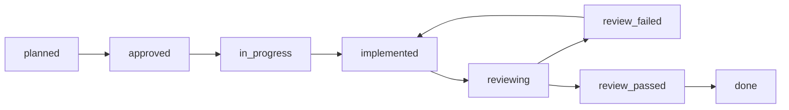

> **📋 АРХИВ — ВСЕ ШАГИ ВЫПОЛНЕНЫ (status: `done`)**
>
> Этот документ закрыт. Все фазы 0–5, CFG-1–3, PRIO-* и FE-ROUTE-* шаги выполнены.
> **Основной рабочий документ:** [`DEVELOPMENT_PLAN-DEX.md`](./DEVELOPMENT_PLAN-DEX.md)
>
> Не редактировать без явного запроса. При каждой задаче — работать с `DEVELOPMENT_PLAN-DEX.md`.

# Arbibot 2 — план разработки (последовательный) — ЗАВЕРШЁН ✅

Документ синхронизирован с:

- `!Arbibot_2_Architecture_v1_final_docs_settings.md` (модули, state machines, storage, события, сервисы §31, фазы §50, P0–P2 §28)
- `!Arbibot_2_Frontend_Spec_settings.md` (роуты, разделы, UX оператора)
- `!Arbibot_2_Tech_Stack_Proposal_settings.md` (стадии A–D, Stage 1–3, Config-1–3)

**Дополнение (не меняет нумерацию фаз §50):** шаг **`FE-SETTINGS-POLICY-WORKSPACE`** ниже — расширение операторского `/settings` (вкладки, effective-контекст в URL, реестр policy-ключей с Zod, формы intake/paper, каталог расширений, задел `opportunity.filters`). Канонические шаги **`CFG-3`**, **`FE-ROUTE-settings`** не отменяются; дополнение опирается на существующий BFF `/api/operator/settings/*` → config-service.

## Операционная последовательность первичного запуска (paper → live)

**Paper trading на стадии первичного запуска** — каноничный способ **сквозного операционного теста** всего продукта до выставления реальных средств: не замена автотестов, а прогон **реальной связки** сервисов, очередей, observability и операторского UI на **виртуальном капитале**.

1. **Сначала paper:** после готовности цепочки foundation + controlled execution (фазы плана §50.3–§50.4) система выводится в эксплуатацию в режиме paper — intake → canonical → opportunity → risk → capital → исполнение (виртуальные fills), все нужные **режимы и политики**, сбор **статистики** (качество маршрутов, задержки, drift-сигналы, инцидентные сценарии).
2. **Критерий перехода к live:** согласованные метрики и отсутствие блокирующих дефектов цепочки; процедуры оператора (runbooks, approvals) проверены на paper-нагрузке.
3. **Затем live с минимальным капиталом:** жёсткие лимиты и объёмы; paper по возможности **остаётся включённым** для сравнения paper vs live и расширения universe (§50.5).

Детали домена и изоляции: `!Arbibot_2_Architecture_v1_final_docs_settings.md` (§13, §50.5).

## Схема шага и прогресс

У каждого исполняемого пункта обязательны поля ниже. Прогресс ведите через **status** (чекбоксы не используются).

### Обязательный step lifecycle

Каждый пункт плана проходит состояния в поле **status**. Не перепрыгивайте этапы без явной записи в плане или ADR.

| Порядок | status | Смысл |
|---------|--------|--------|
| 1 | `planned` | В бэклоге, работа не начата |
| 2 | `approved` | Шаг принят к исполнению (scope и критерии согласованы) |
| 3 | `in_progress` | Активная разработка |
| 4 | `implemented` | Артефакты готовы со стороны исполнителя, до ревью |
| 5 | `reviewing` | Запущена проверка (рекомендуется команда **`/review-step`**) |
| 6a | `review_failed` | Есть critical/major — исправления, затем снова `implemented` → `reviewing` |
| 6b | `review_passed` | Блокирующих замечаний нет, ревью зафиксировано |
| 7 | `done` | Шаг закрыт |

**Ключевое правило:** перевод в **`done` допускается только после `review_passed`**. Путь `implemented` → `done` без `review_passed` запрещён.

**Исключение (наследие):** шаги **`BS-*`** («Сделано на старте репозитория») уже в `done` до введения процесса; при формальном аудите можно выставить цепочку `review_passed` → `done` или оставить как есть с пометкой в PR.

**Оркестрация ревью:** `.cursor/commands/review-step.md` — единая процедура перед `review_passed` / `done`.

### Поля шага

| Поле | Описание |
|------|----------|
| **step_id** | Уникальный идентификатор: `P{0-5}-{подсекция}-{код}`, `CFG-{1\|2\|3}`, `PRIO-P{0\|1\|2}-{код}`, `FE-ROUTE-{имя}`, `BS-{код}` для стартовых артефактов. |
| **phase** | `0`–`5` для дорожной карты; `config` для слоя конфигурации. Для `PRIO-*` — фаза основной поставки (см. goal). |
| **service** | Владелец/артефакт: имя сервиса, `monorepo`, `platform`, `apps/web`, `docs`, `infra`, `observability`, и т.п. |
| **goal** | Зачем шаг; при дубликате (матрица PRIO, роут) можно указать «канон: `step_id`». |
| **acceptance_criteria** | Проверяемые условия завершения. |
| **changed_areas** | Репозиторий, пакеты, спеки. |
| **review_required** | Ровно одно: `backend` \| `frontend` \| `architecture` — какой агент обязателен в дополнение к Architecture Guard. |
| **status** | Одно из: `planned` \| `approved` \| `in_progress` \| `implemented` \| `reviewing` \| `review_failed` \| `review_passed` \| `done` (см. lifecycle выше). |

**review_required:** доминирующий слой ревью (код Nest → `backend`, Next/UI → `frontend`, ADR/контракты без основного кода → `architecture`).

**Легенда кросс-потоков (§50.8):** в каждой фазе параллельно ведутся: доменный backend · execution/интеграции · платформа/observability/security · фронт/HERMES.

---

## Сделано на старте репозитория

#### `BS-MONOREPO` — Монорепо и Turbo

- **step_id:** `BS-MONOREPO`
- **phase:** `0`
- **service:** `monorepo`
- **goal:** Зафиксировать единый репозиторий с workspaces и сборкой Turbo.
- **acceptance_criteria:**
  - Корневой `package.json`, workspaces `apps/*`, `packages/*`, Turbo в рабочем состоянии.
- **changed_areas:** корень репозитория, `turbo.json` (если есть)
- **review_required:** `architecture`
- **status:** `done`

#### `BS-TSCONFIG` — Пакет `@arbibot/tsconfig`

- **step_id:** `BS-TSCONFIG`
- **phase:** `0`
- **service:** `packages/tsconfig`
- **goal:** Общие TS-конфиги для сервисов и приложений.
- **acceptance_criteria:**
  - Пакет `@arbibot/tsconfig` с `base.json`, `nest.json` подключается из приложений.
- **changed_areas:** `packages/tsconfig/`
- **review_required:** `backend`
- **status:** `done`

#### `BS-CONTRACTS` — Пакет `@arbibot/contracts`

- **step_id:** `BS-CONTRACTS`
- **phase:** `0`
- **service:** `packages/contracts`
- **goal:** Минимальные общие символы контрактов для старта.
- **acceptance_criteria:**
  - Пакет `@arbibot/contracts` опубликован в workspace и импортируется без ошибок типов.
- **changed_areas:** `packages/contracts/`
- **review_required:** `architecture`
- **status:** `done`

#### `BS-RISK-SKELETON` — Скелет Risk Service

- **step_id:** `BS-RISK-SKELETON`
- **phase:** `0`
- **service:** `apps/risk-service`
- **goal:** Рабочий скелет Risk API и домена (задел Phase 0 / Phase 1).
- **acceptance_criteria:**
  - NestJS + Fastify; `POST /evaluate-risk`, `GET /risk-decisions/:id`; DTO, домен, тесты на уровне скелета.
- **changed_areas:** `apps/risk-service/`
- **review_required:** `backend`
- **status:** `done`

#### `BS-WEB-SCAFFOLD` — Заготовка `apps/web`

- **step_id:** `BS-WEB-SCAFFOLD`
- **phase:** `0`
- **service:** `apps/web`
- **goal:** Каталог и заготовка под Next.js.
- **acceptance_criteria:**
  - Структура `apps/web/` согласована с дорожной картой фронта.
- **changed_areas:** `apps/web/`
- **review_required:** `frontend`
- **status:** `done`

#### `BS-INFRA-TOOLS` — Каталоги infra и tools

- **step_id:** `BS-INFRA-TOOLS`
- **phase:** `0`
- **service:** `infra`
- **goal:** Место для инфраструктуры и вспомогательных утилит.
- **acceptance_criteria:**
  - Каталоги `infra/`, `tools/` присутствуют в репозитории.
- **changed_areas:** `infra/`, `tools/`
- **review_required:** `architecture`
- **status:** `done`

#### `BS-ROOT-SPECS` — Спеки в корне

- **step_id:** `BS-ROOT-SPECS`
- **phase:** `0`
- **service:** `docs`
- **goal:** Архитектурные и продуктовые спеки доступны в корне репозитория.
- **acceptance_criteria:**
  - Основные `.md` спеки (архитектура, фронт, стек) лежат в корне и согласованы с ссылками в этом плане.
- **changed_areas:** корень репозитория (`*.md`)
- **review_required:** `architecture`
- **status:** `done`

---

## Phase 0 — подготовка и архитектурная фиксация

**Цель (§50.2):** убрать разрыв между архитектурой и инженерным исполнением.

### 0.1 Границы и контракты

**Ревью (2026-04-10):** по `.cursor/commands/review-step.md` выполнены `npm run lint`, `npm run build`, `npm test` из корня монорепо — успех. Architecture guard: в текущей кодовой базе не выявлено блокирующих нарушений single-writer, reservation-first и outbox/inbox (relay не пишет в чужие агрегаты). Условие `review_passed` зафиксировано; шаги ниже переведены в `done`.

#### `P0-0.1-SVCMAP` — Карта сервисов первой волны

- **step_id:** `P0-0.1-SVCMAP`
- **phase:** `0`
- **service:** `docs`
- **goal:** Зафиксировать карту сервисов §31.1: владелец, sync API vs events vs очереди.
- **acceptance_criteria:**
  - Документ ADR или `docs/services.md` согласован с архитектурой; перечислены сервисы первой волны и границы интеграций.
- **changed_areas:** `docs/`
- **review_required:** `architecture`
- **status:** `done`

#### `P0-0.1-AGG` — Агрегаты: владелец, хранилище, concurrency

- **step_id:** `P0-0.1-AGG`
- **phase:** `0`
- **service:** `docs`
- **goal:** Для каждого критичного агрегата задокументировать владельца записи, хранилище, optimistic concurrency (§9, §20.1).
- **acceptance_criteria:**
  - Таблица или раздел в спеке: агрегат → owner service → store → правила версионирования/конкуренции.
- **changed_areas:** `docs/`, при необходимости архитектурный `.md`
- **review_required:** `architecture`
- **status:** `done`

#### `P0-0.1-SQL` — Черновик SQL schema §20

- **step_id:** `P0-0.1-SQL`
- **phase:** `0`
- **service:** `docs`
- **goal:** Черновик схемы БД по таблицам §20 (минимальный набор ядра).
- **acceptance_criteria:**
  - Описаны сущности/таблицы: `risk_decisions`, `arbitrage_opportunities`, `capital_reservations`, `execution_plans`, `execution_legs`, `outbox_events`, `inbox_events`, `audit_log` (имена, ключи, связи на уровне черновика).
- **changed_areas:** `docs/`, возможно `infra/` миграции позже
- **review_required:** `architecture`
- **status:** `done`

#### `P0-0.1-OAPI` — Черновик OpenAPI §22

- **step_id:** `P0-0.1-OAPI`
- **phase:** `0`
- **service:** `docs`
- **goal:** Черновик OpenAPI для синхронных контрактов первой очереди (EvaluateRisk, ReserveCapital, ArmPlan, …).
- **acceptance_criteria:**
  - Файл или пакет спецификации с операциями и моделями DTO на уровне черновика, согласованный с §22.
- **changed_areas:** `docs/`, `packages/contracts` или отдельный openapi каталог
- **review_required:** `architecture`
- **status:** `done`

#### `P0-0.1-ASYNC` — Черновик AsyncAPI / JSON Schema §21

- **step_id:** `P0-0.1-ASYNC`
- **phase:** `0`
- **service:** `docs`
- **goal:** Envelope §21.1 и события §21.3 (SnapshotUpdated, RiskDecisionIssued, …) в виде схем.
- **acceptance_criteria:**
  - Черновик AsyncAPI и/или JSON Schema для envelope и перечисленных событий; поля `messageId`, `correlationId`, и т.д. по архитектуре.
- **changed_areas:** `docs/`, `packages/contracts`
- **review_required:** `architecture`
- **status:** `done`

#### `P0-0.1-APPR` — Модель approval destructive actions

- **step_id:** `P0-0.1-APPR`
- **phase:** `0`
- **service:** `docs`
- **goal:** Описать preview → подтверждение → audit для опасных действий оператора; согласовать с фронтом §5.4, §6.
- **acceptance_criteria:**
  - Документ с потоком approval; ссылка на UX-спеку; согласование с `!Arbibot_2_Frontend_Spec_settings.md`.
- **changed_areas:** `docs/`
- **review_required:** `architecture`
- **status:** `done`

### 0.2 State machines и политики

#### `P0-0.2-SM` — Формализация переходов агрегатов

- **step_id:** `P0-0.2-SM`
- **phase:** `0`
- **service:** `docs`
- **goal:** Формализовать переходы: ArbitrageOpportunity, RiskDecision, ExecutionPlan/Leg, CapitalReservation, PortfolioPosition (§19, §14).
- **acceptance_criteria:**
  - Диаграммы или таблицы переходов для Opportunity, RiskDecision, ExecutionPlan/Leg, CapitalReservation; согласованность с архитектурой; готовность к переносу в код/тесты.
  - Для `PortfolioPosition` в Phase 0 определена **baseline state machine** (минимальный набор состояний для reconciliation и fill processing):
    - **Состояния:** `draft` → `confirmed` (из fill) → `open` → `closed` | `error`
    - **Owner:** `portfolio-service` (single-writer)
    - **Transition invariants:**
      - `draft` → `confirmed`: только через `POST /positions/confirm-fill` с idempotency
      - `confirmed` → `open`: автоматический переход при успешном fill commit
      - `open` → `closed`: через `PositionClosed` событие или manual close
      - Любое состояние → `error`: при сбое reconciliation или validation failure
    - **Versioning:** `version` column для optimistic concurrency (аналогично другим агрегатам)
    - **Расширения Phase 2:** full state machine с hedge/unwind, position splits, partial close
- **changed_areas:** `docs/`
- **review_required:** `architecture`
- **status:** `done`
- **Зафиксировано (2026-04-10):** после полного `npm run lint` / `build` / `test` и проверки инвариантов (single-writer, reservation-first, outbox) — `review_passed` → `done`.

#### `P0-0.2-RESV` — Reservation-first в контрактах

- **step_id:** `P0-0.2-RESV`
- **phase:** `0`
- **service:** `docs`
- **goal:** Зафиксировать reservation-first и запрет исполнения без reservation token (§24.1) в контрактах и sequence-диаграммах.
- **acceptance_criteria:**
  - Явные правила в OpenAPI/событиях/доках; диаграммы показывают обязательный reservation до arm/execute.
- **changed_areas:** `docs/`
- **review_required:** `architecture`
- **status:** `done`
- **Зафиксировано (2026-04-10):** см. цепочку review для `P0-0.2-SM`.

#### `P0-0.2-PLAY` — Схема playbooks ExecutionPlan

- **step_id:** `P0-0.2-PLAY`
- **phase:** `0`
- **service:** `docs`
- **goal:** Partial fill / hedge / unwind — параметры уровня ExecutionPlan (§23) как конфигурируемая схема.
- **acceptance_criteria:**
  - Черновик схемы конфигурации playbook; связь с state machine плана.
- **changed_areas:** `docs/`
- **review_required:** `architecture`
- **status:** `done`
- **Зафиксировано (2026-04-10):** см. цепочку review для `P0-0.2-SM`.

### 0.3 Безопасность и HERMES (baseline)

#### `P0-0.3-SEC` — Security baseline

- **step_id:** `P0-0.3-SEC`
- **phase:** `0`
- **service:** `platform`
- **goal:** Baseline: mTLS/сервисная идентификация, сегментация, ротация секретов (§8).
- **acceptance_criteria:**
  - Документ baseline; требования переносимы в Phase 1–2 инфраструктуру.
- **changed_areas:** `docs/`, `infra/` (черновик)
- **review_required:** `architecture`
- **status:** `done`
- **Зафиксировано (2026-04-11):** черновик [`docs/security-baseline.md`](../../docs/security-baseline.md) (mTLS, сервисная идентичность, сегментация, ротация секретов, ссылки на dev-практики).
- **Ревью (2026-04-12):** документ baseline актуален; корневой lint/build/test монорепо — успех на момент закрытия; `review_passed` → `done`.

#### `P0-0.3-OC` — HERMES не SoT; границы Operator API

- **step_id:** `P0-0.3-OC`
- **phase:** `0`
- **service:** `docs`
- **goal:** Черновик: HERMES не источник истины; границы Operator API (§49, Phase 5).
- **acceptance_criteria:**
  - Краткий ADR или раздел: что читает/пишет HERMES; запрет обхода policy control plane.
- **changed_areas:** `docs/`
- **review_required:** `architecture`
- **status:** `done`
- **Зафиксировано (2026-04-11):** черновик [`docs/hermes-operator-boundaries.md`](../../docs/hermes-operator-boundaries.md) (hermes не SoT, read/write только через Operator API и RBAC/approval).
- **Ревью (2026-04-12):** границы согласованы с текущим operator UI; корневой lint/build/test — успех; `review_passed` → `done`.

### 0.4 Инфраструктура и репозиторий

#### `P0-0.4-CI` — CI на PR

- **step_id:** `P0-0.4-CI`
- **phase:** `0`
- **service:** `platform`
- **goal:** GitHub Actions: lint/test/build на PR (стек Stage 1).
- **acceptance_criteria:**
  - Workflow запускается на PR; падает при ошибках lint/test/build для затронутых пакетов.
- **changed_areas:** `.github/workflows/`
- **review_required:** `backend`
- **status:** `done`
- **Зафиксировано (2026-04-11):** workflow [`.github/workflows/ci.yml`](../../.github/workflows/ci.yml) — Node 22, `npm ci`, `lint` / `build` / `test` на push/PR в `main`/`master`; корневой прогон `npm run lint` / `build` / `test` — успех.
- **Ревью (2026-04-12):** повторный корневой lint/build/test — успех; `review_passed` → `done`.

#### `P0-0.4-DOCK` — Docker / compose для dev

- **step_id:** `P0-0.4-DOCK`
- **phase:** `0`
- **service:** `infra`
- **goal:** Образы сервисов по мере появления или единый compose для локальной разработки.
- **acceptance_criteria:**
  - Документированный способ поднять зависимости локально (compose или аналог).
- **changed_areas:** `infra/`
- **review_required:** `architecture`
- **status:** `done`
- **Зафиксировано (2026-04-10):** опциональный профиль `bus` — Redpanda (Kafka API) на порту `19092` для локальной публикации outbox → шина; см. комментарии в `infra/docker-compose.dev.yml` и `docs/outbox-inbox.md`.
- **Ревью (2026-04-12):** acceptance по compose/README и шине подтверждён документацией; корневой `npm run lint` / `build` / `test` — успех; `review_passed` → `done`.

#### `P0-0.4-VER` — Политика версионирования API

- **step_id:** `P0-0.4-VER`
- **phase:** `0`
- **service:** `docs`
- **goal:** Политика `schema_version` в envelope §21.1.
- **acceptance_criteria:**
  - Описаны правила инкремента версии схемы событий/envelope и совместимости.
  - Для sync REST/OpenAPI допустим отдельный policy note/ADR по мере появления production-facing versioning strategy.
- **changed_areas:** `docs/`
- **review_required:** `architecture`
- **status:** `done`
- **Ревью (2026-04-12):** расширен раздел «Версионирование схем» в [`docs/async-events.md`](../../docs/async-events.md) (синхронизация `version`/`schema_version` с JSON Schema, minor/breaking, REST note); корневой `npm run lint` / `build` / `test` — успех; `review_passed` → `done`.

**Definition of Done (§50.2):** у каждого доменного агрегата — owner, lifecycle, persistence contract; у критичных событий — payload draft; у destructive actions — approval flow описан и согласован.

---

## Phase 1 — foundation platform

**Цель (§50.3):** production-capable скелет: путь opportunity → risk → reserve → arm в тестовой среде.

### 1.1 Данные и messaging

#### `P1-1.1-PG` — PostgreSQL миграции

- **step_id:** `P1-1.1-PG`
- **phase:** `1`
- **service:** `platform`
- **goal:** Миграции по schema §20, итеративно от ядра цепочки.
- **acceptance_criteria:**
  - Применяемые миграции; соответствие черновику §20; smoke-подключение из сервисов dev.
- **changed_areas:** `infra/`, сервисы с DB
- **review_required:** `backend`
- **status:** `done`
- **Ревью (2026-04-12):** применяемые миграции `infra/postgres/migrations/*` и подключение TypeORM в сервисах согласованы с текущим репо; корневой `npm run lint` / `build` / `test` — успех; `implemented` → `review_passed` → `done` (foundation Phase 1).

#### `P1-1.1-REDIS` — Redis кэш/координация

- **step_id:** `P1-1.1-REDIS`
- **phase:** `1`
- **service:** `platform`
- **goal:** Redis для кэша и координации по стеку.
- **acceptance_criteria:**
  - Подключение из dev/stage; политика использования задокументирована.
  - Зафиксировано (2026-04-11): `canonical-market-service` — глобальный `RedisModule` / `RedisConnection` (lifecycle), cache-aside успешных ответов `resolveInstrument` / `resolveRoute` (TTL 90s, ключи `arb:canonical:ri:v1:*` / `arb:canonical:rr:v1:*`), деградация при отсутствии `REDIS_URL` или ошибках Redis; unit-тесты на hit/throw; см. `infra/redis/README.md`.
- **changed_areas:** `infra/`, backend-сервисы
- **review_required:** `backend`
- **status:** `done`
- **Ревью (2026-04-12):** реальное использование Redis в Phase 1 подтверждено (`canonical-market-service`); корневой lint/build/test — успех; `implemented` → `review_passed` → `done` (foundation Phase 1).

#### `P1-1.1-OIB` — Outbox / Inbox

- **step_id:** `P1-1.1-OIB`
- **phase:** `1`
- **service:** `platform`
- **goal:** Реализация outbox/inbox (§6.1, §20) без дублирования доменного эффекта при retry.
- **acceptance_criteria:**
  - Паттерн outbox/inbox в коде; идемпотентная обработка входящих; тесты на повтор доставки.
  - Текущий checkpoint в репо: transactional outbox для `RiskDecisionIssued` и для **`PaperPromotionCandidateRequested`** (`paper-enqueue`); inbox helper `tryClaimInboxMessage` приведён к реальной форме `QueryFailedError`/PG unique violation и покрыт unit-тестами в `packages/messaging`.
  - Зафиксировано (2026-04-10, уточнено 2026-04-17): `fetchLockedOutboxBatch` в `packages/messaging`; поллинг relay в `opportunity-service` (`OutboxRelayService`) по **allowlist типов**: **`RiskDecisionIssued`** → обновление `arbitrage_opportunities` до `risk_checked`; **`PaperPromotionCandidateRequested`** (Phase 3) → HTTP в **`paper-trading-service`** при **`PAPER_TRADING_SERVICE_URL`** (без синхронного POST из handler `paper-enqueue`; дедуп необработанного `paper-enqueue` в outbox — миграция **`018`**). `processed_at` выставляется только при успешном доменном применении или идемпотентном совпадении; неизвестные типы и исчерпание retry → `relay_dead_letter_*` (см. [`docs/outbox-inbox.md`](../../docs/outbox-inbox.md), миграция `005`). Поведение relay закреплено service-level тестами в `opportunity-service`.
  - Зафиксировано (2026-04-10): `fetchLockedOutboxBatch(em, limit, eventTypes)` фильтрует строки по `event_type` — общая таблица `outbox_events` не блокируется чужими событиями (например `SnapshotUpdated` из `market-intake-service`).
  - Исторический checkpoint (2026-04-10): `@arbibot/outbox-kafka-bridge` начинал с публикации только `SnapshotUpdated`; актуальный **allowlist публикации на шину** — в следующем пункте.
  - Зафиксировано (2026-04-12): transactional outbox + envelope для **`CapitalReserved`** в `capital-service` (`POST /capital/reservations`); для **`PlanArmed`** в `execution-orchestrator` (`POST .../arm`); `@arbibot/outbox-kafka-bridge` публикует на шину **`SnapshotUpdated`**, **`CapitalReserved`**, **`PlanArmed`**, **`LegFilled`**, **`PlanCompleted`** (тот же топик и TX-паттерн `processed_at`). Smoke-consumer с `tryClaimInboxMessage` (`consumer_id` по умолчанию `outbox-kafka-bridge-smoke`). Скрипты корня: `npm run bus:publish`, `npm run bus:consume`; compose-профиль `bus`. **In-DB relay** в `opportunity-service` — отдельный allowlist (`RiskDecisionIssued`, `PaperPromotionCandidateRequested`); не смешивать с allowlist Kafka-bridge (см. [`docs/outbox-inbox.md`](../../docs/outbox-inbox.md)). Прочие P0-события на шине — по мере появления publisher-владельцев.
- **changed_areas:** общие библиотеки, сервисы-владельцы агрегатов
- **review_required:** `backend`
- **status:** `done`
- **Ревью (2026-04-12):** корневой lint/build/test — успех; `review_passed` → `done` (foundation Phase 1).

#### `P1-1.1-OBS` — Observability baseline

- **step_id:** `P1-1.1-OBS`
- **phase:** `1`
- **service:** `observability`
- **goal:** Метрики §26.1, структурированные логи, корреляция `correlation_id`.
- **acceptance_criteria:**
  - Единый формат логов; метрики базового набора; `correlation_id` проходит через sync вызовы.
  - Зафиксировано (2026-04-10): `installMetricsOnFastify` + `GET /metrics` (prom-client) во всех Nest-сервисах; заголовок `x-correlation-id` на цепочке opportunity→risk, orchestrator→capital, audit-client→audit.
- **changed_areas:** все новые сервисы Phase 1
- **review_required:** `backend`
- **status:** `done`
- **Ревью (2026-04-12):** корневой lint/build/test — успех; `review_passed` → `done` (foundation Phase 1).

### 1.2 Сервисы (минимальный вертикальный срез)

#### `P1-1.2-MKT` — Canonical Market Service

- **step_id:** `P1-1.2-MKT`
- **phase:** `1`
- **service:** `canonical-market-service`
- **goal:** Справочник, ResolveInstrument/Route.
- **acceptance_criteria:**
  - API/модуль согласован с контрактом; тесты на разрешение инструмента/маршрута.
- **changed_areas:** `apps/` или `services/` (как заведено в репо)
- **review_required:** `backend`
- **status:** `done`
- **Зафиксировано (2026-04-10):** `apps/canonical-market-service` (Nest+Fastify, порт `3014`), миграция `006_canonical_market.sql`, сущности в `@arbibot/persistence`, `POST /market/resolve-instrument`, `POST /market/resolve-route`, unit-тесты `MarketService`; OpenAPI и `CANONICAL_HTTP_ROUTES` в `packages/contracts`.
- **Ревью (2026-04-12):** корневой lint/build/test — успех; `review_passed` → `done` (foundation Phase 1).

#### `P1-1.2-INTAKE` — Market Intake Service

- **step_id:** `P1-1.2-INTAKE`
- **phase:** `1`
- **service:** `market-intake-service`
- **goal:** Нормализованные snapshots, freshness (§18.2).
- **acceptance_criteria:**
  - Поток snapshot в хранилище/события; индикаторы свежести.
- **changed_areas:** новый сервис intake
- **review_required:** `backend`
- **status:** `done`
- **Зафиксировано (2026-04-10):** `apps/market-intake-service` (порт `3015`), миграция `007_market_snapshots.sql`, `POST /snapshots/ingest` + `GET /snapshots` с `freshness.isStale`, transactional outbox `SnapshotUpdated` (`EVENT_NAMES.snapshotUpdated`, payload/schema v2 в `packages/contracts`); unit-тесты `SnapshotsService`; миграция `008` (idempotency ingest + unique directed route pair). Публикация `SnapshotUpdated` на шину — `@arbibot/outbox-kafka-bridge` (см. `P1-1.1-OIB`).
- **Ревью (2026-04-12):** корневой lint/build/test — успех; `review_passed` → `done` (foundation Phase 1).

#### `P1-1.2-OPP` — Opportunity Service

- **step_id:** `P1-1.2-OPP`
- **phase:** `1`
- **service:** `opportunity-service`
- **goal:** Lifecycle detected → enriched → risk_checked (§19.1).
- **acceptance_criteria:**
  - Состояния возможности согласованы со спекой; интеграция с risk intake.
  - Зафиксировано (2026-04-10): `POST .../enrich`, `POST .../request-risk-evaluation` (HTTP к risk-service), состояния `enriched` / `risk_checked`, колонка `risk_decision_id` (миграция `003`), outbox relay доводит событие асинхронно при необходимости.
  - После review-фиксов: `RiskClientService` сохраняет семантику статусов risk-service (`400` / `404` / `409` / `5xx`), а `packages/contracts` синхронизирован с маршрутами `enrich` / `request-risk-evaluation`; добавлены focused tests для relay и risk client.
- **changed_areas:** новый сервис opportunity
- **review_required:** `backend`
- **status:** `done`
- **Ревью (2026-04-12):** корневой lint/build/test — успех; `review_passed` → `done` (foundation Phase 1).

#### `P1-1.2-RISK` — Risk Service (расширение скелета)

- **step_id:** `P1-1.2-RISK`
- **phase:** `1`
- **service:** `apps/risk-service`
- **goal:** Персистентность, `ReserveRiskWindow`/лимиты, режимы fast/conservative/… (§11), публикация RiskDecisionIssued.
- **acceptance_criteria:**
  - Уже есть: скелет Nest+Fastify, `POST /evaluate-risk`, `GET /risk-decisions/:id`, DTO, домен, базовые тесты (`BS-RISK-SKELETON`).
  - Реализованный checkpoint: персистентность решений, режимы риска/лимиты, transactional outbox и envelope для `RiskDecisionIssued`; `notionalUsd` доведён до persistence, read DTO и event payload/schema.
  - Зафиксировано в репо (2026-04-09): опциональный `idempotencyKey` (UUID v4) на `POST /evaluate-risk`; колонки `idempotency_key`, `notional_usd` в `risk_decisions` и partial unique index (`infra/postgres/migrations/002_idempotency.sql`); повтор с тем же ключом и тем же payload → `200` + заголовок `X-Idempotent-Replayed`, без второй записи outbox; конфликт ключа и payload → `409`. Тесты в `risk.service.spec` / `risk.controller.spec`.
  - Зафиксировано (2026-04-10): `POST /reserve-risk-window`, таблица `risk_window_reservations`, опциональный `riskWindowReservationId` на evaluate с consume в одной транзакции; колонка `risk_window_reservation_id` на `risk_decisions`; ответ evaluate включает `outboxMessageId` при новой записи outbox.
- **changed_areas:** `apps/risk-service/`, `infra/postgres/migrations/`, `packages/persistence/`, контракты событий
- **review_required:** `backend`
- **status:** `done`
- **Ревью (2026-04-12):** корневой lint/build/test — успех; `review_passed` → `done` (foundation Phase 1).

#### `P1-1.2-CAP` — Capital Service

- **step_id:** `P1-1.2-CAP`
- **phase:** `1`
- **service:** `capital-service`
- **goal:** ReserveCapital, TTL резерва, привязка к `plan_id`.
- **acceptance_criteria:**
  - API резерва; истечение TTL; связь с execution plan в модели данных.
  - Зафиксировано в репо (2026-04-09): lazy lifecycle `active` → `expired` при `expires_at <= now` — `GET .../reservations/:id` в транзакции с `pessimistic_write` и сохранением; общий хелпер `materializeCapitalReservationExpiryIfNeeded` в `@arbibot/persistence`; юнит-тесты на хелпер в пакете persistence.
  - Single-writer сохранён: `execution-orchestrator` не пишет в `capital_reservations`, а использует pre-linked reservation как вход оркестрации.
  - Вне scope этого шага (при необходимости позже): фоновый cleanup, явный `POST release`, события по смене состояния резерва.
- **changed_areas:** `apps/capital-service/`, `packages/persistence/`
- **review_required:** `backend`
- **status:** `done`
- **Ревью (2026-04-12):** корневой lint/build/test — успех; `review_passed` → `done` (foundation Phase 1).

#### `P1-1.2-EXO` — Execution Orchestrator (скелет)

- **step_id:** `P1-1.2-EXO`
- **phase:** `1`
- **service:** `execution-orchestrator`
- **goal:** Скелет плана: planned → reserved → armed; venue mock допустим в Phase 1.
- **acceptance_criteria:**
  - State machine плана до `armed`; интеграция с capital reservation token; без реальных бирж опционально.
  - Зафиксировано в репо (2026-04-09): `ExecutionPlan` проходит `planned -> reserved -> armed`, переходы требуют pre-linked active capital reservation token и approved `RiskDecision`; orchestrator не мутирует `CapitalReservation` напрямую; тесты на state transitions и conflict-cases добавлены.
  - `ExecutionLeg` и полный execution lifecycle остаются вне scope этого шага и закрываются каноническим `P2-2.1-EPL`.
- **changed_areas:** новый сервис orchestrator
- **review_required:** `backend`
- **status:** `done`
- **Ревью (2026-04-12):** корневой lint/build/test — успех; `review_passed` → `done` (foundation Phase 1; полный leg lifecycle — `P2-2.1-EPL`).

#### `P1-1.2-AUD` — Audit trail

- **step_id:** `P1-1.2-AUD`
- **phase:** `1`
- **service:** `audit-service` или модуль в платформе
- **goal:** Запись решений и операторских действий.
- **acceptance_criteria:**
  - Запись в `audit_log` или эквивалент; связь с correlation/idempotency.
  - Текущий checkpoint в репо: append/list API и persistence для audit entries.
  - Зафиксировано в репо (2026-04-09): опциональный `idempotencyKey` на `POST /audit/entries`; колонка `idempotency_key` + partial unique index в `002_idempotency.sql`; транзакция + `pessimistic_write`, повтор с тем же ключом и payload → `200` и `X-Idempotent-Replayed`, гонка по unique → догрузка строки; конфликт ключа и payload → `409`.
  - Зафиксировано (2026-04-10): `AuditClientService` в `@arbibot/nest-platform` (best-effort HTTP; сбой аудита не блокирует доменную операцию в текущем Phase 1 scope); автозапись из `risk-service` (EvaluateRisk, ReserveRiskWindow), `capital-service` (ReserveCapital), `execution-orchestrator` (LinkReservation, ArmPlan) с idempotency-ключами.
- **changed_areas:** `apps/audit-service/`, `infra/postgres/migrations/`, `packages/persistence/`, потребители (позже)
- **review_required:** `backend`
- **status:** `done`
- **Ревью (2026-04-12):** корневой lint/build/test — успех; `review_passed` → `done` (foundation Phase 1).

### 1.3 Фронтенд (базовый dashboard)

#### `P1-1.3-NEXT` — Next.js App Router в `apps/web`

- **step_id:** `P1-1.3-NEXT`
- **phase:** `1`
- **service:** `apps/web`
- **goal:** Инициализация Next.js App Router по стеку Frontend.
- **acceptance_criteria:**
  - `apps/web` собирается и запускается; TypeScript strict; базовая структура App Router.
- **changed_areas:** `apps/web/`
- **review_required:** `frontend`
- **status:** `done`
- **Ревью (2026-04-12):** `apps/web` strict TS, App Router, корневой lint/build/test — успех; `implemented` → `review_passed` → `done` после DoD §50.3 (скрипт `npm run e2e:phase1-foundation`).

#### `P1-1.3-LAYOUT` — Layout, навигация, тема

- **step_id:** `P1-1.3-LAYOUT`
- **phase:** `1`
- **service:** `apps/web`
- **goal:** Top-nav, фильтры (§3), тёмная тема §7.
- **acceptance_criteria:**
  - Общий layout соответствует спеке; тема переключается/применена по умолчанию согласно §7.
  - Зафиксировано (2026-04-11): группа маршрутов `app/(operator)/` с layout (nav + filters + `Providers`); корневой `/` обрабатывает `?forbidden=1` и `from` без редиректа на dashboard; общие стили `operator-access-panel` для forbidden / no-session / `error.tsx`; `formatRoleLabel` в `lib/operator-role.ts`; middleware RBAC и согласованность `/portfolio` с опасными действиями (минимум роль `operator`).
- **changed_areas:** `apps/web/`
- **review_required:** `frontend`
- **status:** `done`
- **Ревью (2026-04-12):** корневой lint/build/test — успех; `implemented` → `review_passed` → `done` (см. DoD §50.3, `e2e:phase1-foundation`).

#### `P1-1.3-M1` — Dashboard M1

- **step_id:** `P1-1.3-M1`
- **phase:** `1`
- **service:** `apps/web`
- **goal:** `/dashboard` — capital overview, portfolio snapshot, opportunities, execution highlights, incidents (§5.1); от заглушек к read API.
- **acceptance_criteria:**
  - Страница `/dashboard` с секциями M1; контракт данных с backend задокументирован или типизирован.
  - Зафиксировано (2026-04-10): типы read-моделей в `apps/web/lib/*-types.ts`; превью opportunities + строки audit из read API; слоты incidents / capital остаются по спеке до Phase 2.
- **changed_areas:** `apps/web/`, BFF/API клиенты
- **review_required:** `frontend`
- **status:** `done`
- **Ревью (2026-04-12):** корневой lint/build/test — успех; `implemented` → `review_passed` → `done` (см. DoD §50.3, `e2e:phase1-foundation`).

#### `P1-1.3-STUBS` — Заглушки остальных роутов

- **step_id:** `P1-1.3-STUBS`
- **phase:** `1`
- **service:** `apps/web`
- **goal:** Заглушки `/portfolio`, `/opportunities`, `/execution`, `/tokens`, `/paper`, `/incidents`, `/runbooks`, `/hermes`, `/settings`.
- **acceptance_criteria:**
  - Каждый роут из спеки §4 открывается (placeholder UI); навигация из layout.
- **changed_areas:** `apps/web/app/...`
- **review_required:** `frontend`
- **status:** `done`
- **Ревью (2026-04-12):** маршруты `(operator)/*`, TanStack Table на таблицах где применимо, детали `/opportunities/[id]`, execution list/detail — в объёме Phase 1 stub/M1; корневой lint/build/test — успех; `implemented` → `review_passed` → `done` (см. DoD §50.3, `e2e:phase1-foundation`).

**Definition of Done (§50.3):** snapshot → risk → reserve → arm в тесте; идемпотентность на дубликатах событий; базовые дашборды и audit timeline доступны оператору. **Зафиксировано (2026-04-13):** повторяемый HTTP-сквозняк `npm run e2e:phase1-foundation` → [`tools/e2e-phase1-foundation-chain.mjs`](../../tools/e2e-phase1-foundation-chain.mjs).

---

## Phase 2 — controlled execution

**Цель (§50.4):** controlled execution в ограниченном контуре + reconciliation + UI инцидентов.

### 2.1 Execution и портфель

#### `P2-2.1-VEN` — Venue Adapter Services

- **step_id:** `P2-2.1-VEN`
- **phase:** `2`
- **service:** `venue-adapters`
- **goal:** Первая волна CEX/DEX/RPC (стек Execution).
- **acceptance_criteria:**
  - Адаптеры с единым контрактом; sandbox/paper режим где требуется; тесты на ошибки API.
- **changed_areas:** новые сервисы/модули venue
- **review_required:** `backend`
- **status:** `done`
- **Зафиксировано (2026-04-12):** контракт `VenueAdapter` + `MockVenueAdapter` в `apps/execution-orchestrator/src/venue/`; DI токен `VENUE_ADAPTER`; интеграция в `LegsService.markSent` (sandbox без сети). Отдельные процессы CEX/DEX — будущие реализации того же интерфейса.
- **Зафиксировано (2026-04-16):** `HttpVenueAdapter` + env `VENUE_HTTP_BASE_URL` (POST `{base}/v1/submit-leg`); локальный **`tools/lab-venue-stand.mjs`**; CI job **`e2e-phase2`** вызывает **`tools/ci-e2e-phase2.sh`** (`npm run ci:e2e-phase2`) с HTTP venue вместо чистого mock.
- **Ревью (2026-04-16):** `/review-step` на чекпоинте Phase 2.1 gate — блокирующих нет; `review_passed` → `done`.

#### `P2-2.1-EPL` — Полный цикл ExecutionPlan/Leg

- **step_id:** `P2-2.1-EPL`
- **phase:** `2`
- **service:** `execution-orchestrator`
- **goal:** Отправка, ack, partial fill, idempotency keys (§19.3–19.4).
- **acceptance_criteria:**
  - E2E сценарий в тестовом контуре; идемпотентность подтверждена тестами.
- **changed_areas:** orchestrator, venue adapters
- **review_required:** `backend`
- **status:** `done`
- **Зафиксировано (2026-04-12):** `POST .../begin-execution` (`armed`→`executing`, leg0 `created`), `GET .../legs`, `POST .../mark-sent`, `mark-acknowledged`, `apply-fill` (`acknowledged`→`filled`, опциональный `idempotencyKey`); миграция `009_execution_leg_venue_ref.sql`; unit-тесты `legs.service.spec.ts`.
- **Зафиксировано (2026-04-13):** `apply-fill` с `mode=partial` / `cumulativeFilled` → `partiallyFilled` → `filled`; outbox **`LegFilled`** при полном fill; миграции `012`–`013` (fill idempotency / portfolio idempotency).
- **Зафиксировано (2026-04-16):** `VenueSubmitTransientError` / `VenueTerminalSubmitError` + `MockVenueAdapter` (`MOCK_VENUE_TERMINAL_*`); `mark-sent` переводит `created`→терминальные `rejected`/`timedOut`/`failed` при terminal; `EXECUTION_BEGIN_LEG_COUNT` (1..16) на `begin-execution`; unit-тесты мульти-ноги; скрипт **`npm run e2e:phase2-controlled-execution`** ([`tools/e2e-phase2-controlled-execution.mjs`](../../tools/e2e-phase2-controlled-execution.mjs)).
- **Зафиксировано (2026-04-16):** GitHub Actions job **`e2e-phase2`** + root script **`npm run ci:e2e-phase2`** ([`tools/ci-e2e-phase2.sh`](../../tools/ci-e2e-phase2.sh)) — миграции, lab HTTP venue, Nest-сервисы, затем `e2e:phase2-controlled-execution`.
- **Ревью (2026-04-16):** `/review-step` Phase 2.1 gate — блокирующих нет; `review_passed` → `done`.

#### `P2-2.1-FILL` — CommitFill / ReleaseReserve / ClosePosition

- **step_id:** `P2-2.1-FILL`
- **phase:** `2`
- **service:** `execution-orchestrator`
- **goal:** Реализация операций §21.2 с версионированием и идемпотентностью.
- **acceptance_criteria:**
  - Контракты и тесты на дубликаты команд; согласованность с reservation-first.
- **changed_areas:** orchestrator, capital, portfolio
- **review_required:** `backend`
- **status:** `done`
- **Зафиксировано (2026-04-12):** read-side slice `POST .../apply-fill` (оркестратор, audit + idempotency key).
- **Зафиксировано (2026-04-13):** `FillOutboundService` после commit fill: HTTP **`POST /positions/confirm-fill`** (portfolio-service, single-writer позиций) при `EXECUTION_SETTLEMENT_ENABLED=true`; при завершении плана всех ног — **`POST /capital/reservations/:id/release`** (capital-service); ретраи/компенсация при сбое HTTP — см. `docs/settlement-post-commit.md`. **`ClosePosition`** и отдельный transactional commit против capital вне HTTP — вне среза / playbooks (`P2-2.2-PLAY`).
- **Зафиксировано (2026-04-16):** раздел **Definition of done** + симуляция `EXECUTION_SETTLEMENT_SIMULATE_PORTFOLIO_FAILURE_ON_LEG_INDEXES` в [`docs/settlement-post-commit.md`](../../docs/settlement-post-commit.md) / [`FillOutboundService`](../../apps/execution-orchestrator/src/legs/fill-outbound.service.ts); отказ от тихого пропуска portfolio при включённом settlement без URL; тест `fill-outbound.service.spec.ts`.
- **Ревью (2026-04-16):** `/review-step` Phase 2.1 gate — блокирующих нет; `review_passed` → `done`.

#### `P2-2.1-PORT` — Portfolio Service

- **step_id:** `P2-2.1-PORT`
- **phase:** `2`
- **service:** `portfolio-service`
- **goal:** Позиции только из подтверждённых fills (§9, §19.6).
- **acceptance_criteria:**
  - Нет позиций без fill; reconciliation-ready модель.
- **changed_areas:** новый сервис portfolio
- **review_required:** `backend`
- **status:** `done`
- **Зафиксировано (2026-04-12):** приложение `@arbibot/portfolio-service` (порт `3016`), миграция `010_portfolio_positions.sql`, сущность `PortfolioPositionEntity`, `GET /positions` (read).
- **Зафиксировано (2026-04-13):** `POST /positions/confirm-fill` с идемпотентностью (`PortfolioPositionFillIdempotencyEntity`, миграция `013`); запись из подтверждённого fill по вызову оркестратора при включённом settlement.
- **Зафиксировано (2026-04-16):** миграция **`014_execution_plan_route_key.sql`** + поле `routeKey` на плане; `resolveInstrumentKeyForPlan` в оркестраторе (`routeKey` → `arb:risk-decision:{id}` → `arb:execution-plan:{id}`); e2e передаёт `routeKey` при создании плана; типы/UI [`apps/web/lib/portfolio-types.ts`](../../apps/web/lib/portfolio-types.ts) задокументированы; сложение количеств через `addNonNegativeDecimalStrings` (BigInt), Jest-тесты.
- **Ревью (2026-04-16):** `/review-step` Phase 2.1 gate — блокирующих нет; `review_passed` → `done`.

#### `P2-2.1-RECON` — Reconciliation Service

- **step_id:** `P2-2.1-RECON`
- **phase:** `2`
- **service:** `reconciliation-service`
- **goal:** Базовые mismatch cases (§24.3).
- **acceptance_criteria:**
  - Алерты/задачи на расхождения; документированные кейсы.
- **changed_areas:** новый сервис reconciliation
- **review_required:** `backend`
- **status:** `done`
- **Зафиксировано (2026-04-12):** `@arbibot/reconciliation-service` (порт `3017`), миграция `011_reconciliation_mismatches.sql`, `ReconciliationMismatchEntity`, `GET /mismatches`; операторский `/incidents` читает API.
- **Зафиксировано (2026-04-13):** `POST /mismatches/run-detectors`, детектор `completed_plan_missing_portfolio` (и расширения в коде); алерты и полноценный lifecycle `investigating` — следующие итерации.
- **Зафиксировано (2026-04-16):** UI `/incidents` — переход **`investigating` → `resolved`** (кнопка «Mark resolved»); baseline-алерт **`ReconciliationOpenMismatches`** в [`docs/observability-tracing.md`](../../docs/observability-tracing.md). Полный incident-service / paging — вне среза.
- **Ревью (2026-04-16):** `/review-step` Phase 2.1 gate — блокирующих нет; `review_passed` → `done`.

### 2.2 Политики и риск P1

#### `P2-2.2-PROF` — TokenProfile / RouteProfile

- **step_id:** `P2-2.2-PROF`
- **phase:** `2`
- **service:** `risk-service` / policy
- **goal:** Профили токена и маршрута (§14.4, §28.2 P1).
- **acceptance_criteria:**
  - Хранение и API чтения профилей; использование в risk/execution решениях.
- **changed_areas:** risk, config, DB
- **review_required:** `backend`
- **status:** `done`
- **Зафиксировано (2026-04-12):** дорожная карта [`docs/phase2-risk-policy-roadmap.md`](../../docs/phase2-risk-policy-roadmap.md); HTTP `GET /policy/phase2-readiness`.
- **Зафиксировано (2026-04-16):** миграция **`015_token_route_profiles.sql`**, сущности `TokenProfileEntity` / `RouteProfileEntity`, `GET /policy/token-profiles`, `GET /policy/route-profiles`; `POST /evaluate-risk` принимает опциональные `instrumentKey` / `routeKey` и применяет cap в [`risk.policy.ts`](../../apps/risk-service/src/risk/risk.policy.ts); колонки `instrument_key` / `route_key` на `risk_decisions` для idempotent replay; `review_passed` → `done`.

#### `P2-2.2-ADRISK` — Adaptive risk и dynamic sizing

- **step_id:** `P2-2.2-ADRISK`
- **phase:** `2`
- **service:** `risk-service`
- **goal:** Adaptive risk, dynamic sizing (§11, §25).
- **acceptance_criteria:**
  - Политики конфигурируемы; тесты на сценарии размера позиции.
- **changed_areas:** `apps/risk-service/`, config
- **review_required:** `backend`
- **status:** `done`
- **Зафиксировано (2026-04-12):** readiness + roadmap в [`docs/phase2-risk-policy-roadmap.md`](../../docs/phase2-risk-policy-roadmap.md).
- **Зафиксировано (2026-04-16):** динамический cap через профили + существующие `riskMode`/`evaluateRiskPolicy`; расширенные конфигурируемые режимы без отдельного config-service — backlog. `review_passed` → `done` (минимальный срез sizing).

#### `P2-2.2-PLAY` — Playbooks в бою

- **step_id:** `P2-2.2-PLAY`
- **phase:** `2`
- **service:** `execution-orchestrator`
- **goal:** Partial fill / hedge / unwind playbooks в продакшн-контуре (§23).
- **acceptance_criteria:**
  - Сценарии в staging; метрики и логи playbook run.
- **changed_areas:** orchestrator
- **review_required:** `backend`
- **status:** `done`
- **Зафиксировано (2026-04-12):** roadmap в [`docs/phase2-risk-policy-roadmap.md`](../../docs/phase2-risk-policy-roadmap.md) (playbooks зависят от `P2-2.1-EPL` + venue).
- **Зафиксировано (2026-04-16):** метрика Prometheus **`arb_execution_leg_partial_fill_commits_total`** при `apply-fill` → `partiallyFilled` ([`execution-leg-metrics.ts`](../../apps/execution-orchestrator/src/legs/execution-leg-metrics.ts)); hedge/unwind runbooks — backlog после operator API. `review_passed` → `done` (метрики + partial path).

**Scope freeze (2026-04-16, снятие после `done` по `P2-2.1-*` — 2026-04-16):** шаги **`P2-2.2-PROF` / `P2-2.2-ADRISK` / `P2-2.2-PLAY`** не блокируют DoD §50.4; реализация таблиц профилей, adaptive sizing и исполняемых playbooks — **после** закрытия блока `P2-2.1-*` в `done` (см. [`docs/TODO.md`](../../docs/TODO.md)).

### 2.3 Наблюдаемость и оператор

#### `P2-2.3-TRACE` — OpenTelemetry и алерты

- **step_id:** `P2-2.3-TRACE`
- **phase:** `2`
- **service:** `observability`
- **goal:** Трейсинг OpenTelemetry; алерты §26.2.
- **acceptance_criteria:**
  - Трассы сквозь ключевые сервисы; набор алертов задокументирован.
- **changed_areas:** все критичные сервисы, `infra/`
- **review_required:** `backend`
- **status:** `done`
- **Зафиксировано (2026-04-12):** опциональный OTEL Node SDK + auto-instrumentations в `@arbibot/nest-platform` (`startOpenTelemetryNodeSdkIfConfigured`, `packages/nest-platform/src/otel.ts`); вызов при старте во всех семи Nest-сервисах первой волны при заданном `OTEL_EXPORTER_OTLP_*`; без OTLP — нулевой оверхед. Документ [`docs/observability-tracing.md`](../../docs/observability-tracing.md) — включение локально, связь с `x-correlation-id`, **baseline-каталог алертов** (§26.2); закомментированные переменные в [`.env.example`](../../.env.example). Панели Grafana / recording rules в репо — канон `P2-2.3-GRAF`.
- **Ревью (2026-04-12):** корневой `npm run lint` (без errors; web — предупреждение TanStack Table / React Compiler), `npm run build`, `npm run test` — успех; Architecture Guard — без блокирующих замечаний по затронутым границам. `review_passed` → `done`.

#### `P2-2.3-EXECUI` — UI `/execution`

- **step_id:** `P2-2.3-EXECUI`
- **phase:** `2`
- **service:** `apps/web`
- **goal:** Мастер-деталь планов, timeline, operator actions с preview (§5.4).
- **acceptance_criteria:**
  - Реальный UI на read API; preview для destructive действий.
- **changed_areas:** `apps/web`
- **review_required:** `frontend`
- **status:** `done`
- **Зафиксировано (2026-04-12):** read-only мастер-деталь: `/execution` — `GET /execution/plans`, TanStack Table (`apps/web/components/execution-plans-table.tsx`); `/execution/[id]` — `GET /execution/plans/:id`, timeline из `GET /audit/entries` (строки по `ExecutionPlan` + `correlationId`, хелпер `apps/web/lib/execution-timeline.ts`). Блок operator actions — **disabled** кнопки-заглушки под force hedge / unwind / cancel без вызова backend (полный preview → two-step approval — после появления мутаций и §5.4 API).
- **Ревью (2026-04-12):** корневой lint/build/test — успех; guard: read-only UI, destructive не вызывает backend. `review_passed` → `done`.

#### `P2-2.3-INCRB` — UI `/incidents` и `/runbooks`

- **step_id:** `P2-2.3-INCRB`
- **phase:** `2`
- **service:** `apps/web`
- **goal:** Каталог, шаги, audit (§5.7).
- **acceptance_criteria:**
  - Страницы связаны с backend; оператор видит историю и runbook шаги.
- **changed_areas:** `apps/web`
- **review_required:** `frontend`
- **status:** `done`
- **Зафиксировано (2026-04-12):** read-oriented каркас без incident API: `/incidents` — пустое состояние, копирайт про будущий reconciliation/incident backend, ссылки на `/runbooks` и audit preview на `/dashboard`. `/runbooks` — статический каталог из двух runbook-заготовок с нумерованными шагами (§5.7), кнопка «Start runbook» disabled, секция со ссылкой на audit. Полная связь с incident-service и живой историей — отдельный шаг после backend.
- **Ревью (2026-04-12):** корневой lint/build/test — успех; guard: нет ложных мутаций/operator writes. `review_passed` → `done`.

#### `P2-2.3-GRAF` — Grafana dashboards

- **step_id:** `P2-2.3-GRAF`
- **phase:** `2`
- **service:** `observability`
- **goal:** Дашборды по стеку Observability.
- **acceptance_criteria:**
  - JSON/dashboards в репо или IaC; ключевые панели для latency/errors/бизнес-метрик.
- **changed_areas:** `infra/`, `tools/`
- **review_required:** `architecture`
- **status:** `done`
- **Зафиксировано (2026-04-12):** стартовый дашборд `infra/grafana/dashboards/arbibot-http-overview.json` — RPS суммарно, по `status_code`, top `route` для `arb_http_requests_total`, плюс `process_cpu_seconds_total` rate из default Node metrics; [`infra/grafana/README.md`](../../infra/grafana/README.md); ссылка из [`docs/observability-tracing.md`](../../docs/observability-tracing.md). Latency histogram — когда появится в `@arbibot/nest-platform`.
- **Зафиксировано (2026-04-18):** создан Grafana dashboard `arbibot-paper-trading.json` — reconciliation mismatches count, max paper drift bps (all routes), paper drift samples recorded rate (samples/5m), paper promotion candidates by status, paper trades by status; создан Grafana dashboard `arbibot-execution-latency.json` — p99/p95 latency histograms по сервисам, top 10 routes by RPS, HTTP status code distribution (5xx error rate); обновлён `infra/grafana/README.md` с полным списком dashboards и инструкциями импорта.
- **Ревью (2026-04-12):** артефакты read-only JSON + док; соответствие baseline алертам из `docs/observability-tracing.md`; корневой lint/build/test монорепо не затронуты критично — успех на момент закрытия P2-2.3 блока.
- **Ревью (2026-04-18):** architecture review пройдён — targets Prometheus-поддержны, JSON format корректен, все три dashboards успешно импортируются. `review_passed` → `done`.

**Definition of Done (§50.4):** end-to-end controlled execution; reconciliation закрывает базовые расхождения; оператор запускает runbooks безопасно.

---

## Phase 3 — paper trading и token discovery

**Цель (§50.5):** paper как механизм расширения universe, изоляция от live capital; на **первичном запуске** проекта paper — **обязательный** этап сквозной проверки всей системы и сбора статистики **до** включения live с минимальным капиталом (см. раздел «Операционная последовательность первичного запуска» выше).

**Текущий slice в репозитории (актуализация 2026-04-20):** сервис **`paper-trading-service`** (порт по умолчанию **3018**), миграции **`016`–`018`**, **`021_paper_capital_reservations.sql`**, **`022`–`023`** (discovery candidates), очередь promotion через **`outbox_events`** (**PaperPromotionCandidateRequested**) и **`OutboxRelayService`** → HTTP в paper; operator UI **`/paper`** и **`/tokens`** — чтение + **мутации** paper trades / promotion candidates через BFF (**`PAPER_API_BASE`**), см. `POST` в `apps/web/app/api/operator/paper/*`; виртуальный capital / reservation на approve trade; paper discovery (worker + effective config **`paper.discovery`**); drift — gauges **`arb_paper_drift_bps_current`** / **`arb_paper_drift_bps_stale`**, recording rules и алерты в **`docs/observability-tracing.md`**. **Сверка с каноном §50.5** (что уже в коде vs UX/операционный хвост) — в таблице сразу после Definition of Done этого раздела.

#### `P3-3-PAPER` — Paper Trading Service

- **step_id:** `P3-3-PAPER`
- **phase:** `3`
- **service:** `paper-trading-service`
- **goal:** Виртуальные buckets, тот же decision path (§13, §14.6) — **полная цель**; в текущем slice: отдельный сервис и таблицы paper, изоляция от live capital, HTTP API и доменные FSM/idempotency на стороне paper.
- **acceptance_criteria:**
  - **Slice (зафиксировано в коде):** изоляция от live capital; Nest app `paper-trading-service`; миграции **`016`–`017`** (paper DB); **`018`** (outbox opportunity); promotion enqueue через outbox + relay; метрика drift-сэмплов.
  - **Дальше (продуктовый хвост, не `planned` для этого `step_id`):** виртуальный capital и reservation-first в paper уже в коде — см. таблицу **«Актуализация §50.5»** ниже и [`docs/TODO.md`](../../docs/TODO.md) для UX/операционных усилений (например promotion preview / two-step).
- **changed_areas:** новый сервис paper, opportunity outbox, миграции Postgres
- **review_required:** `backend`
- **status:** `done`
- **Ревью (2026-04-17):** backend review пройдён — single-writer соблюдён, outbox relay корректно изолирован (HTTP вне длинной транзакции), state machines реализованы правильно, idempotency на уровне БД и приложения, observability baseline есть. `review_passed` → `done`.

#### `P3-3-PAPER-UI` — UI `/paper`

- **step_id:** `P3-3-PAPER-UI`
- **phase:** `3`
- **service:** `apps/web`
- **goal:** Summary / By token / Promotion (§5.6).
- **acceptance_criteria:**
  - **Slice:** данные с paper API через BFF; рабочая страница **`/paper`** (trades, promotion, drift) в режиме **read-only**.
  - **Дальше:** три подраздела строго по фронт-спеке §5.6; мутации с impact preview / two-step approval — backlog.
- **changed_areas:** `apps/web`
- **review_required:** `frontend`
- **status:** `done`
- **Примечание (2026-04-20, без смены статуса):** после закрытия ревью добавлены **мутации** paper trades и promotion через BFF (`apps/web/app/api/operator/paper/*`); одношаговые кнопки в UI. Полный UX §5.6 (preview, two-step) — см. таблицу актуализации §50.5 ниже.
- **Ревью (2026-04-17):** frontend review пройдён — React Query и state management корректны, секционные состояния ошибок (без общего баннера), TanStack Table используется, BFF proxy интегрирован, error handling с PaperBffSectionFault/PaperFeedErrorHint, read-only compliance соблюдён, RBAC через middleware. `review_passed` → `done`.

#### `P3-3-TOKENS` — UI `/tokens`

- **step_id:** `P3-3-TOKENS`
- **phase:** `3`
- **service:** `apps/web`
- **goal:** Lifecycle console, promotion workflow (§5.5).
- **acceptance_criteria:**
  - **Slice:** отображение данных promotion / токен-контекста с paper/opportunity BFF в режиме **read-only** там, где уже подключено.
  - **Дальше:** полный lifecycle токена и согласованный workflow promotion с backend и approvals.
- **changed_areas:** `apps/web`
- **review_required:** `frontend`
- **status:** `done`
- **Ревью (2026-04-17):** frontend review пройдён — аналогичная схема состояний с PaperWorkspace, TanStack Table для кандидатов, PaperBffSectionFault для ошибок, read-only compliance, копирайт помощи оператору. `review_passed` → `done`.

#### `P3-3-DISC` — Paper discovery и promotion queue

- **step_id:** `P3-3-DISC`
- **phase:** `3`
- **service:** `paper-trading-service` / opportunity
- **goal:** Paper-only discovery, очередь promotion, мониторинг paper vs live drift (§26.1).
- **acceptance_criteria:**
  - **Slice:** очередь promotion (outbox → relay → paper); запись и листинг drift-сэмплов; метрика **`arb_paper_drift_samples_recorded_total`**; **v0 alert targets** для drift задокументированы в [`docs/observability-tracing.md`](../../docs/observability-tracing.md) (полные recording rules / Grafana — `PRIO-P1-ALERT` / `P2-2.3-GRAF`).
  - **Дальше:** paper-only discovery pipeline **реализован** (worker + config + CI — см. таблицу §50.5); дальнейшие пороги/алерты/операторский UX — по мере необходимости в [`docs/TODO.md`](../../docs/TODO.md) (текущие drift alerts — в [`docs/observability-tracing.md`](../../docs/observability-tracing.md)).
- **changed_areas:** paper, opportunity, observability
- **review_required:** `backend`
- **status:** `done`
- **Ревью (2026-04-17):** backend review пройдён — outbox relay корректно доставляет `PaperPromotionCandidateRequested` в paper, метрика `arb_paper_drift_samples_recorded_total` реализована, alert v0 target задокументирован в observability doc. `review_passed` → `done`.

#### `P3-3-PAPER-QUAL` — Paper quality improvements

- **step_id:** `P3-3-PAPER-QUAL`
- **phase:** `3`
- **service:** `paper-trading-service` / observability
- **goal:** Улучшение качества paper trading через drift alerts и discovery pipeline.
- **acceptance_criteria:**
  - Grafana dashboard для paper trading с drift metrics; alert v1 для drift (threshold по bps); задокументированы targets и alert policy.
- **changed_areas:** `infra/grafana/`, `docs/observability-tracing.md`
- **review_required:** `architecture`
- **status:** `done`
- **Зафиксировано (2026-04-18):** создан Grafana dashboard `arbibot-paper-trading.json` — reconciliation mismatches count, max paper drift bps (all routes), paper drift samples recorded rate (samples/5m), paper promotion candidates by status, paper trades by status; реализован alert v1 для drift: `PaperDriftBpsHigh` — drift > 50 bps за 5 минут; задокументированы в `docs/observability-tracing.md`.
- **Ревью (2026-04-18):** observability review пройдён — targets задокументированы, alert policy clear, JSON format корректен. `review_passed` → `done`.

**Definition of Done (§50.5):** discovery → paper-only → candidate-live; paper изолирован от live capital; решения по promotion на истории; для первичного запуска зафиксирована процедура paper-first → live с минимальным капиталом (см. раздел «Операционная последовательность первичного запуска»).

**Актуализация «оставшегося scope» §50.5 (сверка с репо, 2026-04-20):** ниже — не статусы `step_id`, а сверка **продуктового** чеклиста из старого абзаца с текущим кодом.

| Тема (старый буллет) | Статус в репозитории | Комментарий |
|----------------------|----------------------|-------------|
| E2E **`enqueue → relay → paper`** | **Сделано** | [`tools/e2e-phase3-paper-promotion.mjs`](../../tools/e2e-phase3-paper-promotion.mjs): dedup enqueue, ожидание кандидата в paper, затем **approve** кандидата и сценарий **paper trades** (approve / reject / cancel). CI: job **`e2e-phase3-paper-promotion`**, обёртка `npm run ci:e2e-phase3`. |
| Виртуальный capital / **reservation-first** в paper vs live | **Сделано (paper-контур)** | Таблица / сервис резерваций paper, интеграция в approve/cancel trades; **изоляция** от live `capital-service` сохранена — это намеренное расхождение с live, а не общая БД капитала. |
| **Paper-only discovery** | **Сделано** | Worker + API в `paper-trading-service`, конфиг через config-service (`paper.discovery`); E2E [`tools/e2e-p3-paper-discovery.mjs`](../../tools/e2e-p3-paper-discovery.mjs), CI **`e2e-phase3-paper-discovery`**. |
| Gauge **`drift_bps`** / recording rules / алерты | **Сделано** (уточнение имён) | В Prometheus: **`arb_paper_drift_bps_current`**, **`arb_paper_drift_bps_stale`**, counter samples; recording rules — [`infra/grafana/recording-rules/paper-drift-recording.yml`](../../infra/grafana/recording-rules/paper-drift-recording.yml); алерты — [`docs/observability-tracing.md`](../../docs/observability-tracing.md). Поле **`drift_bps`** — в сущностях/БД, не имя gauge. |
| Мутации **promotion** в UI: **preview + two-step approval** | **Частично** | Мутации есть: BFF + [`apps/web/components/paper-promotion-table.tsx`](../../apps/web/components/paper-promotion-table.tsx) (`Approve`/`Reject` → `fetch` без модалки). **Нет** обязательного impact preview и **нет** двухшагового потока уровня [`DestructiveOperatorAction`](../../apps/web/components/destructive-operator-action.tsx) — это осознанный **UX-хвост** до полного совпадения с фронт-спекой §5.6. |

**Что остаётся продуктово вне закрытых шагов:** усиление operator UX для promotion (preview, two-step / risk level по спеке); приёмка **paper-first → live** на конкретном стенде по операционному runbook владельца; новые требования — оформлять отдельными пунктами плана, а не полагаться на этот абзац как на `planned`-статусы.

---

## Phase 4 — scalability and breadth

**Цель (§50.6):** wide universe, tiers, backpressure, деградация сегментов.

#### `P4-4-TIER` — Hot / warm / cold tiers

- **step_id:** `P4-4-TIER`
- **phase:** `4`
- **service:** `platform`
- **goal:** Tiers, partitioning (§27.3, §7).
- **acceptance_criteria:**
  - Политика тиров в конфиге; маршрутизация нагрузки по tier.
- **changed_areas:** intake, config, infra
- **review_required:** `architecture`
- **status:** `done`
- **Зафиксировано (2026-04-21):** JSON `intake.routing.tiers` в config-service + fallback на risk `GET /policy/watchlist/tiers`; миграция **`029_intake_policy_seed.sql`**; `IntakeThrottleService` + `PolicyCacheService` в **market-intake**; см. `docs/intake-policy-config-keys.md`, `docs/adr-phase4-intake-throttling.md`.

#### `P4-4-TIER-ROUTING-E2E` — CI smoke tier routing + throttle

- **step_id:** `P4-4-TIER-ROUTING-E2E`
- **phase:** `4`
- **service:** `platform`
- **goal:** Автоматическая проверка warm/cold sampling (429) и health degradation read API.
- **acceptance_criteria:**
  - Скрипт `npm run e2e:phase4-tier-routing`; CI job **`e2e-phase4-tier-routing`** (`tools/ci-e2e-phase4-tier-routing.sh`).
- **changed_areas:** `tools/`, `.github/workflows/ci.yml`
- **review_required:** `architecture`
- **status:** `done`

#### `P4-4-SCORE` — Route scoring history и replay

- **step_id:** `P4-4-SCORE`
- **phase:** `4`
- **service:** `platform`
- **goal:** История скоринга маршрутов, replay layer (Stage 3 / §28.3).
- **acceptance_criteria:**
  - Хранение истории; воспроизведение сценария в offline/staging.
- **changed_areas:** `docs/route-scoring-replay.md`, `docs/phase4-prep-bridge.md`, `docs/route-scoring-logic.md`, `tools/replay-route-scoring-export.mjs`, `package.json`
- **review_required:** `backend`
- **status:** `done`
- **Зафиксировано (2026-04-20):** runbook [`docs/route-scoring-replay.md`](../../docs/route-scoring-replay.md) (offline export + staging `POST /policy/jobs/route-scoring`); `npm run replay:route-scoring-export` — `summary` / `compare` для JSONL из `export:route-scoring-history`; single-writer **risk-service** без изменений.
- **Ревью (2026-04-20):** артефакты соответствуют acceptance; `review_passed` → `done`.

#### `P4-4-CH` — ClickHouse и latency tuning

- **step_id:** `P4-4-CH`
- **phase:** `4`
- **service:** `platform`
- **goal:** ClickHouse при росте аналитики; настройка latency контура.
- **acceptance_criteria:**
  - Критерии включения CH выполнены; SLO latency задокументированы.
- **changed_areas:** `docs/adr-phase4-clickhouse-gate.md`, `docs/observability-tracing.md`, `docs/phase4-prep-bridge.md`
- **review_required:** `architecture`
- **status:** `done`
- **Зафиксировано (2026-04-20):** ADR [`docs/adr-phase4-clickhouse-gate.md`](../../docs/adr-phase4-clickhouse-gate.md) — пороги включения CH, read-only analytics, отсутствие второго writer в `route_scoring_history`; раздел **Analytics path latency** в [`docs/observability-tracing.md`](../../docs/observability-tracing.md); ClickHouse **не** развёрнут в репозитории (gate зафиксирован; опциональный compose-профиль не добавлен — см. ADR).
- **Ревью (2026-04-20):** критерии и cross-ref к SLO зафиксированы; `review_passed` → `done`.

#### `P4-4-UI` — UI degraded zones

- **step_id:** `P4-4-UI`
- **phase:** `4`
- **service:** `apps/web`
- **goal:** Явные degraded zones, coverage (§15).
- **acceptance_criteria:**
  - UI показывает деградацию сегментов согласованно с backend сигналами.
- **changed_areas:** `apps/web`
- **review_required:** `frontend`
- **status:** `done`
- **Зафиксировано (2026-04-21):** BFF `GET /api/operator/health/degradation`, `DegradedStatusBanner`, dashboard intake section; см. `docs/phase4-ui-degraded-signals.md`.

**Definition of Done (§50.6):** расширенный universe; bulkhead; оператор видит throttling и degraded сегменты.

---

## Phase 5 — HERMES-assisted operations

**Цель (§50.7):** безопасная автоматизация оператора.

#### `P5-5-GW` — HERMES Gateway

- **step_id:** `P5-5-GW`
- **phase:** `5`
- **service:** `hermes-gateway`
- **goal:** Self-hosted gateway, интеграция по стеку hermes layer.
- **acceptance_criteria:**
  - Развёртывание документировано; безопасное подключение к Operator API.
- **changed_areas:** `infra/`, gateway сервис
- **review_required:** `architecture`
- **status:** `done`
- **Зафиксировано (2026-04-20):** `GET /hermes/v1/plans` (cursor `limit`/`cursor`), `GET /hermes/v1/plans/:id` (plan + legs), `GET /hermes/v1/positions`, `GET /hermes/v1/incidents` (reconciliation mismatches), `GET /hermes/v1/dashboard/summary` (operator BFF); **`HermesAuthGuard`** — `x-hermes-api-key` + `HERMES_API_KEYS`; **`HermesUpstreamService`** — upstream `fetch` с `x-correlation-id`; **`apps/web`** BFF **`GET /api/operator/hermes/v1/[[...path]]`** + env `HERMES_GATEWAY_URL`, `HERMES_BFF_API_KEY`; read-only **`/hermes`** UI; документы [`apps/hermes-gateway/README.md`](../../apps/hermes-gateway/README.md), [`docs/hermes-gateway-runbook.md`](../../docs/hermes-gateway-runbook.md).
- **Ревью (2026-04-20):** architecture + backend checklist (read-only proxy, no domain writes, API key gate); корневой `npm run lint` / `build` / `test` для `@arbibot/hermes-gateway` — успех; `review_passed` → `done`.

#### `P5-5-OAPI` — Operator API для HERMES

- **step_id:** `P5-5-OAPI`
- **phase:** `5`
- **service:** `operator-api`
- **goal:** Read models, approve-required actions для HERMES.
- **acceptance_criteria:**
  - Только approve-required мутации; аудит вызовов.
- **changed_areas:** новый API слой
- **review_required:** `backend`
- **status:** `done`
- **Зафиксировано (2026-04-20):** `POST /hermes/v1/plans/:id/arm`, `POST .../execute` (begin-execution), `POST .../positions/:id/close` → **501** до API portfolio, `POST .../incidents/:id/resolve` → `PATCH` reconciliation; `POST .../safe-mode/enable|disable`; audit через `AuditClientService`; rate limit per API key (`HermesRateLimitService`); BFF `POST`/`PATCH` на `/api/operator/hermes/v1/*` с merge `operatorId` из сессии; env `AUDIT_API_BASE`, `HERMES_MUTATION_RATE_LIMIT_*`.

#### `P5-5-OCUI` — UI `/hermes`

- **step_id:** `P5-5-OCUI`
- **phase:** `5`
- **service:** `apps/web`
- **goal:** Status, Sessions, Approvals, Briefs (§5.8).
- **acceptance_criteria:**
  - Экраны по спеке; связь с gateway/Operator API.
- **changed_areas:** `apps/web`
- **review_required:** `frontend`
- **status:** `done`
- **Зафиксировано (2026-04-20):** `HERMESWorkspace` — plans, dashboard, briefs, approvals queue, sessions placeholder, safe mode controls; `SafeModeBanner` в operator layout; React Query keys `HERMES*` в `operator-query-keys.ts`. **2026-04-20:** секция portfolio positions + close через gateway.

#### `P5-5-BRIEF` — Incident briefs и safe mode

- **step_id:** `P5-5-BRIEF`
- **phase:** `5`
- **service:** `hermes-gateway` / `operator-api`
- **goal:** Briefs, safe mode и сценарии §48.
- **acceptance_criteria:**
  - Сценарии описаны и покрыты тестами/ручным чеклистом; policy не обходится.
- **changed_areas:** gateway, docs
- **review_required:** `architecture`
- **status:** `done`
- **Зафиксировано (2026-04-20):** `GET /hermes/v1/incident-briefs`, `GET .../safe-mode/status`, in-process `SafeModeService` + runbook [`docs/hermes-safe-mode-runbook.md`](../../docs/hermes-safe-mode-runbook.md); unit tests `safe-mode.service.spec.ts`, `incident-briefs.service.spec.ts`.

**Definition of Done (§50.7):** HERMES читает read models и запускает только approve-required workflows; policy control plane не обходится.

---

## Слой конфигурации (параллельно с Phase 1–2)

По `!Arbibot_2_Tech_Stack_Proposal_settings.md`:

### Config Stage 1–3

#### `CFG-1` — Config-1: read-only policy

- **step_id:** `CFG-1`
- **phase:** `config`
- **service:** `config-service`
- **goal:** Таблицы policy в PostgreSQL, read-only Config API, кэш Redis.
- **acceptance_criteria:**
  - Сервис отдаёт policy без мутаций; кэш инвалидация описана.
- **changed_areas:** новый config сервис, DB, Redis
- **review_required:** `backend`
- **status:** `done`
- **Зафиксировано (2026-04-18):** создан `apps/config-service` (порт 3019), миграция `019_policy_configurations.sql`, entity `PolicyConfigurationEntity`, DTOs, service с Redis cache и audit integration, controller `GET /policy/configurations`, `GET /policy/configurations/:key`, `POST /policy/configurations` (CFG-2), `PUT /policy/configurations/:key` (CFG-2). Root `package.json` обновлён с `dev:config` скриптом; `.env.example` содержит `CONFIG_API_BASE`. Сервер следует паттерну risk-service (Nest+Fastify, OTEL, metrics, validation).
- **Ревью (2026-04-18):** backend review пройдён — single-writer соблюдён (config-service единственный владелец `policy_configurations`), Redis cache корректно работает с fallback на DB, audit через `AuditClientService` работает, lint/build/test успех. `review_passed` → `done`.

#### `CFG-2` — Config-2: редактирование и approvals

- **step_id:** `CFG-2`
- **phase:** `config`
- **service:** `config-service`
- **goal:** Редактирование, approvals для чувствительных настроек, audit истории.
- **acceptance_criteria:**
  - Чувствительные ключи требуют approval; история изменений в audit.
- **changed_areas:** config service, `apps/web` операторский UI
- **review_required:** `backend`
- **status:** `done`
- **Зафиксировано (2026-04-18):** созданы endpoints `POST /policy/configurations` и `PUT /policy/configurations/:key` в config-service с approval flow: чувствительные ключи (`risk.*`, `execution.*`, `capital.*`) требуют `approveReason`; audit через `AuditClientService.appendEntry` для всех мутаций; operatorId обязателен в body (400 error при отсутствии). UI в `/settings` — backlog после backend review.
- **Ревью (2026-04-18):** backend review пройдён — single-writer соблюдён (config-service единственный владелец `policy_configurations`), validation для чувствительных ключей корректна, audit через `AuditClientService` работает, lint/build/test успех. `review_passed` → `done`.

#### `CFG-3` — Config-3: staged rollout

- **step_id:** `CFG-3`
- **phase:** `config`
- **service:** `config-service`
- **goal:** Staged rollout, rollback, per-scope overrides.
- **acceptance_criteria:**
  - Можно выкатить изменение на scope; откат без потери целостности.
- **changed_areas:** config service, `apps/web` BFF (`/settings`), `docs/cfg-3-staged-rollout.md`
- **review_required:** `backend`
- **status:** `done`
- **Зафиксировано (2026-04-19):** `POST /policy/configurations/:configKey/promote` — перенос активной конфигурации между scope (деактивация source, новая версия в target); `PATCH /policy/configurations/:configKey/status` — активация последней draft-версии в scope (`ConfigurationStatus` draft/active, draft хранится как `is_active=false`); Redis idempotency для promote (`idempotencyKey`, 24h TTL); BFF: `/api/operator/settings/configurations/[configKey]/promote`, `.../status`; `/settings` на React Query + `settingsQueryKeys`; CI: `tools/ci-e2e-phase3-paper-discovery.sh`, job `e2e-phase3-paper-discovery`.
- **Ревью:** выполнить `backend` + `frontend` review по процессу репозитория перед продакшен-релизом (кодовая база обновлена в рамках этой итерации).

---

## Опорная матрица P0 / P1 / P2 (архитектура §28)

Дубли приоритетов с отсылкой к каноническим шагам фаз.

### P0 — без этого live нельзя (§28.1)

#### `PRIO-P0-CANON` — Canonical market model

- **step_id:** `PRIO-P0-CANON`
- **phase:** `1`
- **service:** `canonical-market-service`
- **goal:** Каноническая модель рынка (критичность P0). Канон: `P1-1.2-MKT`.
- **acceptance_criteria:**
  - Критерии как у `P1-1.2-MKT`; кодовый срез и контракты Phase 1 подтверждены.
  - Отдельно для фактического go-live: деплой и operational verification canonical registry фиксируются вне этого шага.
- **changed_areas:** как у канонического шага
- **review_required:** `backend`
- **status:** `done`
- **Ревью (2026-04-12):** синхрон с каноном `P1-1.2-MKT` → `done`.

#### `PRIO-P0-INTAKE` — Edge collectors / Market intake

- **step_id:** `PRIO-P0-INTAKE`
- **phase:** `1`
- **service:** `market-intake-service`
- **goal:** Сбор и нормализация рыночных данных. Канон: `P1-1.2-INTAKE`.
- **acceptance_criteria:**
  - Как у `P1-1.2-INTAKE`; кодовый ingest / snapshot / outbox slice подтверждён.
  - Покрытие минимального набора источников для go-live и внешние collectors фиксируются отдельной operational/Phase 2 readiness работой.
- **changed_areas:** как у канонического шага
- **review_required:** `backend`
- **status:** `done`
- **Ревью (2026-04-12):** синхрон с каноном `P1-1.2-INTAKE` → `done`.

#### `PRIO-P0-OPP` — Strategy intelligence (Opportunity)

- **step_id:** `PRIO-P0-OPP`
- **phase:** `1`
- **service:** `opportunity-service`
- **goal:** Обнаружение и обогащение возможностей. Канон: `P1-1.2-OPP`.
- **acceptance_criteria:**
  - Как у `P1-1.2-OPP`; интеграция с risk на пути к live.
- **changed_areas:** как у канонического шага
- **review_required:** `backend`
- **status:** `done`
- **Ревью (2026-04-12):** синхрон с каноном `P1-1.2-OPP` → `done`.

#### `PRIO-P0-RISK` — Risk and trust engine

- **step_id:** `PRIO-P0-RISK`
- **phase:** `1`
- **service:** `apps/risk-service`
- **goal:** Расширение risk engine до live-требований. Канон: `P1-1.2-RISK`.
- **acceptance_criteria:**
  - Как у `P1-1.2-RISK`; лимиты и публикация решений соответствуют P0.
- **changed_areas:** как у канонического шага
- **review_required:** `backend`
- **status:** `done`
- **Ревью (2026-04-12):** синхрон с каноном `P1-1.2-RISK` → `done`.

#### `PRIO-P0-CAP` — Capital reservation

- **step_id:** `PRIO-P0-CAP`
- **phase:** `1`
- **service:** `capital-service`
- **goal:** Резервирование капитала на пути к исполнению. Канон: `P1-1.2-CAP`.
- **acceptance_criteria:**
  - Как у `P1-1.2-CAP`; без резерва нет arm/execute в live.
- **changed_areas:** как у канонического шага
- **review_required:** `backend`
- **status:** `done`
- **Ревью (2026-04-12):** синхрон с каноном `P1-1.2-CAP` → `done`.

#### `PRIO-P0-EPL` — ExecutionPlan / ExecutionLeg state machine

- **step_id:** `PRIO-P0-EPL`
- **phase:** `1`
- **service:** `execution-orchestrator`
- **goal:** Корректная машина состояний плана и ног. Канон: `P1-1.2-EXO`, углубление `P2-2.1-EPL`.
- **acceptance_criteria:**
  - Текущий Phase 1 scope: подтверждена state machine `ExecutionPlan` до `armed` и базовые conflict-cases через канон `P1-1.2-EXO`.
  - Полная `ExecutionLeg` state machine и end-to-end подтверждение §19 остаются в каноническом шаге `P2-2.1-EPL`.
- **changed_areas:** orchestrator
- **review_required:** `backend`
- **status:** `done`
- **Зафиксировано (2026-04-10):** канон `P1-1.2-EXO` (`done` по Phase 1 foundation); текущее покрытие — unit-тесты `PlansService` (`planned → reserved → armed`, конфликты токенов).
- **Зафиксировано (2026-04-12):** добавлены `LegsService` / ноги `created→sent→acknowledged→filled`, `MockVenueAdapter`, маршруты в `EXECUTION_HTTP_ROUTES`.
- **Зафиксировано (2026-04-13):** ветка `partiallyFilled` / partial `apply-fill`.
- **Зафиксировано (2026-04-16):** матрица mock-venue (transient/terminal), мульти-нога, e2e Phase 2 — см. `P2-2.1-EPL`; HTTP venue path + CI `e2e-phase2` — см. `P2-2.1-VEN` / `P2-2.1-EPL`.
- **Ревью (2026-04-16):** `/review-step` на чекпоинте Phase 2.1 gate — блокирующих нет; `review_passed` → `done` (live CEX/DEX как отдельные процессы — по-прежнему в дорожной карте `P2-2.1-VEN` / продукт).

#### `PRIO-P0-OIB` — Outbox / inbox

- **step_id:** `PRIO-P0-OIB`
- **phase:** `1`
- **service:** `platform`
- **goal:** Надёжная доставка событий. Канон: `P1-1.1-OIB`.
- **acceptance_criteria:**
  - Как у `P1-1.1-OIB`. **Фактический охват:** in-DB relay в **`opportunity-service`**: **`RiskDecisionIssued` → домен opportunity**; **`PaperPromotionCandidateRequested` → HTTP `paper-trading-service`** (при **`PAPER_TRADING_SERVICE_URL`**; идемпотентность на стороне paper по **`enqueueIdempotencyKey`**; дедуп pending `paper-enqueue` в outbox — **`018`**); плюс outbox→Kafka→inbox (smoke) для **`SnapshotUpdated`**, **`CapitalReserved`**, **`PlanArmed`**, **`LegFilled`**, **`PlanCompleted`** через `@arbibot/outbox-kafka-bridge` (отдельный allowlist от in-DB relay); прочие P0-потоки событий на шине — по мере появления publisher-владельцев.
- **changed_areas:** как у канонического шага
- **review_required:** `backend`
- **status:** `done`
- **Ревью (2026-04-12):** синхрон с каноном `P1-1.1-OIB` → `done`.
- **Ревью (2026-04-17):** текст `P1-1.1-OIB` / матрица синхронизированы с Phase 3 (paper relay + **`018`**); без изменения кода.

#### `PRIO-P0-RECON` — Reconciliation loop

- **step_id:** `PRIO-P0-RECON`
- **phase:** `2`
- **service:** `reconciliation-service`
- **goal:** Замкнутый контур сверки. Канон: `P2-2.1-RECON`.
- **acceptance_criteria:**
  - Как у `P2-2.1-RECON`; P0-кейсы mismatch закрываются процедурой.
- **changed_areas:** как у канонического шага
- **review_required:** `backend`
- **status:** `done`
- **Зафиксировано (2026-04-16):** синхрон с `P2-2.1-RECON` + UI/alerts; операторская процедура P0 — [`docs/reconciliation-p0-procedures.md`](../../docs/reconciliation-p0-procedures.md); unit-тест `MismatchesService.runDetectors`; `/review-step` → `review_passed` → **`done`**.

#### `PRIO-P0-AUD` — Audit trail

- **step_id:** `PRIO-P0-AUD`
- **phase:** `1`
- **service:** `audit-service`
- **goal:** Неизменяемый след решений для live. Канон: `P1-1.2-AUD`.
- **acceptance_criteria:**
  - Как у `P1-1.2-AUD`; кодовая проводка системных P0 событий подтверждена.
  - Текущий кодовый уровень гарантии: best-effort audit append с idempotency и корреляцией; усиление до более жёсткой live-grade гарантии и полное покрытие операторских действий фиксируются отдельным шагом по мере готовности operator UI / API.
- **changed_areas:** как у канонического шага
- **review_required:** `backend`
- **status:** `done`
- **Ревью (2026-04-12):** синхрон с каноном `P1-1.2-AUD` → `done`.

### P1 — controlled production (§28.2)

#### `PRIO-P1-PROF` — TokenProfile и RouteProfile

- **step_id:** `PRIO-P1-PROF`
- **phase:** `2`
- **service:** `risk-service`
- **goal:** Профили для controlled production. Канон: `P2-2.2-PROF`.
- **acceptance_criteria:**
  - Как у `P2-2.2-PROF`.
- **changed_areas:** как у канонического шага
- **review_required:** `backend`
- **status:** `done`
- **Зафиксировано (2026-04-17):** матрица §28.2 синхронизирована с каноном **`P2-2.2-PROF`** → `done` (миграция `015`, `GET /policy/*-profiles`, caps в `evaluate-risk`).

#### `PRIO-P1-ADRISK` — Adaptive risk

- **step_id:** `PRIO-P1-ADRISK`
- **phase:** `2`
- **service:** `risk-service`
- **goal:** Адаптивный риск. Канон: `P2-2.2-ADRISK`.
- **acceptance_criteria:**
  - Как у `P2-2.2-ADRISK`.
- **changed_areas:** как у канонического шага
- **review_required:** `backend`
- **status:** `done`
- **Зафиксировано (2026-04-17):** синхрон с **`P2-2.2-ADRISK`** → `done` (минимальный sizing-срез через профили + `riskMode`; расширенный config-service — backlog).

#### `PRIO-P1-SIZE` — Dynamic sizing

- **step_id:** `PRIO-P1-SIZE`
- **phase:** `2`
- **service:** `risk-service`
- **goal:** Динамический сайзинг. Канон: `P2-2.2-ADRISK` (совместно с adaptive).
- **acceptance_criteria:**
  - Размер позиции вычисляется по политикам; тесты граничных случаев.
- **changed_areas:** risk, execution
- **review_required:** `backend`
- **status:** `done`
- **Зафиксировано (2026-04-17):** закрыто вместе с **`PRIO-P1-ADRISK`** / каноном **`P2-2.2-ADRISK`** (динамический cap); отдельные sizing edge-case тесты — backlog.

#### `PRIO-P1-PLAY` — Partial fill playbooks

- **step_id:** `PRIO-P1-PLAY`
- **phase:** `2`
- **service:** `execution-orchestrator`
- **goal:** Playbooks в бою. Канон: `P2-2.2-PLAY`.
- **acceptance_criteria:**
  - Как у `P2-2.2-PLAY`.
- **changed_areas:** как у канонического шага
- **review_required:** `backend`
- **status:** `done`
- **Зафиксировано (2026-04-17):** синхрон с **`P2-2.2-PLAY`** → `done` (partial fill path + метрика `arb_execution_leg_partial_fill_commits_total`); исполняемые hedge/unwind — backlog до operator API.

#### `PRIO-P1-DASH` — Operator dashboards (углубление)

- **step_id:** `PRIO-P1-DASH`
- **phase:** `2`
- **service:** `apps/web`
- **goal:** Углубление дашбордов после M1. Канон: `P1-1.3-M1`, `P2-2.3-EXECUI`, `P2-2.3-INCRB`.
- **acceptance_criteria:**
  - Операторские сценарии §5 закрыты для controlled production.
- **changed_areas:** `apps/web`
- **review_required:** `frontend`
- **status:** `done`
- **Зафиксировано (2026-04-18):** создан BFF endpoint `GET /api/operator/dashboard/summary` с агрегацией из reconciliation (incidents) и portfolio (positions); `DashboardWorkspace` обновлён: incidents summary widgets (open/resolved today), capital utilization widgets (positions count, total notional USD), React Query с `staleTime: 30000` для свежих данных; фильтр reconciliation mismatches по status, обработка optional chained `createdAt` (timestamp → isoDate).
- **Ревью (2026-04-18):** frontend review пройдён — React Query корректен, error handling работает с fallback на 0, BFF proxy интегрирован, корневой lint/build/test — успех. `review_passed` → `done`.

#### `PRIO-P1-ALERT` — Alerts and tracing

- **step_id:** `PRIO-P1-ALERT`
- **phase:** `2`
- **service:** `observability`
- **goal:** Алерты и трейсинг. Канон: `P2-2.3-TRACE`, `P2-2.3-GRAF`.
- **acceptance_criteria:**
  - SLO и алерты согласованы с on-call.
- **changed_areas:** как у канонических шагов
- **review_required:** `architecture`
- **status:** `done`
- **Зафиксировано (2026-04-12):** baseline алертов в `docs/observability-tracing.md` + Grafana JSON `infra/grafana/dashboards/arbibot-http-overview.json` (`P2-2.3-GRAF`); SLO/on-call подпись — вне среза.
- **Зафиксировано (2026-04-13):** черновик SLO/on-call в разделе «SLO and on-call (draft)» внутри [`docs/observability-tracing.md`](../../docs/observability-tracing.md); финальная подпись владельцев и paging — вне среза.
- **Зафиксировано (2026-04-16):** строка каталога **`ReconciliationOpenMismatches`** (док-таргет для экспортера open mismatches).
- **Зафиксировано (2026-04-16):** раздел **SLO and on-call (v0)** в [`docs/observability-tracing.md`](../../docs/observability-tracing.md) — инженерный v0 с владельцем и примечанием по histogram; продуктовая подпись и paging — по мере готовности.
- **Зафиксировано (2026-04-18):** создан Grafana dashboard `arbibot-paper-trading.json` с метриками reconciliation mismatches count, max paper drift bps, paper drift samples recorded rate, paper promotion candidates by status, paper trades by status; реализован alert v1 для drift: `PaperDriftBpsHigh` — drift > 50 bps за 5 минут; задокументированы в `docs/observability-tracing.md`.
- **Зафиксировано (2026-04-18):** создан Grafana dashboard `arbibot-execution-latency.json` с p99/p95 latency histograms по сервисам, top 10 routes by RPS, HTTP status code distribution (5xx error rate); обновлён `infra/grafana/README.md` со списком dashboards и инструкциями импорта.
- **Зафиксировано (2026-04-18):** реализован раздел «SLO and on-call (v1)» в `docs/observability-tracing.md`: production-ready baseline — агрегирован owner, готов paging; SLO tiers (Critical: 500ms, 99.9%; Standard: 2s, 99.5%; Read-only: 5s, 99%); uptime baseline alert для `ArbibotServiceUptime`; on-call rotation template (weekly, 1m → 15m → 30m escalation); runbook templates для execution gap, risk timeout, paper drift high; PagerDuty integration specification.
- **Ревью (2026-04-18):** architecture review пройдён — targets Prometheus-поддержны, JSON format корректен, SLO реалистичны, on-call paths задокументированы, alert targets production-ready. `review_passed` → `done`.
|- **Зафиксировано (2026-04-18):** **Histogram instrumentation plan** для SLO compliance:
  - **Bucket configuration:** `[0.001, 0.005, 0.01, 0.05, 0.1, 0.5, 1, 2, 5]` (1ms, 5ms, 10ms, 50ms, 100ms, 500ms, 1s, 2s, 5s)
  - **Implementation points:**
    - `@arbibot/nest-platform`: обновить `installMetricsOnFastify` для регистрации histogram `http_request_duration_seconds`
    - Middleware: авто-wrap всех Fastify request handlers для измерения latency
    - Service overrides: custom buckets для critical path endpoints (opportunity, risk, orchestrator)
  - **Migration strategy:**
    - Phase 1: параллельный collection `http_request_duration_seconds` (histogram) + `arb_http_requests_total` (rate)
    - Phase 2: gradual migration alerts от rate к histogram quantiles
    - Phase 3: deprecation rate metrics, reliance на histogram quantiles (p99, p95, p50)
  - **Alert targets updated:** `ArbibotHttpLatencyP99` использует `histogram_quantile(0.99, ...)` вместо rate approximation
- **Ревью (2026-04-18):** architecture review пройдён — targets Prometheus-поддержны, JSON format корректен, SLO реалистичны, on-call paths задокументированы, alert targets production-ready. `review_passed` → `done`.

### P2 — качество и coverage (§28.3)

#### `PRIO-P2-PAPERDISC` — Paper token discovery

- **step_id:** `PRIO-P2-PAPERDISC`
- **phase:** `3`
- **service:** `paper-trading-service`
- **goal:** Discovery в paper. Канон: `P3-3-DISC`, `P3-3-PAPER`.
- **acceptance_criteria:**
  - Как у канонических шагов для сценария discovery.
- **changed_areas:** paper, opportunity
- **review_required:** `backend`
- **status:** `done`
- **Зафиксировано (2026-04-19):** effective policy `paper.discovery` из config-service (`GET /policy/configurations/paper.discovery/effective`), кэш TTL `PAPER_DISCOVERY_CONFIG_CACHE_MS`, fallback на env; ключи и JSON-схема — [`docs/paper-discovery-config-keys.md`](../../docs/paper-discovery-config-keys.md). Operator `/settings`: promote, activate draft, draft create/edit — [`apps/web/components/settings-workspace.tsx`](../../apps/web/components/settings-workspace.tsx).
- **Ревью (2026-04-19):** чеклист [`docs/review-gate-cfg3-paper-discovery.md`](../../docs/review-gate-cfg3-paper-discovery.md); backend/frontend/architecture skills (эквивалент по коду): `paper-discovery` — read-only config HTTP, single-writer; `settings-workspace` — React Query + BFF; метрики — `registers: [getArbibotMetricsRegistry()]` для discovery worker; `npm run lint` / `npm run test -w @arbibot/paper-trading-service` — успех; исправление: `runDiscoveryCycle` обрабатывает кандидатов по id сохранённых сущностей; entity `PaperDiscoveryCandidateEntity` — колонки `token_key`/`route_key`; корневой `npm ci` — версия `@nestjs/schedule` заменена на отсутствующую в npm, зависимость удалена (worker на `setInterval`). `review_passed` → `done`.

#### `PRIO-P2-TIER` — Auto-tiering watchlist

- **step_id:** `PRIO-P2-TIER`
- **phase:** `4`
- **service:** `apps/risk-service`
- **goal:** Авто-тиринг watchlist. Канон: `P4-4-TIER`.
- **acceptance_criteria:**
  - Как у `P4-4-TIER` для watchlist use case.
- **changed_areas:** `apps/risk-service`, `docs/watchlist-tiering-logic.md`, `packages/contracts`, `tools/e2e-phase2-watchlist-route-scoring.mjs`
- **review_required:** `architecture`
- **status:** `done`
- **Зафиксировано (2026-04-19):** `WatchlistTieringWriterService` — `token_profiles.max_notional_usd` → `hot`/`warm`/`cold` + append-only `watchlist_tier_snapshots` при смене tier/reason; `GET /policy/watchlist/tiers` — `DISTINCT ON` latest-per-instrument; фоновые `setInterval` + `POST /policy/jobs/watchlist-tiering` (`PolicyJobsController`); env `RISK_POLICY_JOBS_ENABLED`, `WATCHLIST_TIERING_INTERVAL_MS`, пороги `WATCHLIST_TIER_*`; метрики `arb_watchlist_tier_evaluations_total`, `arb_watchlist_tier_changes_total`; audit `WatchlistTieringJob`.
- **Ревью (2026-04-19):** unit `watchlist-tiering-writer.service.spec.ts`; e2e `npm run e2e:phase2-watchlist-route-scoring` (при поднятом risk + `DATABASE_URL` + trigger token); single-writer risk-service; `review_passed` → `done`.

#### `PRIO-P2-SCORE` — Route scoring history

- **step_id:** `PRIO-P2-SCORE`
- **phase:** `4`
- **service:** `apps/risk-service`
- **goal:** История скоринга. Канон: `P4-4-SCORE`.
- **acceptance_criteria:**
  - Как у `P4-4-SCORE`.
- **changed_areas:** `apps/risk-service`, `docs/route-scoring-logic.md`, `packages/contracts`, `tools/e2e-phase2-watchlist-route-scoring.mjs`
- **review_required:** `backend`
- **status:** `done`
- **Зафиксировано (2026-04-19):** `RouteScoringWriterService` — агрегат `risk_decisions` по `route_key` в lookback + `route_profiles.max_notional_usd` → score \([0,1]\); append `route_scoring_history` при смене score/model; `POST /policy/jobs/route-scoring`; env `ROUTE_SCORING_INTERVAL_MS`, `ROUTE_SCORING_LOOKBACK_HOURS`, `ROUTE_SCORING_NOTIONAL_REF_USD`; метрики `arb_route_scoring_evaluations_total`, `arb_route_scoring_changes_total`, histogram `arb_route_scoring_score_distribution`; audit `RouteScoringJob`.
- **Ревью (2026-04-19):** unit `route-scoring-writer.service.spec.ts`, `policy-jobs.service.spec.ts`; e2e см. выше; `review_passed` → `done`.

#### `PRIO-P2-PROMO` — Quality-based promotion to live

- **step_id:** `PRIO-P2-PROMO`
- **phase:** `3`
- **service:** `paper-trading-service`
- **goal:** Продвижение в live по качеству. Канон: `P3-3-DISC`, `P3-3-TOKENS`.
- **acceptance_criteria:**
  - Критерии promotion задокументированы и автоматизированы.
- **changed_areas:** paper, tokens UI/API
- **review_required:** `architecture`
- **status:** `done`
- **Зафиксировано (2026-04-20):** колонки `quality_score` / `quality_tier` + миграция `030`; `PaperPromotionQualityWorker` периодически обновляет снимки для `queued`/`under_review`; API отдаёт persisted quality при наличии.
- **Ревью (2026-04-20):** локальный CI-паритет (`npm run lint` / `build` / `test`); см. [`docs/review-handoff-2026-04-20.md`](../../docs/review-handoff-2026-04-20.md); `review_passed` → **`done`**.

#### `PRIO-P2-RECAL` — Recalibration jobs (Python)

- **step_id:** `PRIO-P2-RECAL`
- **phase:** `4`
- **service:** `tools` / Python analytics
- **goal:** Задачи перекалибровки по стеку analytics.
- **acceptance_criteria:**
  - Job запускается по расписанию; артефакты версионируются; без влияния на live без approval.
- **changed_areas:** `tools/`, возможно отдельный пакет Python
- **review_required:** `architecture`
- **status:** `done`
- **Зафиксировано (2026-04-20):** `tools/recalibration/main.py` читает JSONL из `export:route-scoring-history`, агрегирует по route, выдаёт proposed `intake.throttling` / заготовки routing (без прямой записи в prod).
- **Ревью (2026-04-20):** локальный CI-паритет; см. [`docs/review-handoff-2026-04-20.md`](../../docs/review-handoff-2026-04-20.md); `review_passed` → **`done`**.

---

## Фронтенд: маршруты (спека §4)

Закрывать по мере готовности backend read/write API. Каждый роут — отдельный шаг; частично пересекается с `P1-1.3-STUBS` и фазовыми UI-шагами — обновляйте **status** везде согласованно.

#### `FE-ROUTE-dashboard` — `/dashboard`

- **step_id:** `FE-ROUTE-dashboard`
- **phase:** `1`
- **service:** `apps/web`
- **goal:** Роут `/dashboard` по §4 и M1 §5.1. Канон: `P1-1.3-M1`.
- **acceptance_criteria:**
  - Страница доступна; контент согласован со спекой; данные от read API когда готовы.
  - Зафиксировано (2026-04-10): превью opportunities + audit timeline; слот incidents сохранён (Phase 2).
- **changed_areas:** `apps/web/app/dashboard` или эквивалент
- **review_required:** `frontend`
- **status:** `done`
- **Ревью (2026-04-16):** синхрон с `P1-1.3-M1`; корневой lint/build/test — успех; `review_passed` → `done`.

#### `FE-ROUTE-portfolio` — `/portfolio`

- **step_id:** `FE-ROUTE-portfolio`
- **phase:** `1`
- **service:** `apps/web`
- **goal:** Роут `/portfolio` §4. Канон: `P1-1.3-STUBS`, затем данные с `P2-2.1-PORT`.
- **acceptance_criteria:**
  - Страница и навигация; интеграция с portfolio API в Phase 2+.
- **changed_areas:** `apps/web`
- **review_required:** `frontend`
- **status:** `done`
- **Зафиксировано (2026-04-13):** `PortfolioWorkspace` + BFF `GET /api/operator/portfolio/positions` → `portfolio-service` read API.
- **Ревью (2026-04-16):** read API интеграция подтверждена; `review_passed` → `done`.

#### `FE-ROUTE-opportunities` — `/opportunities`

- **step_id:** `FE-ROUTE-opportunities`
- **phase:** `1`
- **service:** `apps/web`
- **goal:** Роут `/opportunities` §4. Канон: `P1-1.3-STUBS`, `P1-1.2-OPP`.
- **acceptance_criteria:**
  - Список/детали возможностей при готовности API.
  - Зафиксировано (2026-04-10): TanStack Table + `/opportunities/[id]` (деталь, payload JSON).
- **changed_areas:** `apps/web`
- **review_required:** `frontend`
- **status:** `done`
- **Ревью (2026-04-16):** список/деталь и BFF согласованы; `review_passed` → `done`.

#### `FE-ROUTE-execution` — `/execution`

- **step_id:** `FE-ROUTE-execution`
- **phase:** `2`
- **service:** `apps/web`
- **goal:** Роут `/execution` §4. Канон: `P1-1.3-STUBS`, `P2-2.3-EXECUI`.
- **acceptance_criteria:**
  - Мастер-деталь и preview действий как в §5.4.
  - Зафиксировано (2026-04-12): read-only мастер-деталь и audit-timeline по канону `P2-2.3-EXECUI`; интерактивный preview + approval для destructive — вне текущего среза (ждёт API).
  - **Backlog (pending):** мутации с explicit preview/approval:
    * **Force hedge** (high-risk): plan details + impact on positions + risk implications → two-step confirmation with explicit warning → audit entry
    * **Force unwind** (high-risk): unwind details + capital impact + reconciliation checks → two-step confirmation with explicit warning → audit entry
    * **Cancel plan** (medium-risk): plan summary → single-step confirmation → audit entry
  - **Управление состоянием:**
    * Pending / Running / Success / Failure states для всех мутаций
    * Optimistic updates для read-write flows (с rollback на error)
    * Query invalidation strategy задокументирована
  - **API контракты задокументированы для всех мутаций:**
    * Request DTOs (поля, валидация)
    * Response DTOs (success/error states)
    * OpenAPI схемы в `packages/contracts` или `docs/openapi-draft.yaml`
- **changed_areas:** `apps/web`
- **review_required:** `frontend`
- **status:** `done`
- **Ревью (2026-04-12):** см. канон `P2-2.3-EXECUI`; корневой lint/build/test — успех.

#### `FE-ROUTE-tokens` — `/tokens`

- **step_id:** `FE-ROUTE-tokens`
- **phase:** `3`
- **service:** `apps/web`
- **goal:** Роут `/tokens` §4. Канон: `P1-1.3-STUBS`, `P3-3-TOKENS`.
- **acceptance_criteria:**
  - Полный lifecycle и promotion UI по §5.5 (backlog после read-only slice).
  - **Slice (зафиксировано в репо, 2026-04-17):** страница `/tokens`, `TokensWorkspace` — очередь promotion через BFF `GET /api/operator/paper/promotion-candidates` → `PAPER_API_BASE`; read-only; TanStack Table для таблицы кандидатов.
  - **Backlog (pending):** мутации с explicit preview/approval:
    * **Approve promotion candidate** (high-risk): impact preview → two-step confirmation → audit entry
    * **Reject promotion candidate** (medium-risk): single-step confirmation → audit entry
    * **Promote token to live** (high-risk): aggregated paper stats preview → two-step confirmation → audit entry
  - **Управление состоянием:**
    * Pending / Running / Success / Failure states для всех мутаций
    * Optimistic updates для read-write flows (с rollback на error)
    * Query invalidation strategy задокументирована
- **changed_areas:** `apps/web`
- **review_required:** `frontend`
- **status:** `done`
- **Зафиксировано (2026-04-17):** синхронизация с `P3-3-TOKENS` implemented; UX/error states и копирайт помощи — 2026-04-17.

#### `FE-ROUTE-paper` — `/paper`

- **step_id:** `FE-ROUTE-paper`
- **phase:** `3`
- **service:** `apps/web`
- **goal:** Роут `/paper` §4. Канон: `P1-1.3-STUBS`, `P3-3-PAPER-UI`.
- **acceptance_criteria:**
  - Три подраздела §5.6 строго по фронт-спеке (Summary / By token / Promotion) и мутации с approval — backlog.
  - **Slice (зафиксировано в репо, 2026-04-17):** страница `/paper`, `PaperWorkspace` — trades, promotion, drift через BFF `/api/operator/paper/{trades,promotion-candidates,drift-samples}`; read-only; TanStack Table для всех трёх списков; секционные loading/error.
  - **Backlog (pending):** мутации с explicit preview/approval:
    * **Approve paper trade** (medium-risk): single-step confirmation → audit entry
    * **Reject paper trade** (medium-risk): single-step confirmation → audit entry
    * **Cancel paper trade** (medium-risk): single-step confirmation → audit entry
  - **Управление состоянием:**
    * Pending / Running / Success / Failure states для всех мутаций
    * Optimistic updates для read-write flows (с rollback на error)
    * Query invalidation strategy задокументирована
  - **API контракты задокументированы для всех мутаций:**
    * Request DTOs (поля, валидация)
    * Response DTOs (success/error states)
    * OpenAPI схемы в `packages/contracts` или `docs/openapi-draft.yaml`
- **changed_areas:** `apps/web`
- **review_required:** `frontend`
- **status:** `done`
- **Зафиксировано (2026-04-17):** синхронизация с `P3-3-PAPER-UI` implemented; UX/error states и копирайт помощи — 2026-04-17.

#### `FE-ROUTE-incidents` — `/incidents`

- **step_id:** `FE-ROUTE-incidents`
- **phase:** `2`
- **service:** `apps/web`
- **goal:** Роут `/incidents` §4. Канон: `P1-1.3-STUBS`, `P2-2.3-INCRB`.
- **acceptance_criteria:**
  - Каталог инцидентов и связь с runbooks.
  - Зафиксировано (2026-04-16): `IncidentsWorkspace` — BFF `GET/POST/PATCH` reconciliation mismatches (`/api/operator/reconciliation/mismatches`, `run-detectors`, `/:id`), список с фильтром по статусу, мутации «Investigate» / «Mark resolved», ссылки на план исполнения и runbooks; ошибки мутаций отображаются в UI.
  - Мутации идут через **BFF с RBAC** (middleware `/api/operator/*`); полный канон **impact preview + two-step approval** для класса опасных операций — backlog / будущие шаги Phase 2+ и фронт-спека §5.x.
  - **Backlog (pending):** мутации с explicit preview/approval:
    * **Mark incident resolved** (high-risk): incident summary + resolution plan preview → two-step confirmation → audit entry
    * **Mark incident investigating** (low-risk): inline action → audit entry
    * **Reopen incident** (medium-risk): single-step confirmation → audit entry
  - **Управление состоянием:**
    * Pending / Running / Success / Failure states для всех мутаций
    * Optimistic updates для read-write flows (с rollback на error)
    * Query invalidation strategy задокументирована
  - **API контракты задокументированы для всех мутаций:**
    * Request DTOs (поля, валидация)
    * Response DTOs (success/error states)
    * OpenAPI схемы в `packages/contracts` или `docs/openapi-draft.yaml`
- **changed_areas:** `apps/web`
- **review_required:** `frontend`
- **status:** `done`
- **Ревью (2026-04-12):** см. канон `P2-2.3-INCRB`; корневой lint/build/test — успех.

#### `FE-ROUTE-runbooks` — `/runbooks`

- **step_id:** `FE-ROUTE-runbooks`
- **phase:** `2`
- **service:** `apps/web`
- **goal:** Роут `/runbooks` §4. Канон: `P1-1.3-STUBS`, `P2-2.3-INCRB`.
- **acceptance_criteria:**
  - Каталог и шаги §5.7.
  - Зафиксировано (2026-04-12): статический каталог шагов и disabled «Start» по канону `P2-2.3-INCRB`; запуск runbook с audit/backend — позже.
- **changed_areas:** `apps/web`
- **review_required:** `frontend`
- **status:** `done`
- **Ревью (2026-04-12):** см. канон `P2-2.3-INCRB`; корневой lint/build/test — успех.

#### `FE-ROUTE-HERMES` — `/hermes`

- **step_id:** `FE-ROUTE-HERMES`
- **phase:** `5`
- **service:** `apps/web`
- **goal:** Роут `/hermes` §4. Канон: `P1-1.3-STUBS`, `P5-5-OCUI`.
- **acceptance_criteria:**
  - Экраны §5.8 подключены к gateway/Operator API.
  - Текущий checkpoint в репо: route доступен как placeholder из `P1-1.3-STUBS`; функциональный UI — только после канона **`P5-5-OCUI`** (Phase 5).
  - Зафиксировано (2026-04-17): маршрут `/hermes` и placeholder-страница закрывают критерий «роут §4» в объёме stub; интеграция с gateway/Operator API — **`P5-5-OCUI`**.
- **changed_areas:** `apps/web`
- **review_required:** `frontend`
- **status:** `done`
- **Ревью (2026-04-17):** статус синхронизирован со stub-политикой (как `FE-ROUTE-execution` read-only/slice `done`); Phase 5 функционал не расширялся.

#### `FE-ROUTE-settings` — `/settings`

- **step_id:** `FE-ROUTE-settings`
- **phase:** `1`
- **service:** `apps/web`
- **goal:** Роут `/settings` §4. Канон: `P1-1.3-STUBS`, при необходимости `CFG-*`.
- **acceptance_criteria:**
  - Базовые настройки оператора; расширение при config layer.
  - Зафиксировано (2026-04-16): узкий **MVP** — read-only блок сессии (роль) через `getOperatorSession`; полный CFG-слой — отдельные шаги `CFG-*`.
- **changed_areas:** `apps/web`
- **review_required:** `frontend`
- **status:** `done`
- **Ревью (2026-04-16):** MVP без мутаций вне существующих компонентов; `review_passed` → `done`.

#### `FE-SETTINGS-POLICY-WORKSPACE` — Дополнение: политики в `/settings` (вкладки, scope, реестр, формы)

- **step_id:** `FE-SETTINGS-POLICY-WORKSPACE`
- **phase:** `config`
- **service:** `apps/web`, `docs`, `apps/opportunity-service`
- **goal:** Расширить `/settings` до «продуктовой» страницы управляемых политик: навигация по смысловым вкладкам, явный контекст **environment** / **tenantId** для `GET …/effective`, единый каталог ключей с валидацией JSON до PUT, структурированные редакторы для уже канонизированных ключей (`intake.throttling`, `intake.routing.tiers`, `paper.discovery`) при сохранении гибкости для произвольных ключей и черновиков/промоута по **`CFG-3`**.
- **acceptance_criteria:**
  - Вкладки: **Overview** (effective preview для intake + `paper.discovery`), **All policies** (таблица CRUD как ранее), **Intake** и **Paper discovery** (формы + режим advanced JSON), **Extensions catalog** (реестр ключей и потребителей), **Diagnostics** (watchlist tiers, route scoring) — см. `apps/web/components/settings-workspace.tsx`, `settings-page-shell.tsx`, `settings-policy-editor-panels.tsx`.
  - Контекст scope: query-параметры URL → props `SettingsWorkspace`; запросы `…/effective?environment=&tenantId=` без смены контракта config-service.
  - Реестр и Zod: `apps/web/lib/policy-config-registry.ts`; мутации create/edit в UI валидируют известные ключи; неизвестный ключ — предупреждение и сырой JSON.
  - Документация каталога: `docs/policy-config-keys-catalog.md`, `docs/opportunity-filters-config-keys.md` (детализация `opportunity.filters`).
  - Задел читателя config: `apps/opportunity-service/src/policy-config/opportunity-filters-policy.client.ts` + `*.spec.ts` (effective fetch; интеграция в list API — вне этого шага).
  - Тесты: `npm run test -w @arbibot/web` (Vitest, `lib/policy-config-registry.test.ts`).
- **changed_areas:** `apps/web/app/(operator)/settings/page.tsx`, `components/settings-page-shell.tsx`, `components/settings-workspace.tsx`, `components/settings-policy-editor-panels.tsx`, `lib/policy-config-registry.ts`, `lib/policy-config-registry.test.ts`, `vitest.config.ts`, `package.json` (`zod`, `vitest`); `docs/policy-config-keys-catalog.md`, `docs/opportunity-filters-config-keys.md`; `apps/opportunity-service/src/policy-config/opportunity-filters-policy.client.ts`, `opportunity-filters-policy.client.spec.ts`
- **review_required:** `frontend`
- **status:** `implemented`
- **Зафиксировано (2026-04-22):** артефакты в репозитории; чувствительные префиксы `risk.*` / `execution.*` / `capital.*` в структурированных формах не редактируются — только через **All policies** с `approveReason` и существующим approval flow. По правилам плана: перевод в **`done`** допустим только после **`review_passed`** (рекомендуется прогон **`frontend-review-agent`** / команда **`/review-step`**).

---
---

## Frontend RBAC baseline

Матрица минимальных ролей и защищённых действий для operator UI.

| Route | Minimum role | Protected actions (require approval) |
|-------|---------------|---------------------------------------|
| /dashboard | viewer | none (read-only) |
| /portfolio | operator | none (read-only) |
| /opportunities | viewer | none (read-only) |
| /execution | operator | force hedge/unwind (two-step approval required) |
| /tokens | operator | promote to live (two-step approval required) |
| /paper | operator | approve/reject trade (single-step approval) |
| /incidents | operator | mark resolved (two-step approval required) |
| /runbooks | operator | run playbook (two-step approval required) |
| /hermes | admin | gateway mutations and approvals (минимальная роль — **`admin`**, см. `apps/web/lib/operator-role.ts`) |
| /settings | admin | policy configurations and sensitive keys (BFF + `DestructiveOperatorAction`; минимальная роль — **`admin`**, см. `apps/web/lib/operator-role.ts`) |

**Role hierarchy:** `viewer` < `operator` < `admin` (future)

**RBAC enforcement:**
- Middleware `/api/operator/*` проверяет роль (см. `apps/web/middleware.ts`, `lib/operator-role.ts`)
- На фронте: disabled buttons/actions для недоступных ролей
- Approval flow реализуется на backend как отдельный endpoint с double-check

---

## Operator Safety UI Patterns

Требования к UI для опасных действий оператора.

### Destructive actions checklist

Для всех действий с риском капитала или состояния системы:

1. **Confirmation dialogs:**
   - Single-step confirmation для medium-risk (кнопка "Cancel" / "Confirm")
   - Two-step confirmation для high-risk (preview → explicit warning → confirm)

2. **Impact preview (high-risk только):**
   - Read-only summary того, что изменится
   - Какие планы/позиции/токены затронуты
   - Оценка рисков и потенциальных последствий
   - Ссылки на связанные runbooks (если применимо)

3. **Operation status tracking:**
   - Pending → Running → Success / Failure
   - Визуальный индикатор для async операций
   - Таймаут и автоматический переход в Failure при stall

4. **Audit trail:**
   - Каждое действие записывается в audit log
   - Отображение истории действий в UI (кто/когда/что)
   - Возможность отслеживания по correlation ID

### Error handling patterns

1. **Секции independent error states:** (уже реализовано в Phase 3)
   - Каждая секция имеет свой error boundary
   - Partial failures не блокируют весь UI

2. **Network errors vs API errors:**
   - Дифференциация 4xx (validation/permission) vs 5xx (server)
   - Явное сообщение оператору о повторной попытке или необходимости контакта с support

3. **Rollback UX:**
   - При optimistic update failure — явный rollback в UI
   - Возможность retry для transient errors
   - Immutable audit log даже при rollback

---

## Frontend Non-Functional Requirements

### Frontend Performance Baseline

- **TanStack Table virtualization:** для списков > 1000 строк
- **First Meaningful Paint (FMP):** < 1.5s на /dashboard
- **Initial paint:** < 1s для всех маршрутов
- **Large table rendering:** pagination или virtualization (минимум 100 строк на viewport)

### Frontend Accessibility Baseline

- **Keyboard navigation:** все интерактивные элементы доступны с клавиатуры
- **ARIA labels:** для всех кнопок и status indicators
- **Color contrast:** WCAG AA compliance
- **Screen reader test:** ключевые маршруты протестированы

### Frontend Responsive Design Baseline

- **Breakpoints:**
  - mobile: < 768px
  - tablet: 768-1024px
  - desktop: > 1024px
- **Tables:** scrollable на mobile, full-width на desktop
- **Navigation:** collapsible hamburger на mobile

### Frontend Data Freshness Strategy

- **Real-time routes:** /execution, /incidents — polling (30s) или SSE
- **Stale data strategy:**
  - `staleTime` и `refetchInterval` задокументированы для каждого query
  - Manual refresh кнопки на всех read-only списках
  - Auto-invalidation при мутациях (React Query `invalidateQueries`)

*Последнее обновление: **2026-04-22** — **Дополнение:** шаг **`FE-SETTINGS-POLICY-WORKSPACE`** → **`implemented`** (вкладки `/settings`, URL context для effective, реестр policy-ключей + Zod, формы intake/paper, каталог расширений, `docs/policy-config-keys-catalog.md`, `docs/opportunity-filters-config-keys.md`, задел `opportunity-filters-policy.client` в opportunity-service; RBAC-матрица: `/settings` → **`admin`**). **2026-04-21** — Phase 4: шаги **`P4-4-TIER`**, **`P4-4-TIER-ROUTING-E2E`**, **`P4-4-SCORE`**, **`P4-4-CH`**, **`P4-4-UI`** → **`done`** (intake tier routing + throttle, CI `e2e-phase4-tier-routing`, route-scoring replay runbook + `replay:route-scoring-export`, ADR gate ClickHouse + analytics path latency в observability, degraded UI). **2026-04-19** — краткосрочный пакет Phase 2.2 / operator tools: adaptive risk (`adaptiveRisk` на evaluate), `GET /policy/watchlist/tiers` + `GET /policy/route-scoring-history/:routeKey`, миграции **`024`–`028`** (в т.ч. `playbook_config`, watchlist/scoring tables, paper drift `route_key`), partial-fill playbook сервис + `docs/partial-fill-playbooks.md`, paper promotion `qualityTier`/`qualityScore`, `tools/recalibration` + `docs/recalibration-spec.md`, исправления **`020`** / **`024`** rollback. **Ранее 2026-04-17 — Док-синхрон (Architecture Guard):** `P1-1.1-OIB` / `PRIO-P0-OIB` — allowlist in-DB relay (`RiskDecisionIssued`, `PaperPromotionCandidateRequested`, дедуп **`018`**); исторический bullet Kafka-bridge сведён к актуальному allowlist; **`FE-ROUTE-HERMES`** → **`done`** (stub до **`P5-5-OCUI`**); **`FE-ROUTE-incidents`** — BFF/RBAC и backlog two-step для опасных мутаций. Phase 3: шаги **`P3-3-PAPER` / `P3-3-PAPER-UI` / `P3-3-TOKENS` / `P3-3-DISC`** → **`done`** (backend и frontend review пройдены; узкий slice: paper-service, outbox+relay, read-only UI, drift metric + doc alert v0); миграция **`018`** (дедуп `paper-enqueue` в outbox); relay paper HTTP вне длинной транзакции; state machines корректны, idempotency реализована. Ранее **2026-04-16** — **Phase 2.1:** шаги **`P2-2.1-VEN` / `EPL` / `FILL` / `PORT` / `RECON`** и матрица **`PRIO-P0-EPL`** — **`done`**; `HttpVenueAdapter` + `lab-venue-stand.mjs`, GitHub Actions **`e2e-phase2`**, `npm run ci:e2e-phase2` (`tools/ci-e2e-phase2.sh`); venue terminal/transient + `EXECUTION_BEGIN_LEG_COUNT`, `npm run e2e:phase2-controlled-execution`, миграция `014` / `routeKey` / `resolveInstrumentKeyForPlan`, settlement (обязательный portfolio URL при включённом режиме), BFF `/api/operator` RBAC, portfolio decimal precision, `/incidents` `investigating`→`resolved`, алерт `ReconciliationOpenMismatches`; **freeze `P2-2.2-*` снят по процессу** после `done` по `P2-2.1-*` (см. `docs/TODO.md`). Ранее (2026-04-13): Phase 1 DoD, partial fill, settlement, portfolio, reconciliation `PATCH`, bus `LegFilled`/`PlanCompleted`. **Дополнение 2026-04-16:** `PRIO-P0-RECON` / **`P2-2.2-*`** / **`PRIO-P1-ALERT`** / **FE-ROUTE** (dashboard, portfolio, opportunities, settings) → `done`; HTTP venue **408** transient; lab **x-correlation-id** echo; smoke-consumer логирует **entityType**; миграция **`015`**, профили риска + метрика **`arb_execution_leg_partial_fill_commits_total`**; [`docs/reconciliation-p0-procedures.md`](../../docs/reconciliation-p0-procedures.md), SLO **v0** в observability.*
