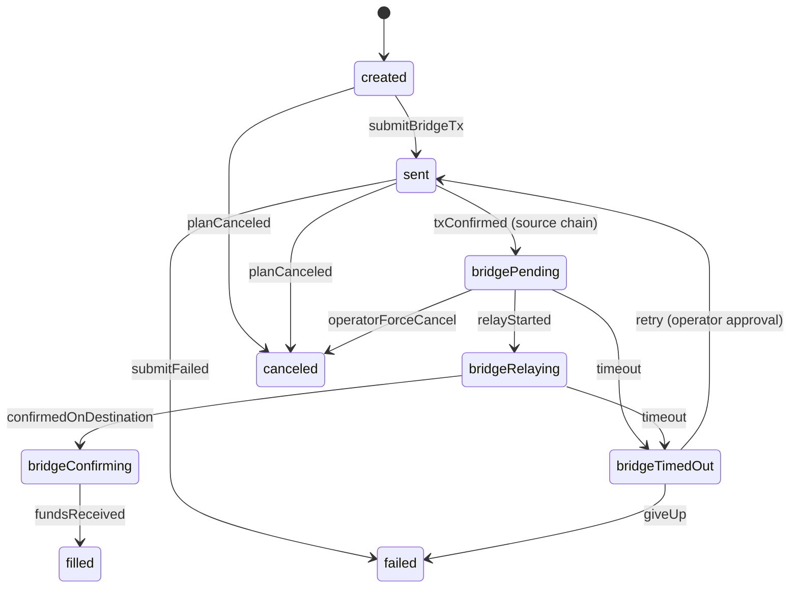

# ADR: Cross-chain execution — DEX A on chain X → bridge → DEX B on chain Y

**Status:** ✅ approved — reviewed against architecture principles (single-writer, reservation-first, idempotency, operator safety)
**Date:** 2026-05-19
**Step:** `DEX-2-0-ADR`
**Depends on:** `DEX-1-3-LIVE-MAINNET` (done ✅)

---

## Context

DEX-1 provides single-chain DEX arbitrage across Arbitrum, Base, and BNB Chain with self-custody EOA wallets. Cross-chain arbitrage (DEX A on chain X → bridge → DEX B on chain Y) introduces fundamentally new challenges:

1. **Bridge latency** — cross-chain transfers take 1–60 minutes (Across/Stargate fast lanes) to 7+ days (native L2 bridges)
2. **Bridge counterparty risk** — funds locked in bridge contracts during transit
3. **Multi-chain coordination** — legs span different chains with independent block times
4. **Idempotency** — bridge transactions are inherently asynchronous and may timeout or retry
5. **Capital efficiency** — capital is locked during bridge transit, affecting reservation-first protocol

The system must extend the existing `ExecutionPlan` state machine and `ExecutionLeg` model to support bridge legs while preserving **single-writer principle**, **reservation-first protocol**, and **optimistic concurrency control**.

---

## Decision

### 1. ExecutionLeg type distinction

**Decision:** Introduce a `legType` column on `execution_legs` to distinguish DEX legs from bridge legs.

```typescript
type LegType = 'dex' | 'bridge';
```

| Column | Type | Values | Default |
|--------|------|--------|---------|
| `leg_type` | `text` | `'dex'` \| `'bridge'` | `'dex'` |

**Rationale:** Bridge legs have fundamentally different lifecycle (submit → wait for finality → confirm on destination chain) vs DEX legs (submit → wait for tx receipt). A `legType` discriminator allows type-specific handling without polymorphic tables.

**Migration:** `036_execution_leg_leg_type.sql` — adds `leg_type` column with default `'dex'` for backward compatibility.

### 2. Bridge leg state machine

**Decision:** Extend `ExecutionLeg` states with bridge-specific transitions.



**New states (bridge legs only):**

| State | Description | Trigger |
|-------|-------------|---------|
| `bridgePending` | TX confirmed on source chain, waiting for relay | Bridge adapter detects source TX confirmation |
| `bridgeRelaying` | Relay in progress (relayer picked up) | Bridge adapter detects relay TX |
| `bridgeConfirming` | Funds arrived on destination chain, waiting for confirmations | Bridge adapter detects destination TX |
| `bridgeTimedOut` | Bridge transfer exceeded timeout threshold | `BridgeTimeoutWorker` |

**DEX legs remain unchanged:** `created → sent → acknowledged → filled | partiallyFilled | rejected | canceled | timedOut | failed`

### 3. Bridge adapter interface

**Decision:** Introduce `BridgeAdapter` interface alongside existing `VenueAdapter`.

```typescript
interface BridgeSubmitResult {
  sourceTxHash: string;
  sourceChainId: number;
  destinationChainId: number;
  bridgeId: string;        // unique bridge transfer ID for tracking
  estimatedRelayMs: number; // estimated relay time in ms
}

interface BridgeStatusResult {
  status: 'pending' | 'relaying' | 'confirming' | 'completed' | 'failed';
  sourceTxHash: string;
  destinationTxHash: string | null;
  confirmations: number;
  estimatedCompletionMs: number;
}

interface BridgeAdapter {
  readonly bridgeKey: string;       // 'across' | 'stargate' | 'native-arb' | 'native-base'
  readonly supportedChains: [number, number][]; // [source, destination] pairs

  submitBridgeTransfer(params: BridgeTransferParams): Promise<BridgeSubmitResult>;
  checkBridgeStatus(bridgeId: string): Promise<BridgeStatusResult>;
  estimateBridgeFee(params: BridgeTransferParams): Promise<BridgeFeeEstimate>;
  estimateRelayTime(params: BridgeTransferParams): Promise<number>; // ms
}

interface BridgeTransferParams {
  sourceChainId: number;
  destinationChainId: number;
  token: string;           // token address on source chain
  destinationToken: string; // token address on destination chain (may differ if bridging wrapped)
  amount: bigint;
  recipientAddress: string; // wallet address on destination chain
  idempotencyKey: string;
}

interface BridgeFeeEstimate {
  bridgeFee: bigint;        // fee in wei (native token)
  relayerFee: bigint;       // relayer fee if applicable
  estimatedGasSource: bigint;
  estimatedGasDestination: bigint; // gas for claim on destination (if needed)
  totalEstimatedCostUsd: number;
}
```

### 4. Bridge venue key routing

**Decision:** Extend `VenueFactoryService` to route bridge legs via bridge adapter registry.

```typescript
// New bridge venue keys
type BridgeVenueKey = 'across' | 'stargate' | 'native-arb' | 'native-base';

// All recognised bridge keys
const BRIDGE_VENUE_KEYS: ReadonlySet<string> = new Set([
  'across', 'stargate', 'native-arb', 'native-base',
]);

// In playbook config:
// dexSwaps[legIndex].venueKey = 'across' for bridge legs
// dexSwaps[legIndex].legType = 'bridge' (new field)
```

**Routing flow:**
1. `VenueFactoryService.submitLeg()` checks `legType` from `playbookConfig`
2. If `legType === 'bridge'` → route to `BridgeAdapterFactory`
3. If `legType === 'dex'` (or undefined for backward compat) → route to DEX adapter

### 5. Single-writer boundaries

**Decision:** All bridge entities owned by `execution-orchestrator` (same as DEX-1).

| Entity | Writer | Notes |
|--------|--------|-------|
| `ExecutionPlan` | `execution-orchestrator` | Unchanged |
| `ExecutionLeg` | `execution-orchestrator` | New `leg_type` discriminator |
| `OnChainTransaction` | `execution-orchestrator` | Extended for bridge TXs (source + destination) |
| `bridge_transfers` | `execution-orchestrator` | **New table** — bridge transfer tracking |
| `CapitalReservation` | `capital-service` | Unchanged |
| `PortfolioPosition` | `portfolio-service` | Unchanged |

**No shared state:** Bridge adapters do not write to `CapitalReservation`, `PortfolioPosition`, or `ReconciliationMismatch`. All cross-service communication via HTTP APIs.

### 6. Database schema extensions

**New table: `bridge_transfers`**

```sql
CREATE TABLE bridge_transfers (
  id                  UUID PRIMARY KEY DEFAULT gen_random_uuid(),
  leg_id              UUID NOT NULL REFERENCES execution_legs(id) ON DELETE CASCADE,
  bridge_key          TEXT NOT NULL,            -- 'across' | 'stargate' | 'native-*'
  source_chain_id     INTEGER NOT NULL,
  destination_chain_id INTEGER NOT NULL,
  source_tx_hash      VARCHAR(66),              -- TX on source chain
  destination_tx_hash VARCHAR(66),              -- TX on destination chain (nullable until completed)
  bridge_id           TEXT,                      -- bridge-specific transfer ID
  token_address       VARCHAR(42) NOT NULL,     -- source token
  destination_token_address VARCHAR(42) NOT NULL,
  amount              NUMERIC(78,0) NOT NULL,
  status              TEXT NOT NULL DEFAULT 'pending',
  -- pending | relaying | confirming | completed | failed | timed_out
  estimated_relay_ms  BIGINT,
  actual_relay_ms     BIGINT,
  idempotency_key     TEXT NOT NULL UNIQUE,     -- prevents double-bridge
  submitted_at        TIMESTAMPTZ,
  confirmed_at        TIMESTAMPTZ,
  failed_at           TIMESTAMPTZ,
  timeout_at          TIMESTAMPTZ,
  error_message       TEXT,
  created_at          TIMESTAMPTZ NOT NULL DEFAULT NOW(),
  updated_at          TIMESTAMPTZ NOT NULL DEFAULT NOW()
);

CREATE INDEX idx_bridge_transfers_leg_id ON bridge_transfers(leg_id);
CREATE INDEX idx_bridge_transfers_status ON bridge_transfers(status);
CREATE INDEX idx_bridge_transfers_source_tx ON bridge_transfers(source_tx_hash);
CREATE INDEX idx_bridge_transfers_destination_tx ON bridge_transfers(destination_tx_hash);
CREATE INDEX idx_bridge_transfers_idempotency ON bridge_transfers(idempotency_key);
CREATE INDEX idx_bridge_transfers_timeout ON bridge_transfers(timeout_at) WHERE status IN ('pending', 'relaying');
```

**Extension: `on_chain_transactions`**

```sql
-- Add bridge transfer reference
ALTER TABLE on_chain_transactions ADD COLUMN bridge_transfer_id UUID REFERENCES bridge_transfers(id);
ALTER TABLE on_chain_transactions ADD COLUMN tx_role TEXT; -- 'source' | 'destination' | 'claim'
```

**Extension: `execution_legs`**

```sql
ALTER TABLE execution_legs ADD COLUMN leg_type TEXT NOT NULL DEFAULT 'dex';
ALTER TABLE execution_legs ADD COLUMN chain_id INTEGER; -- explicit chain for the leg
```

**Migration:** `036_dex2_crosschain.sql`

### 7. Idempotency patterns

**Decision:** Three levels of idempotency for bridge transactions.

#### 7.1 Bridge transfer idempotency (submission)

```typescript
// Idempotency key = `${planId}:${legIndex}:${bridgeKey}`
// Stored in bridge_transfers.idempotency_key (UNIQUE constraint)
// If duplicate submission detected → return existing bridge_transfer record
```

**Flow:**
1. Generate `idempotencyKey` deterministically from `planId + legIndex + bridgeKey`
2. Check `bridge_transfers` for existing row with this key
3. If exists and status is `pending|relaying|confirming` → return existing (no re-submit)
4. If exists and status is `failed|timed_out` → operator must approve retry (new key)
5. If not exists → submit bridge transfer, insert row

#### 7.2 On-chain TX idempotency (source chain)

- Same as DEX-1: `on_chain_transactions.tx_hash` is UNIQUE
- Bridge adapter uses wallet nonce tracking to prevent double-submit

#### 7.3 Fill idempotency (destination chain)

- `bridge_transfers.destination_tx_hash` confirms receipt
- `execution_leg_fill_idempotency` table (existing) covers fill commitment
- Fill only committed once per leg via optimistic concurrency

### 8. Reservation-first protocol extension

**Decision:** Capital reservation must cover bridge transit time.

```
EvaluateOpportunity → EvaluateRisk → ReserveCapital/ReserveRiskWindow → ArmPlan → ExecutePlan
```

**Extension:**
- `CapitalReservation` TTL must account for: bridge relay time + destination DEX execution + buffer
- New config key: `dex.bridge.reservationBufferMs` (default: 300000 = 5 minutes)
- Risk window must span: source DEX execution + bridge relay + destination DEX execution
- If bridge transfer times out → capital reservation may expire → **escalation to operator**

**Capital lock calculation:**
```
totalLockMs = sourceDexExecMs + bridgeEstimatedRelayMs + destinationDexExecMs + reservationBufferMs
```

### 9. Cross-chain plan lifecycle (example)

**Scenario:** Arbitrage WETH on Arbitrum → bridge to Base → sell WETH on Base

```
Plan: planned → reserved → armed → executing

Leg 0 (dex, Arbitrum):  created → sent → acknowledged → filled  (buy WETH on Arbitrum)
Leg 1 (bridge):         created → sent → bridgePending → bridgeRelaying → bridgeConfirming → filled
Leg 2 (dex, Base):      created → sent → acknowledged → filled  (sell WETH on Base)

Plan: executing → completed
```

**Failure scenario: bridge timeout**

```
Leg 0 (dex, Arbitrum):  filled ✅
Leg 1 (bridge):         sent → bridgePending → bridgeTimedOut

Plan: executing → hedged | unwound | failed (depending on policy)
  → operator escalation: force unwind Leg 0 or wait for bridge recovery
```

### 10. ExecutionPlan state machine (unchanged at top level)

The `ExecutionPlan` state machine does **not** change for cross-chain. The existing states handle the lifecycle:

```
planned → reserved → armed → executing → completed | hedged | unwound | failed | canceled
```

What changes is the **internal leg orchestration**:
- DEX legs: execute sequentially or in parallel as before
- Bridge legs: start after source DEX leg fills, block destination DEX leg until bridge completes
- The orchestrator must handle bridge-specific timeouts and escalations

### 11. Module structure

```
apps/execution-orchestrator/src/execution/
├── dex/
│   ├── adapters/              # Existing DEX adapters
│   ├── bridge/                # NEW: Bridge adapters
│   │   ├── bridge-adapter.interface.ts
│   │   ├── across-bridge.adapter.ts
│   │   ├── stargate-bridge.adapter.ts
│   │   ├── native-bridge.adapter.ts
│   │   └── bridge-adapter.factory.ts
│   ├── services/
│   │   ├── bridge-transfer.service.ts    # NEW: bridge transfer lifecycle
│   │   ├── bridge-timeout.worker.ts      # NEW: timeout detection
│   │   └── ... (existing services)
│   └── ...
├── execution.module.ts
└── venue-factory.service.ts  # Extended with bridge routing
```

### 12. Observability

**New metrics:**

| Metric | Type | Labels | Description |
|--------|------|--------|-------------|
| `arb_bridge_submit_total` | Counter | bridge_key, source_chain, dest_chain | Bridge transfer submissions |
| `arb_bridge_relay_duration_seconds` | Histogram | bridge_key | Actual relay duration |
| `arb_bridge_timeout_total` | Counter | bridge_key, source_chain, dest_chain | Bridge transfer timeouts |
| `arb_bridge_fee_usd` | Histogram | bridge_key | Bridge fee distribution |
| `arb_bridge_capital_lock_duration_seconds` | Histogram | bridge_key | Time capital locked in bridge |

**New events:**

| Event | Trigger | Payload |
|-------|---------|---------|
| `BridgeTransferSubmitted` | Bridge TX submitted on source chain | planId, legId, bridgeKey, sourceChainId, destChainId, amount |
| `BridgeTransferRelaying` | Relay detected | planId, legId, bridgeId |
| `BridgeTransferCompleted` | Funds confirmed on destination | planId, legId, destinationTxHash |
| `BridgeTransferTimedOut` | Timeout threshold exceeded | planId, legId, bridgeKey |

**New health endpoint:** `GET /health/dex/bridge` — bridge adapter status, pending transfers count, stuck transfers.

### 13. Operator safety

**Bridge-specific destructive actions:**
- **Retry bridge transfer** — requires operator approval + impact preview
- **Force unwind bridge leg** — requires two-step approval, creates audit trail
- **Cancel pending bridge** — only before source TX confirmed (may not be possible after submission)

**Timeout policy (configurable via config-service):**

| Config key | Default | Description |
|------------|---------|-------------|
| `dex.bridge.timeoutMs` | 600000 (10 min) | Default bridge timeout |
| `dex.bridge.timeoutMs.across` | 300000 (5 min) | Across-specific timeout |
| `dex.bridge.timeoutMs.native` | 604800000 (7 days) | Native L2 bridge timeout |
| `dex.bridge.maxRetryAttempts` | 1 | Max auto-retry before operator escalation |
| `dex.bridge.reservationBufferMs` | 300000 (5 min) | Extra buffer for capital reservation |

---

## Alternatives considered

| Option | Rejection reason |
|--------|------------------|
| Separate `bridge-service` | Breaks single-writer for `ExecutionLeg`; adds cross-service latency for bridge status checks |
| Bridge legs as separate `ExecutionPlan` | Complicates atomicity; breaks plan-level state machine; doubles reservation overhead |
| Polyglot persistence for bridge state (Redis) | Adds inconsistency risk; `bridge_transfers` in Postgres ensures ACID with execution state |
| No `legType` discriminator — detect by venueKey | Fragile; bridge keys may overlap with DEX keys on some chains; explicit type is clearer |
| Async event-driven bridge tracking (Kafka only) | Polling-based tracking is simpler; outbox events for bridge status changes complement polling |

---

## Consequences

### Positive
- **Single-writer compliance:** All bridge entities owned by `execution-orchestrator`
- **Reservation-first:** Capital reservation TTL accounts for bridge transit time
- **Idempotency:** Three levels prevent double-bridge, double-fill, and double-submit
- **Observability:** Full bridge lifecycle metrics and events
- **Backward compatibility:** DEX-1 single-chain flows unaffected (`leg_type` defaults to `'dex'`)
- **Operator safety:** Bridge timeouts, retries, and force unwinds require approval

### Negative
- **Execution orchestrator complexity:** Bridge module adds significant state management
- **Capital lock duration:** Bridge transfers lock capital for minutes to hours, reducing throughput
- **Counterparty risk:** Funds locked in bridge contracts; no atomic rollback
- **Test complexity:** Multi-chain E2E requires testnet funds on multiple chains

### Mitigations
- **Feature flag:** `DEX_BRIDGE_ENABLED` — disable bridge legs without affecting DEX-1
- **Capital limits:** Configurable max bridge transfer amount (`dex.bridge.maxTransferAmount`)
- **Timeout + escalation:** Automatic timeout detection with operator escalation
- **Paper bridge:** `PaperBridgeAdapter` for testing without real bridge contracts

---

## Implementation plan

| Step | Description | Depends on |
|------|-------------|------------|
| `DEX-2-1-BRIDGE-ACROSS` | `AcrossBridgeAdapter` + bridge transfer service + testnet E2E | This ADR |
| `DEX-2-1-BRIDGE-STG` | `StargateBridgeAdapter` + bridge limits docs | `DEX-2-1-BRIDGE-ACROSS` |
| `DEX-2-1-BRIDGE-NATIVE` | `NativeBridgeAdapter` + long finality runbook | `DEX-2-1-BRIDGE-STG` |
| `DEX-2-2-PLAN` | Multi-leg plan builder + `chainId` on ExecutionLeg + orchestrator extensions | Bridge adapters |
| `DEX-2-3-RECON-XCHAIN` | Bridge reconciliation detectors + force unwind runbook | `DEX-2-2-PLAN` |
| `DEX-2-4-E2E` | Multi-chain E2E: testnet → mainnet | `DEX-2-3-RECON-XCHAIN` |

---

## Links

- [DEVELOPMENT_PLAN-DEX.md](../.cursor/plans/DEVELOPMENT_PLAN-DEX.md) — DEX development plan
- [dex-2-multichain.md](../.cursor/plans/dex/dex-2-multichain.md) — DEX-2 step details
- [adr-dex-structure.md](adr-dex-structure.md) — DEX-1 component architecture ADR
- [state-machines.md](state-machines.md) — Existing state machine definitions
- [reservation-first.md](reservation-first.md) — Reservation-first protocol
- [dex-frontend-ui-spec.md](dex-frontend-ui-spec.md) — Frontend UI spec (bridge columns TBD)