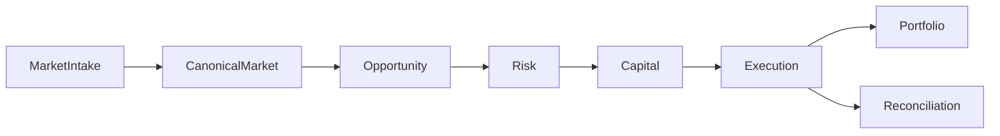

# 01 — Обзор системы

Arbibot 2 — монорепозиторий контура крипто-арбитража: рынок и снимки → нормализованный справочник → возможности → оценка риска и резервы → оркестрация исполнения → портфель и сверка, плюс операторский UI и конфигурация политик.

## Поток данных (упрощённо)

Техническая цепочка исполнения (после появления возможности): snapshot → opportunity → **risk** → **reserve** (risk window + capital) → **arm** → ноги плана до `plan.completed`. Подробнее о фазах и статусе возможностей/планов — [README.md](../../README.md), [.cursor/plans/DEVELOPMENT_PLAN.md](../../.cursor/plans/DEVELOPMENT_PLAN.md).

## Где искать карту сервисов и агрегатов

- [docs/services.md](../services.md) — назначение HTTP-сервисов в `apps/*`.
- [docs/aggregates.md](../aggregates.md) — доменные сущности и границы.
- [docs/reservation-first.md](../reservation-first.md) — протокол резервирования.

## Пакеты общего кода

- `packages/contracts` — маршруты, имена событий, типы envelope.
- `packages/persistence` — сущности TypeORM, outbox/inbox.
- `packages/messaging` — claim inbox, выборка outbox.
- `packages/nest-database`, `packages/nest-platform` — БД, метрики, корреляция, audit client.
- `packages/outbox-kafka-bridge` — публикация выбранных типов событий в Kafka/Redpanda.

Следующий шаг по архитектуре: [02 — архитектурные инварианты](02-architecture-invariants.md).
