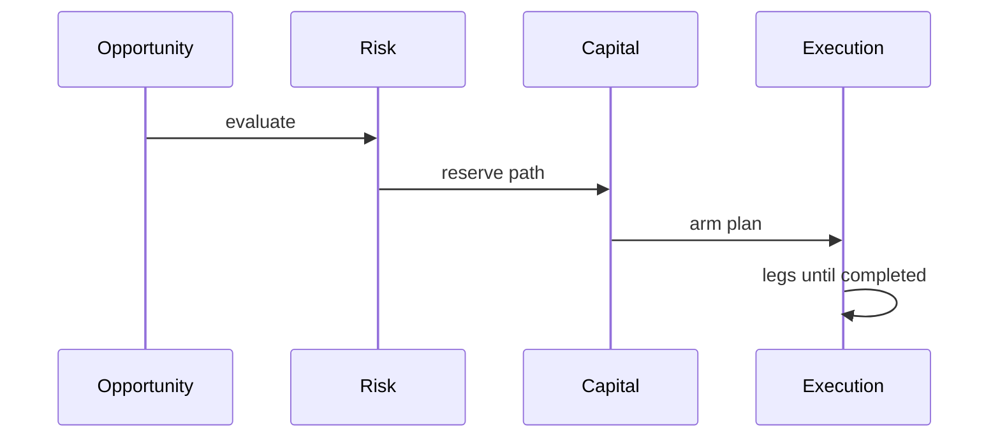

# 02 — Архитектурные инварианты

Эти правила нельзя обходить при изменениях в домене исполнения, риска и paper/live.

## Краткий чеклист

| Инвариант | Смысл |
|-----------|--------|
| **Single-writer** | Один сервис владеет мутациями сущности (например ExecutionPlan — execution-orchestrator; paper trades — paper-trading-service). |
| **Reservation-first** | Нельзя «стрелять» в venue без резерва риска и капитала в нужном порядке. |
| **Версии и идемпотентность** | Переходы состояний и внешние колбэки (fills, оператор) проходят с проверкой версии / ключей идемпотентности. |
| **Outbox / inbox** | Асинхронная доставка событий через таблицы и (для части типов) Kafka; отдельные allowlist для relay и bridge. |
| **Изоляция paper** | Виртуальный капитал и paper-сущности не смешиваются с live capital-service без явной модели. |
| **Операторские разрушительные действия** | Превью влияния, двухшаговое подтверждение, аудит — см. [operator-approval-flow.md](../operator-approval-flow.md). |

Канон формулировок для агентов и людей: [.cursor/rules/arbibot-project.mdc](../../.cursor/rules/arbibot-project.mdc).

## Состояния (куда копать)

- Планы и ноги исполнения — [docs/state-machines.md](../state-machines.md).
- События и шины — [docs/outbox-inbox.md](../outbox-inbox.md), [docs/async-events.md](../async-events.md).

## Поток «до завершения плана» (напоминание)

Детали контрактов — OpenAPI-черновик [docs/openapi-draft.yaml](../openapi-draft.yaml).

Практика локального запуска: [03 — локальная разработка](03-local-dev.md).
