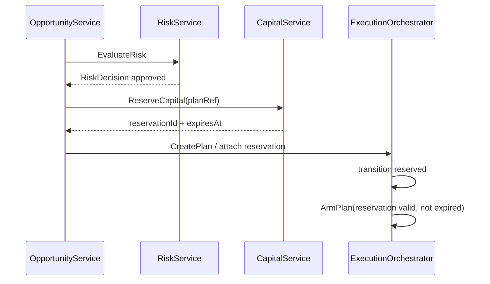

# Reservation-first в контрактах (P0-0.2-RESV)

## Правило

Исполнение (**arm** / **execute**) **запрещено** без валидного **capital reservation token** и пройденной цепочки **EvaluateRisk → RiskDecision** там, где домен это требует.

## Sequence (целевой)

## OpenAPI

- `POST /execution/plans/{id}/arm` возвращает **409** если резерв отсутствует, истёк или не совпадает `plan_id`.
- `ReserveCapital` принимает опциональный `planId` после создания плана; оркестратор связывает FK.

## События

- `CapitalReserved` до `PlanArmed`.
- Нарушение порядка в логах/метриках — инцидент для reconciliation (Phase 2).
