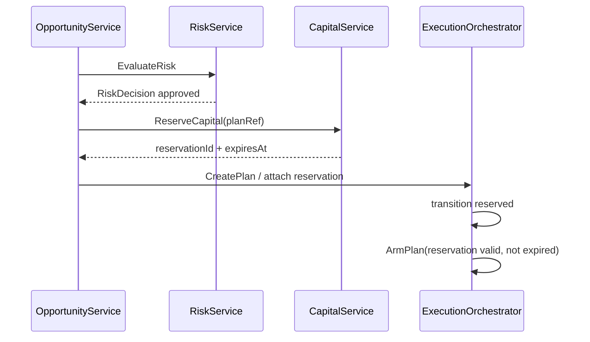

# Reservation-first в контрактах (P0-0.2-RESV)

## Правило

Исполнение (**arm** / **execute**) **запрещено** без валидного **capital reservation token** и пройденной цепочки **EvaluateRisk → RiskDecision** там, где домен это требует.

## Sequence (целевой)

```mermaid
sequenceDiagram
  participant O as OpportunityService
  participant R as RiskService
  participant C as CapitalService
  participant X as ExecutionOrchestrator
  O->>R: EvaluateRisk
  R-->>O: RiskDecision approved
  O->>C: ReserveCapital(planRef)
  C-->>O: reservationId + expiresAt
  O->>X: CreatePlan / attach reservation
  X->>X: transition reserved
  X->>X: ArmPlan(reservation valid, not expired)
```

## OpenAPI

- `POST /execution/plans/{id}/arm` возвращает **409** если резерв отсутствует, истёк или не совпадает `plan_id`.
- `ReserveCapital` принимает опциональный `planId` после создания плана; оркестратор связывает FK.

## События

- `CapitalReserved` до `PlanArmed`.
- Нарушение порядка в логах/метриках — инцидент для reconciliation (Phase 2).

## Идемпотентность резервирования (PLAN9 P9-9)

- **`UNIQUE(correlation_id)`** на `capital_reservations` (migration `051_capital_reservation_correlation_unique.sql`): повторный `ReserveCapital` с тем же `correlation_id` не создаёт дубль — возвращает существующую reservation. Защита от retry-циклов opportunity→capital при сбоях сети.
- **Sweeper**: фоновой worker чистит `expired` reservations с истёкшим TTL; `active` reservation блокирует повторный reserve того же плана до release/expire.

## Paper capital — отдельная подсистема (Phase 3)

Paper-trading имеет собственную таблицу `paper_capital_reservations` (не shared с live `capital_reservations`), полностью изолированную от real-capital flows.

- **Hotfix migration 050**: старый `UNIQUE(instrument_key, state)` блокировал settle любой сделки, у чьего инструмента уже была `expired`-reservation → зависшие `active` сделки насыщали Phase B concurrency → каскадно вставал весь AutoDrive pipeline. Заменён на partial unique index `WHERE state='active'` (одна active reservation per instrument, expired unconstrained).
- **Self-healing**: следующий tick Phase C (`AutoDriveWorker`) повторяет `expireReservation` на зависших сделках; ручной backfill не нужен.
