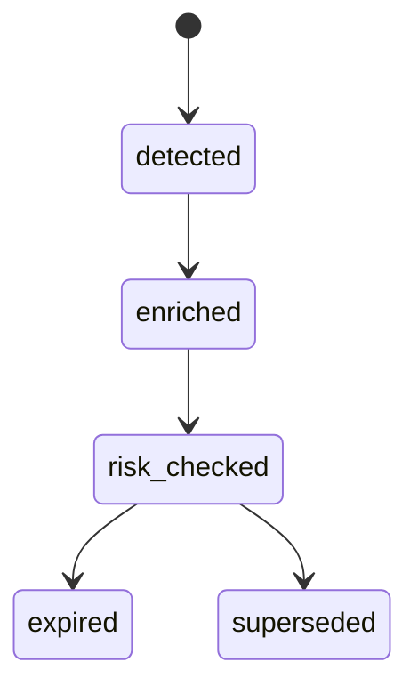
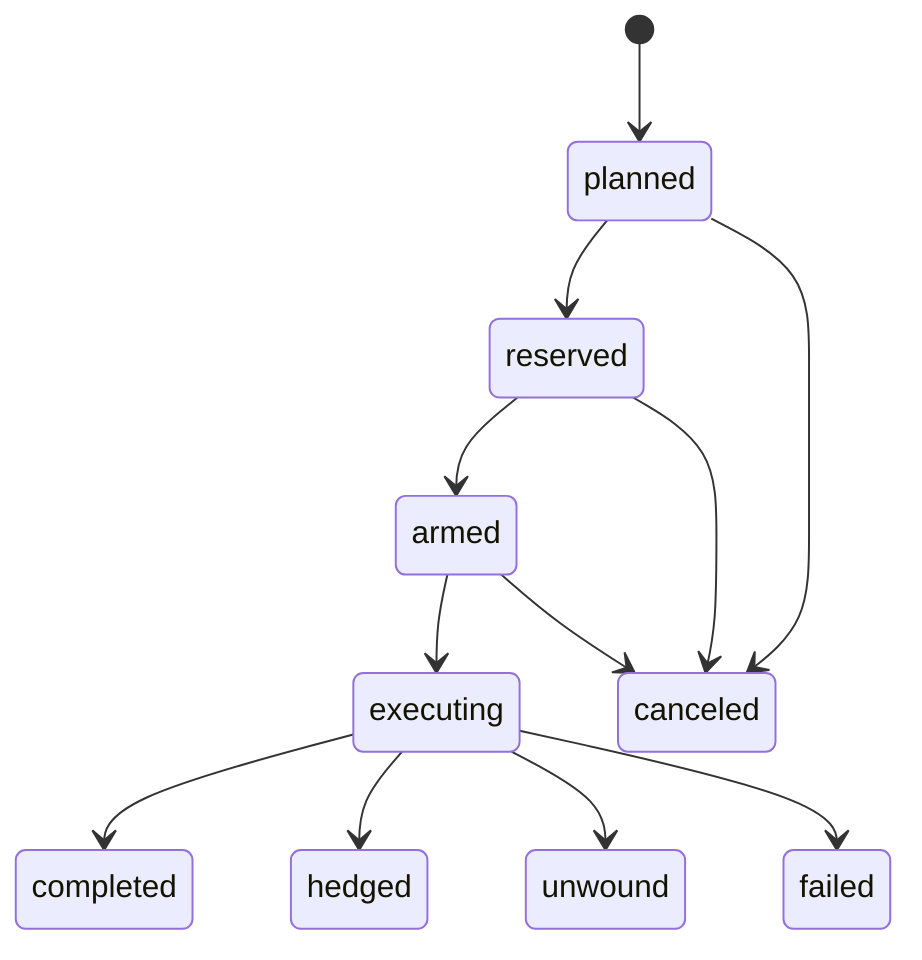
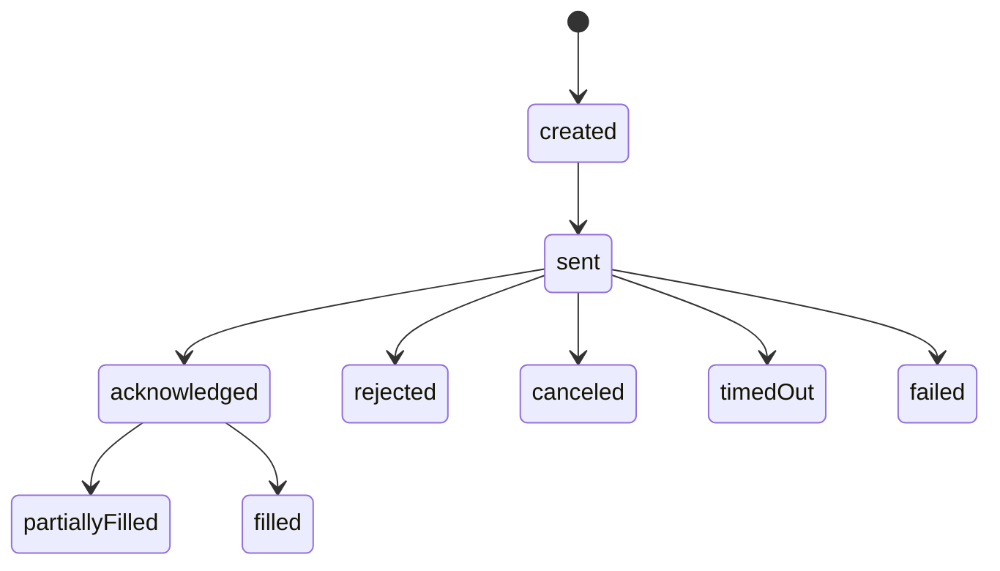

# State machines агрегатов (P0-0.2-SM)

## ArbitrageOpportunity

Переходы только через **opportunity-service** с compare-and-set по `entity_version`.

## RiskDecision

Жизненный цикл: создание записи (**immutable** с точки зрения бизнес-исхода). Корректировки политик не переписывают прошлые решения — новая оценка = новая запись.

Состояния исхода: `approved` | `rejected` | `deferred` (поле outcome).

## ExecutionPlan

## ExecutionLeg

## CapitalReservation

`active` → `released` | `expired` (TTL worker или явный release).

## PortfolioPosition (Phase 2+)

Отдельная спека при появлении сервиса портфеля; связь с `PlanCompleted` / `PositionClosed`.
