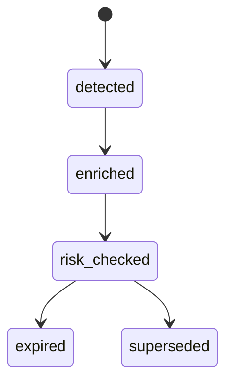
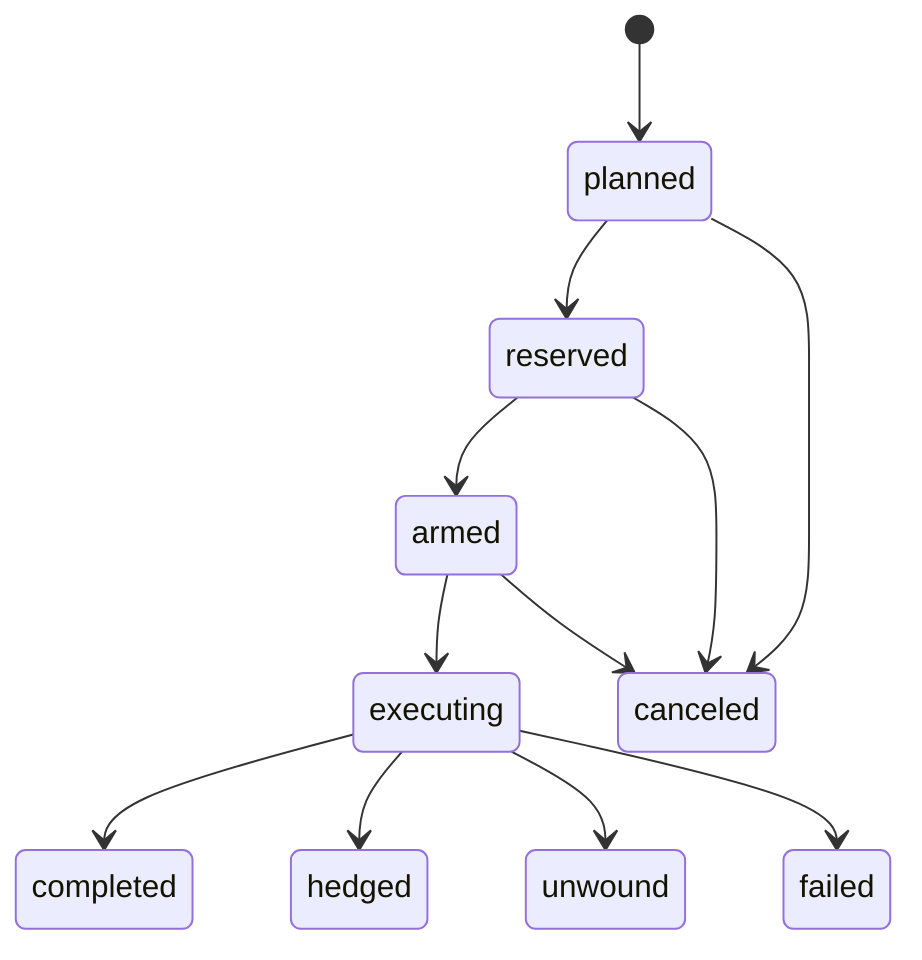
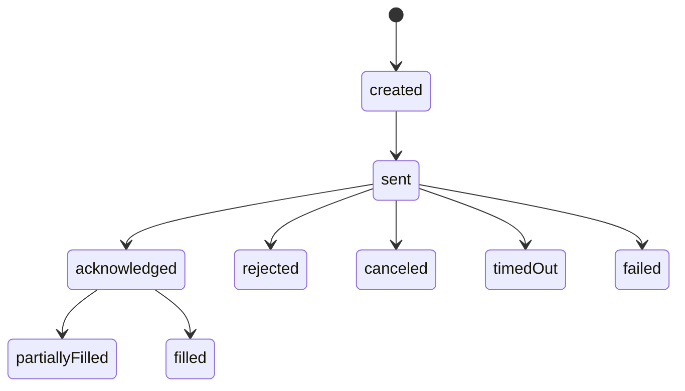

# State machines агрегатов (P0-0.2-SM)

## ArbitrageOpportunity



Переходы только через **opportunity-service** с compare-and-set по `entity_version`.

## RiskDecision

Жизненный цикл: создание записи (**immutable** с точки зрения бизнес-исхода). Корректировки политик не переписывают прошлые решения — новая оценка = новая запись.

Состояния исхода: `approved` | `rejected` | `deferred` (поле outcome).

## ExecutionPlan



## ExecutionLeg



## CapitalReservation

`active` → `released` | `expired` (TTL worker или явный release).

## PortfolioPosition (Phase 2+)

**Baseline state machine (Phase 0):**
```
portfolio_position: draft → confirmed → open → closed | error
```

**Transitions:**
- `draft → confirmed`: fill received from execution orchestrator (`POST /positions/confirm-fill`)
- `confirmed → open`: fill committed, position becomes active
- `open → closed`: position fully closed (all legs executed) or manually closed
- `any → error`: reconciliation failure, validation error, or data inconsistency

**Owner:** `portfolio-service` (single-writer)

**Versioning:** `version` column with optimistic concurrency on updates

**Future extensions (Phase 2+):**
- Position splits (partial close)
- Hedge/unwind state machines
- Position lifecycle hooks (events: `PositionOpened`, `PositionClosed`, `PositionError`)
- Link to `PlanCompleted` / `LegFilled` events for full reconciliation
