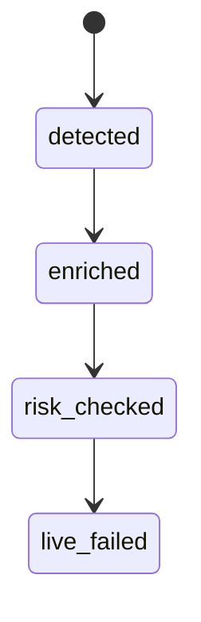
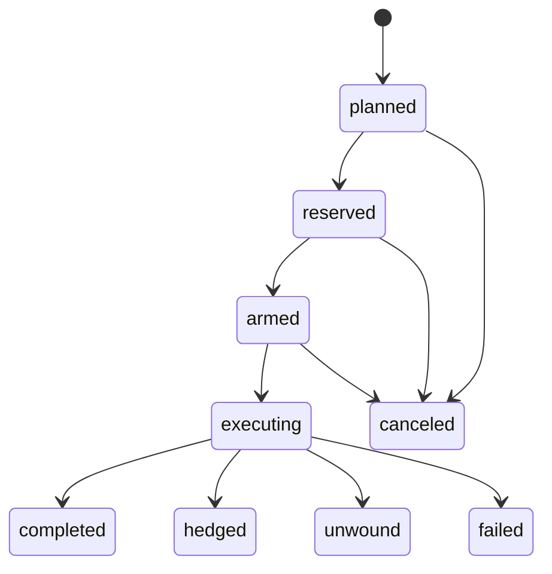
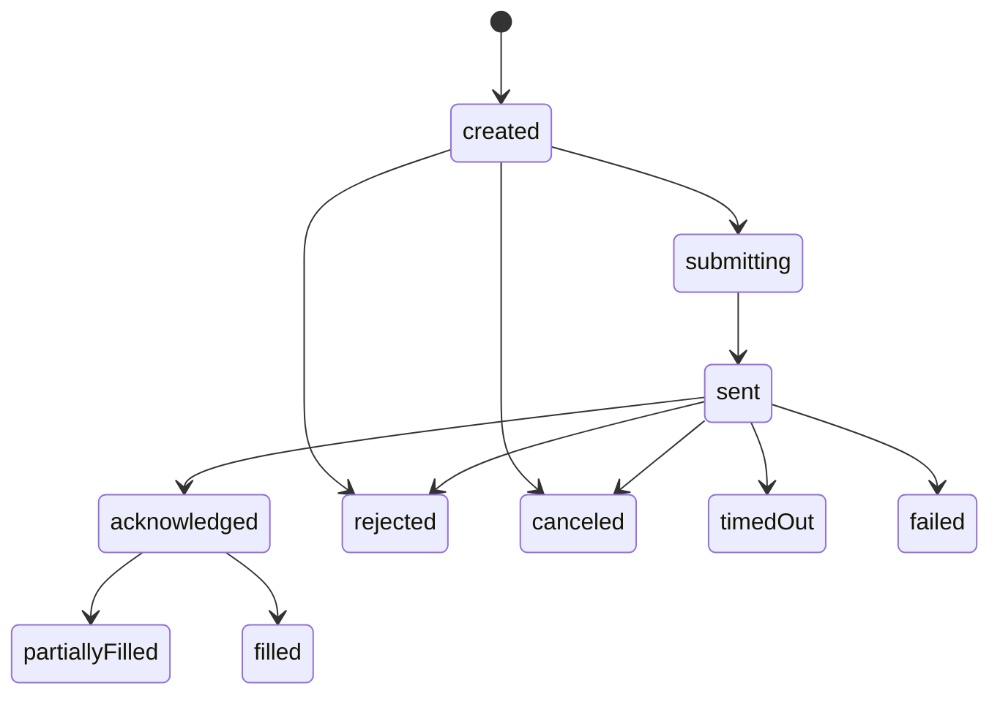

# State machines агрегатов (P0-0.2-SM)

> **Верифицировано 2026-08-11** против production БД (Aéza, commit `1a7894b`) и
> `infra/postgres/migrations/001–054.sql`. CHECK-констрейнты в БД — источник истины
> для допустимых значений; код (`opportunity-states.ts`, `legs.service.ts`) — для
> переходов. Устаревшие расхождения с предыдущей версией документа исправлены.

## ArbitrageOpportunity


```mermaid
stateDiagram-v2
  [*] --> detected
  detected --> enriched
  enriched --> risk_checked
  risk_checked --> live_failed
```

**Допустимые значения** (production data + код): `detected`, `enriched`, `risk_checked`, `live_failed`.

- `detected → enriched → risk_checked`: через **opportunity-service** с compare-and-set по `entity_version`. Канон значений — `apps/opportunity-service/src/opportunities/opportunity-states.ts` (`OPPORTUNITY_STATES`).
- `risk_checked`: **терминальное по умолчанию** — opportunity остаётся в этом состоянии, либо уходит в paper (через `paperEnqueue`), либо (с PLAN10) в live-execution через `LiveAutoDriveWorker`. Сама opportunity при этом **не** переходит в новое состояние — вместо этого миграция **054** добавила колонку `live_execution_plan_id` (dedup-маркер: `risk_checked AND live_execution_plan_id IS NULL` — частичный индекс для отбора не-диспатченных).
- `risk_checked → live_failed`: `opportunities.service.ts:186` (raw string — НЕ в `OPPORTUNITY_STATES` const). Терминальное, **не** re-queued. См. PLAN10 `LiveAutoDriveWorker`.

> ⚠️ Предыдущая версия документа упоминала переходы `risk_checked → expired` и
> `risk_checked → superseded` — эти значения **отсутствуют** и в коде, и в production
> данных. Сохранены здесь как историческая справка; если будут реализованы —
> добавить явно в `OPPORTUNITY_STATES` и CHECK.

## RiskDecision

Жизненный цикл: создание записи (**immutable** с точки зрения бизнес-исхода). Корректировки политик не переписывают прошлые решения — новая оценка = новая запись.

Состояния исхода: `approved` | `rejected` | `deferred` (поле outcome).

## ExecutionPlan


```mermaid
stateDiagram-v2
  [*] --> planned
  planned --> reserved
  reserved --> armed
  armed --> executing
  executing --> completed
  executing --> hedged
  executing --> unwound
  executing --> failed
  planned --> canceled
  reserved --> canceled
  armed --> canceled
```

**Допустимые значения** (production CHECK constraint, migration `001_core.sql:42`):
`planned, reserved, armed, executing, completed, hedged, unwound, failed, canceled`.

> ⚠️ Значения `created` и `submitting` НЕ относятся к `execution_plans.state` —
> это `execution_legs.state` (см. ниже). Распространённая путаница.

## ExecutionLeg


```mermaid
stateDiagram-v2
  [*] --> created
  created --> submitting
  submitting --> sent
  sent --> acknowledged
  acknowledged --> partiallyFilled
  acknowledged --> filled
  created --> rejected
  created --> canceled
  sent --> rejected
  sent --> canceled
  sent --> timedOut
  sent --> failed
```

**Допустимые значения** (production CHECK constraint, migration `001_core.sql:55` + `052_execution_legs_submitting_state.sql`):
`created, submitting, sent, acknowledged, partiallyFilled, filled, rejected, canceled, timedOut, failed`.

- `submitting` (PLAN9 P9-1, migration 052): **двухфазный mark-sent**. `LegsService.markSent()` сначала переводит `created → submitting` (atomic с persist on_chain_transactions + outbox emit), и только после подтверждения broadcast — `submitting → sent`. Crash между ними оставляет leg в `submitting`; recovery через stuck-plan-reaper (PLAN9 P9-7).
- `created → submitting → sent → ... → filled`: full lifecycle драйвится `LegAutoDriverWorker` (PLAN10 P10-EO, `apps/execution-orchestrator/src/legs/leg-auto-driver.worker.ts`).

## CapitalReservation (live, Phase 1)

`active` → `released` | `expired` (TTL worker или явный release).

**Допустимые значения** (production CHECK): `active, released, expired`.

- **UNIQUE(correlation_id)** (PLAN9 P9-9, migration `051_capital_reservation_correlation_unique.sql`): идемпотентность резервирования — повтор с тем же `correlation_id` не создаёт дубль.

## PaperCapitalReservation (paper-only, Phase 3)

`active` → `expired` (TTL worker Phase C AutoDrive).

**Допустимые значения** (production CHECK): `active, expired`.

- **Partial unique index** `WHERE state='active'` (migration `050_paper_capital_reservation_unique_fix.sql`): hotfix — старый `UNIQUE(instrument_key, state)` блокировал settle любой сделки с expired reservation; заменён на partial index active-only. Self-healing через следующий tick Phase C.

## PortfolioPosition (Phase 2+)

**Baseline state machine (Phase 0):**
```
portfolio_position: draft → confirmed → open → closed | error
```

**Transitions:**
- `draft → confirmed`: fill received from execution orchestrator (`POST /positions/confirm-fill`)
- `confirmed → open`: fill committed, position becomes active
- `open → closed`: position fully closed (all legs executed) or manually closed
- `any → error`: reconciliation failure, validation error, or data inconsistency

**Owner:** `portfolio-service` (single-writer)

**Versioning:** `version` column with optimistic concurrency on updates

**Future extensions (Phase 2+):**
- Position splits (partial close)
- Hedge/unwind state machines
- Position lifecycle hooks (events: `PositionOpened`, `PositionClosed`, `PositionError`)
- Link to `PlanCompleted` / `LegFilled` events for full reconciliation

## PortfolioPosition (Phase 2+)

**Baseline state machine (Phase 0):**
```
portfolio_position: draft → confirmed → open → closed | error
```

**Transitions:**
- `draft → confirmed`: fill received from execution orchestrator (`POST /positions/confirm-fill`)
- `confirmed → open`: fill committed, position becomes active
- `open → closed`: position fully closed (all legs executed) or manually closed
- `any → error`: reconciliation failure, validation error, or data inconsistency

**Owner:** `portfolio-service` (single-writer)

**Versioning:** `version` column with optimistic concurrency on updates

**Future extensions (Phase 2+):**
- Position splits (partial close)
- Hedge/unwind state machines
- Position lifecycle hooks (events: `PositionOpened`, `PositionClosed`, `PositionError`)
- Link to `PlanCompleted` / `LegFilled` events for full reconciliation
